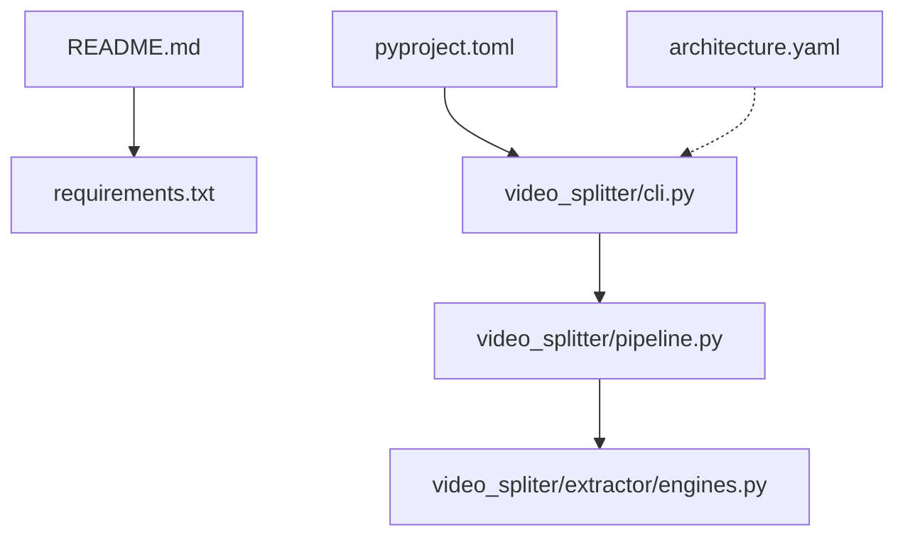
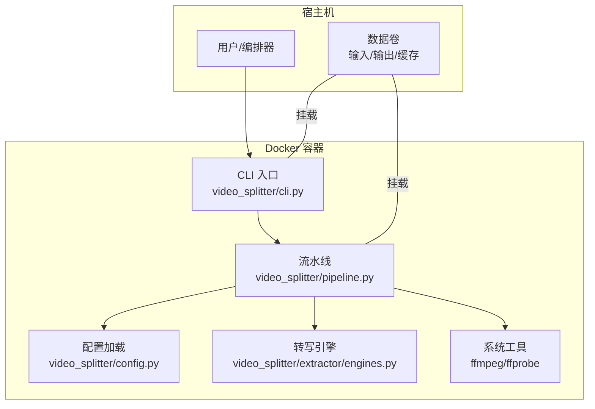
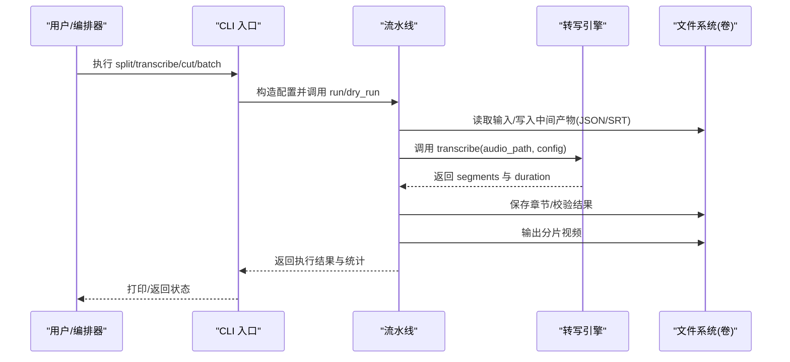
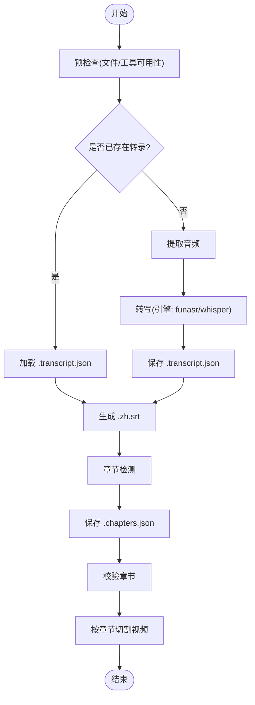
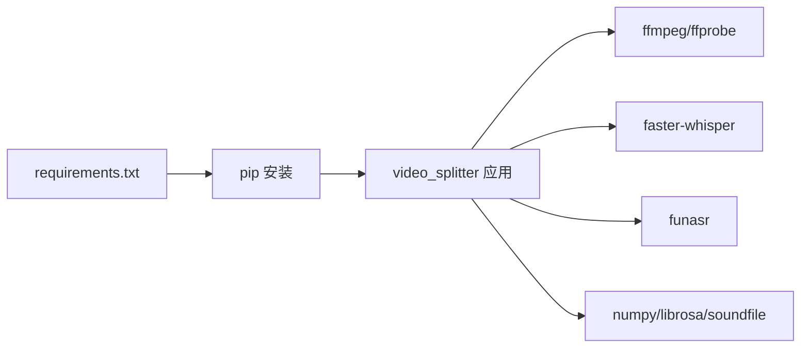

# 容器化部署

<cite>
**本文引用的文件**
- [README.md](file://README.md)
- [requirements.txt](file://requirements.txt)
- [pyproject.toml](file://pyproject.toml)
- [video_splitter/config.py](file://video_splitter/config.py)
- [video_splitter/cli.py](file://video_splitter/cli.py)
- [video_splitter/pipeline.py](file://video_splitter/pipeline.py)
- [video_splitter/extractor/engines.py](file://video_splitter/extractor/engines.py)
- [architecture.yaml](file://architecture.yaml)
</cite>

## 目录
1. [简介](#简介)
2. [项目结构](#项目结构)
3. [核心组件](#核心组件)
4. [架构总览](#架构总览)
5. [详细组件分析](#详细组件分析)
6. [依赖分析](#依赖分析)
7. [性能考虑](#性能考虑)
8. [故障排查指南](#故障排查指南)
9. [结论](#结论)
10. [附录](#附录)

## 简介
本文件为 VideoSplitter 的容器化部署文档，面向在 Docker 与 Docker Compose 环境下构建、编排与运行视频智能分段服务。内容涵盖：
- 镜像构建策略（基础镜像选择、依赖安装优化、多阶段构建）
- Docker Compose 服务编排与依赖管理
- 容器环境配置（GPU 支持、内存限制、存储卷挂载）
- 容器间通信与数据持久化方案
- 容器性能调优与安全加固最佳实践

VideoSplitter 通过命令行入口驱动“提取音频→语音转写→章节检测→校验→按章节切割”的流水线，并支持多种转写引擎（FunASR、Whisper）。

## 项目结构
仓库包含 Python 应用代码、依赖清单与工程配置。关键路径如下：
- 应用入口与流水线：video_splitter/cli.py、video_splitter/pipeline.py
- 配置与环境变量：video_splitter/config.py
- 转写引擎抽象与实现：video_splitter/extractor/engines.py
- 依赖清单与测试配置：requirements.txt、pyproject.toml
- 顶层说明与约束：README.md、architecture.yaml

图表来源
- [README.md:1-50](file://README.md#L1-L50)
- [requirements.txt:1-26](file://requirements.txt#L1-L26)
- [pyproject.toml:1-28](file://pyproject.toml#L1-L28)
- [video_splitter/cli.py:1-256](file://video_splitter/cli.py#L1-L256)
- [video_splitter/pipeline.py:1-131](file://video_splitter/pipeline.py#L1-L131)
- [video_splitter/extractor/engines.py:1-251](file://video_splitter/extractor/engines.py#L1-L251)
- [architecture.yaml:1-10](file://architecture.yaml#L1-L10)

章节来源
- [README.md:1-50](file://README.md#L1-L50)
- [requirements.txt:1-26](file://requirements.txt#L1-L26)
- [pyproject.toml:1-28](file://pyproject.toml#L1-L28)
- [architecture.yaml:1-10](file://architecture.yaml#L1-L10)

## 核心组件
- CLI 入口：提供 split、transcribe、cut、check、review、batch、gui 等子命令，统一解析参数并调用 Pipeline。
- 流水线编排：顺序执行预检查、音频提取、转写、章节检测、校验、切割，并输出 SRT 与分片视频。
- 配置管理：从环境变量覆盖模型大小、设备、计算类型、LLM 接口、切分模式、命名模板、恢复标志、转写引擎等。
- 转写引擎：抽象接口 TranscriptionEngine，内置 FunASR 与 Whisper 两种实现，支持健康检查与进度回调。

章节来源
- [video_splitter/cli.py:1-256](file://video_splitter/cli.py#L1-L256)
- [video_splitter/pipeline.py:1-131](file://video_splitter/pipeline.py#L1-L131)
- [video_splitter/config.py:1-54](file://video_splitter/config.py#L1-L54)
- [video_splitter/extractor/engines.py:1-251](file://video_splitter/extractor/engines.py#L1-L251)

## 架构总览
下图展示容器内外的关键交互：外部通过 Docker 暴露 CLI 或 API（可选），容器内部由 CLI 驱动 Pipeline，Pipeline 调用各子系统完成视频处理。

图表来源
- [video_splitter/cli.py:1-256](file://video_splitter/cli.py#L1-L256)
- [video_splitter/pipeline.py:1-131](file://video_splitter/pipeline.py#L1-L131)
- [video_splitter/config.py:1-54](file://video_splitter/config.py#L1-L54)
- [video_splitter/extractor/engines.py:1-251](file://video_splitter/extractor/engines.py#L1-L251)

## 详细组件分析

### 容器镜像构建策略
- 基础镜像选择
  - 推荐基于官方 Python 镜像（如 python:3.12-slim），以匹配 pyproject 要求的 Python 版本范围，减少体积。
  - 若需 GPU 加速（Whisper/FunASR），可基于 nvidia/cuda 基础镜像或 NVIDIA Container Toolkit 支持的运行时。
- 依赖安装优化
  - 使用 requirements.txt 作为依赖清单；将 ffmpeg/ffprobe 作为系统依赖在镜像中安装，避免运行时缺失。
  - 利用 pip 缓存层与只读中间层，先复制依赖清单再复制源码，提升构建缓存命中率。
- 多阶段构建建议
  - 构建阶段：安装编译型依赖（如 torch、funasr 等可能触发编译的包），生成 wheel 缓存。
  - 运行阶段：仅拷贝最终产物与必要运行时库，减小镜像体积并降低攻击面。
- 环境变量与配置注入
  - 通过环境变量注入 LLM 密钥、设备选择、引擎名称、FunASR 模型目录等，便于不同环境复用同一镜像。

章节来源
- [requirements.txt:1-26](file://requirements.txt#L1-L26)
- [pyproject.toml:1-28](file://pyproject.toml#L1-L28)
- [video_splitter/config.py:1-54](file://video_splitter/config.py#L1-L54)
- [video_splitter/extractor/engines.py:1-251](file://video_splitter/extractor/engines.py#L1-L251)

### Docker Compose 服务编排与依赖管理
- 服务划分
  - video-splitter：主处理服务，挂载输入/输出卷，设置资源限制与 GPU 运行时（可选）。
  - 可选 worker：用于批量任务队列（如需扩展）。
- 依赖管理
  - 通过 volumes 挂载宿主目录到容器，实现输入视频、中间产物（转录 JSON、章节 JSON、SRT）、输出分片的持久化。
  - 通过 environment 注入配置项（见下节“容器环境配置选项”）。
- 网络与通信
  - 默认桥接网络即可满足单机场景；如需微服务化，可为不同服务分配独立网络与端口映射。

章节来源
- [video_splitter/cli.py:1-256](file://video_splitter/cli.py#L1-L256)
- [video_splitter/pipeline.py:1-131](file://video_splitter/pipeline.py#L1-L131)

### 容器环境配置选项
- 通用配置（环境变量）
  - OPENAI_API_BASE / OPENAI_API_KEY：LLM 代理地址与密钥（用于摘要/成本估算等）。
  - WHALECLOUD_API_KEY：特定平台密钥覆盖。
  - VIDEO_SPLITTER_DEVICE：推理设备（auto/cpu/cuda 等）。
  - VIDEO_SPLITTER_RESUME：是否启用断点续跑（1/true/yes）。
  - VIDEO_SPLITTER_ENGINE：转写引擎名（funasr/whisper）。
  - VIDEO_SPLITTER_FUNASR_MODEL_DIR：FunASR 本地模型目录（可挂载卷）。
- 资源与运行时
  - CPU/内存限制：通过 compose deploy.resources.limits 或 docker run --cpus/--memory 控制。
  - GPU 支持：compose runtime=nvidia 或 docker run --gpus all，并在镜像中安装对应 CUDA 驱动与库。
- 存储卷挂载
  - 输入卷：/app/input（放置待处理视频）
  - 输出卷：/app/output（存放分片视频、SRT、JSON 中间结果）
  - 模型卷：/app/models（FunASR/Whisper 模型缓存，避免重复下载）
  - 日志卷：/app/logs（集中收集运行日志）

章节来源
- [video_splitter/config.py:1-54](file://video_splitter/config.py#L1-L54)
- [video_splitter/extractor/engines.py:1-251](file://video_splitter/extractor/engines.py#L1-L251)

### 容器间通信与数据持久化
- 通信方式
  - 同机单容器：直接通过文件系统共享卷进行数据交换。
  - 多容器：通过 Docker 网络与 REST/gRPC 接口通信（可扩展 API 服务封装 CLI）。
- 数据持久化
  - 所有中间产物（.transcript.json、.chapters.json、.zh.srt）与输出分片均落盘于挂载卷，确保进程重启后可 resume。
  - 模型文件缓存至独立卷，避免每次启动重复拉取。

章节来源
- [video_splitter/pipeline.py:1-131](file://video_splitter/pipeline.py#L1-L131)

### 关键流程时序（CLI → Pipeline → 引擎）

图表来源
- [video_splitter/cli.py:1-256](file://video_splitter/cli.py#L1-L256)
- [video_splitter/pipeline.py:1-131](file://video_splitter/pipeline.py#L1-L131)
- [video_splitter/extractor/engines.py:1-251](file://video_splitter/extractor/engines.py#L1-L251)

### 复杂逻辑流程图（流水线步骤）

图表来源
- [video_splitter/pipeline.py:1-131](file://video_splitter/pipeline.py#L1-L131)

## 依赖分析
- 外部系统依赖
  - FFmpeg/ffprobe：音视频处理与探测，必须在 PATH 中可用。
- Python 依赖
  - 核心：faster-whisper、json-repair、pydantic、librosa、soundfile、openai
  - 增强：numpy、tqdm
  - GUI/ASR：PySide6、funasr、torch（仅在需要 GUI 或 FunASR 时安装）
- 架构约束
  - architecture.yaml 限定模块导入边界，利于容器内最小化依赖集。

图表来源
- [requirements.txt:1-26](file://requirements.txt#L1-L26)
- [architecture.yaml:1-10](file://architecture.yaml#L1-L10)

章节来源
- [requirements.txt:1-26](file://requirements.txt#L1-L26)
- [architecture.yaml:1-10](file://architecture.yaml#L1-L10)

## 性能考虑
- 模型与设备
  - 通过 VIDEO_SPLITTER_DEVICE 指定 cpu/cuda，结合 GPU 运行时显著提升转写速度。
  - FunASR 模型可通过 VIDEO_SPLITTER_FUNASR_MODEL_DIR 指向本地缓存，避免网络抖动影响。
- I/O 与并发
  - 将输入/输出置于高性能磁盘（NVMe），并通过 volume 直挂减少拷贝开销。
  - 批量处理（batch）串行执行，避免瞬时 IO/CPU 峰值过高；可在编排层并行多个容器实例。
- 资源限制
  - 合理设置 CPU/内存上限，防止单个容器抢占过多资源导致整体不稳定。
- 构建缓存
  - 多阶段构建分离编译期与运行期依赖，最大化利用镜像层缓存。

[本节为通用指导，不直接分析具体文件]

## 故障排查指南
- 常见错误定位
  - FFmpeg/ffprobe 未找到：检查 PATH 与镜像是否安装系统依赖。
  - 转写引擎不可用：确认 funasr/faster-whisper 已安装且模型目录可访问。
  - LLM 密钥缺失：检查 OPENAI_API_KEY/WHALECLOUD_API_KEY 是否注入。
  - 权限不足：确保输出目录有写权限，磁盘空间充足。
- 诊断命令
  - 使用 CLI 的 check 子命令验证依赖与粗略基准。
  - 查看容器日志与挂载卷中的中间产物（.transcript.json、.chapters.json、.zh.srt）。

章节来源
- [video_splitter/cli.py:85-152](file://video_splitter/cli.py#L85-L152)
- [skill.md:395-418](file://skill.md#L395-L418)

## 结论
通过将 VideoSplitter 容器化，可实现跨平台一致的运行环境、灵活的依赖管理与弹性扩缩容。配合合理的镜像分层、资源限制、GPU 支持与数据持久化策略，能够在生产环境中稳定高效地处理大规模视频分段任务。

[本节为总结性内容，不直接分析具体文件]

## 附录

### 环境变量参考（部分）
- OPENAI_API_BASE：LLM 代理地址
- OPENAI_API_KEY：LLM 密钥
- WHALECLOUD_API_KEY：平台密钥覆盖
- VIDEO_SPLITTER_DEVICE：设备选择（auto/cpu/cuda）
- VIDEO_SPLITTER_RESUME：是否断点续跑（1/true/yes）
- VIDEO_SPLITTER_ENGINE：转写引擎（funasr/whisper）
- VIDEO_SPLITTER_FUNASR_MODEL_DIR：FunASR 模型目录

章节来源
- [video_splitter/config.py:1-54](file://video_splitter/config.py#L1-L54)
- [video_splitter/extractor/engines.py:1-251](file://video_splitter/extractor/engines.py#L1-L251)

### 安全加固建议
- 最小权限原则：容器以非 root 用户运行，仅授予必要的文件系统读写权限。
- 镜像瘦身：移除不必要的调试工具与开发依赖，定期扫描漏洞。
- 密钥管理：通过编排平台的 Secret 机制注入敏感信息，避免硬编码。
- 网络隔离：仅暴露必要端口，必要时使用反向代理与鉴权。

[本节为通用指导，不直接分析具体文件]
