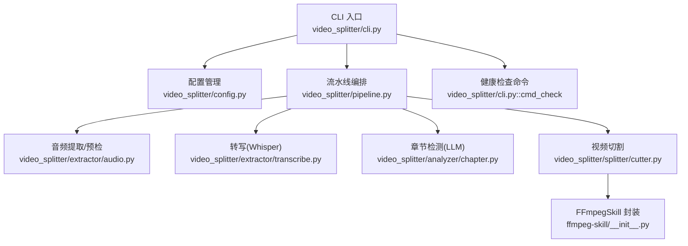
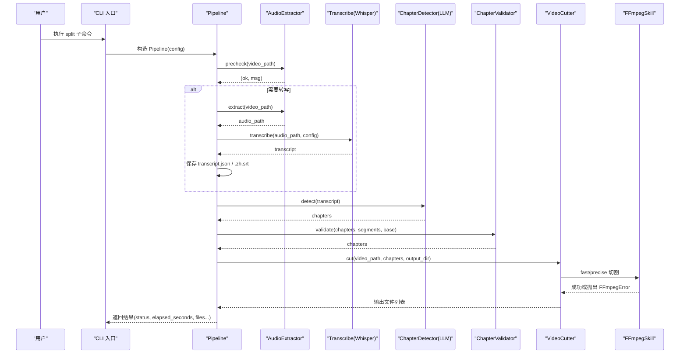
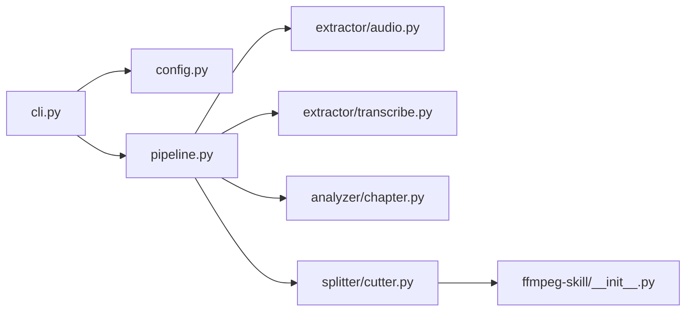

# 故障排查

<cite>
**本文引用的文件**   
- [README.md](file://README.md)
- [cli.py](file://video_splitter/cli.py)
- [config.py](file://video_splitter/config.py)
- [pipeline.py](file://video_splitter/pipeline.py)
- [audio.py](file://video_splitter/extractor/audio.py)
- [transcribe.py](file://video_splitter/extractor/transcribe.py)
- [chapter.py](file://video_splitter/analyzer/chapter.py)
- [cutter.py](file://video_splitter/splitter/cutter.py)
- [__init__.py](file://ffmpeg-skill/__init__.py)
- [ffmpeg_tool.py](file://ffmpeg-skill/ffmpeg_tool.py)
</cite>

## 目录
1. [简介](#简介)
2. [项目结构](#项目结构)
3. [核心组件](#核心组件)
4. [架构总览](#架构总览)
5. [详细组件分析](#详细组件分析)
6. [依赖关系分析](#依赖关系分析)
7. [性能注意事项](#性能注意事项)
8. [故障排查指南](#故障排查指南)
9. [结论](#结论)
10. [附录](#附录)

## 简介
本指南面向使用 VideoSplitter 的用户与运维人员，聚焦常见问题诊断、错误定位、调试模式启用、系统健康检查、错误代码含义与处理建议、社区支持与问题报告流程，以及性能瓶颈识别与优化建议。内容基于仓库源码实现进行梳理，确保可操作、可追溯。

## 项目结构
VideoSplitter 采用“命令行入口 + 流水线编排 + 模块化能力”的架构：
- CLI 层：提供 split、transcribe、cut、check、review、gui、batch 等子命令
- 配置层：统一从环境变量加载 SplitConfig
- 流水线层：Pipeline 编排预检、音频提取、转写、章节检测、校验、切割
- 模块层：音频提取、转写、章节检测（LLM）、视频切割、FFmpeg 封装

图表来源
- [cli.py:1-256](file://video_splitter/cli.py#L1-L256)
- [config.py:1-54](file://video_splitter/config.py#L1-L54)
- [pipeline.py:1-131](file://video_splitter/pipeline.py#L1-L131)
- [audio.py:1-171](file://video_splitter/extractor/audio.py#L1-L171)
- [transcribe.py:1-105](file://video_splitter/extractor/transcribe.py#L1-L105)
- [chapter.py:1-343](file://video_splitter/analyzer/chapter.py#L1-L343)
- [cutter.py:1-98](file://video_splitter/splitter/cutter.py#L1-L98)
- [__init__.py:1-673](file://ffmpeg-skill/__init__.py#L1-L673)

章节来源
- [README.md:1-50](file://README.md#L1-L50)
- [cli.py:1-256](file://video_splitter/cli.py#L1-L256)
- [config.py:1-54](file://video_splitter/config.py#L1-L54)
- [pipeline.py:1-131](file://video_splitter/pipeline.py#L1-L131)

## 核心组件
- CLI 入口：负责参数解析、子命令分发、结果输出与批处理
- 配置管理：通过环境变量覆盖默认行为（设备、模型、引擎、恢复模式等）
- 流水线编排：串联预检、转写、章节检测、校验、切割，并记录步骤与耗时
- 音频提取与预检：调用 ffprobe/ffmpeg/librosa 做质量评估与时长获取
- 转写：基于 faster-whisper 的语音转文本，支持进度回调
- 章节检测：LLM 驱动的主题切分，具备重试、JSON 修复与均匀分割回退
- 视频切割：fast/precise 两种模式，自动回退到精确编码
- FFmpegSkill：对 ffmpeg/ffprobe 的统一封装与错误类型定义

章节来源
- [cli.py:1-256](file://video_splitter/cli.py#L1-L256)
- [config.py:1-54](file://video_splitter/config.py#L1-L54)
- [pipeline.py:1-131](file://video_splitter/pipeline.py#L1-L131)
- [audio.py:1-171](file://video_splitter/extractor/audio.py#L1-L171)
- [transcribe.py:1-105](file://video_splitter/extractor/transcribe.py#L1-L105)
- [chapter.py:1-343](file://video_splitter/analyzer/chapter.py#L1-L343)
- [cutter.py:1-98](file://video_splitter/splitter/cutter.py#L1-L98)
- [__init__.py:1-673](file://ffmpeg-skill/__init__.py#L1-L673)

## 架构总览
下图展示一次完整“按主题分段”的流程及关键异常点。

图表来源
- [cli.py:15-46](file://video_splitter/cli.py#L15-L46)
- [pipeline.py:31-111](file://video_splitter/pipeline.py#L31-L111)
- [audio.py:26-171](file://video_splitter/extractor/audio.py#L26-L171)
- [transcribe.py:11-59](file://video_splitter/extractor/transcribe.py#L11-L59)
- [chapter.py:77-322](file://video_splitter/analyzer/chapter.py#L77-L322)
- [cutter.py:30-98](file://video_splitter/splitter/cutter.py#L30-L98)
- [__init__.py:95-142](file://ffmpeg-skill/__init__.py#L95-L142)

## 详细组件分析

### CLI 与命令
- split：支持 --max-duration、--model、--cut-mode、--resume、--dry-run
- transcribe：仅转写，输出 transcript.json
- cut：基于已有 chapters.json 直接切割
- check：环境与健康检查（FFmpeg、faster-whisper、json-repair、LLM API Key）
- review：交互式校对转录稿
- gui：启动 GUI
- batch：批量处理目录下所有 mp4

常见排错要点
- 未安装 PySide6 导致 gui 无法启动：会提示安装命令
- 缺少 LLM API Key：check 会告警；split 在章节检测阶段可能回退为均匀分割
- dry_run：不实际调用 LLM，仅估算 token 与费用

章节来源
- [cli.py:15-256](file://video_splitter/cli.py#L15-L256)

### 配置与环境变量
- OPENAI_API_BASE / WHALECLOUD_API_KEY / OPENAI_API_KEY：LLM 基地址与密钥
- VIDEO_SPLITTER_DEVICE：设备选择（auto/cpu/gpu）
- VIDEO_SPLITTER_RESUME：是否跳过已有中间文件
- VIDEO_SPLITTER_ENGINE：转写引擎名（如 funasr）

排错要点
- 若同时设置 OPENAI_API_KEY 与 WHALECLOUD_API_KEY，后者优先
- resume 为真时，若 transcript.json/.chapters.json 存在则跳过对应步骤

章节来源
- [config.py:19-54](file://video_splitter/config.py#L19-L54)

### 流水线 Pipeline
- 步骤：precheck → transcribe → chapter → validate → cut
- 状态字段：status、steps_completed、output_files、elapsed_seconds、error
- dry_run：仅估算 token 与费用，不调用 LLM

排错要点
- 任一环节抛异常都会将 status 置为 error，并记录 error 信息
- 可通过 steps_completed 判断失败发生在哪一步

章节来源
- [pipeline.py:21-131](file://video_splitter/pipeline.py#L21-L131)

### 音频提取与预检
- precheck：使用 ffprobe 获取时长，librosa 采样短时音频计算 RMS 与静音比例
- get_duration：通过 ffprobe 获取时长
- extract：调用 ffmpeg 提取 16kHz 单声道 WAV

排错要点
- librosa/numpy 缺失会跳过预检但继续运行
- 音频无声或静音比例过高会给出警告，ASR 准确率可能受影响
- ffprobe/ffmpeg 不可用时抛出运行时错误

章节来源
- [audio.py:26-171](file://video_splitter/extractor/audio.py#L26-L171)

### 转写（Whisper）
- 使用 faster-whisper，支持 vad_filter 与进度回调
- estimate_tokens：粗略估计 LLM token 数
- to_srt：生成 SRT 字幕

排错要点
- 模型大小、设备、计算精度由 SplitConfig 控制
- 长音频转写较慢，建议使用合理模型尺寸与设备

章节来源
- [transcribe.py:11-105](file://video_splitter/extractor/transcribe.py#L11-L105)

### 章节检测（LLM）
- 单次调用或滑动窗口分块（约15分钟，重叠2分钟）
- 重试机制与指数退避
- JSON 修复（json-repair），失败则回退为均匀分割
- 时间戳范围与起止合法性校验

排错要点
- openai 包未安装会抛出运行时错误
- 网络/鉴权失败会触发重试并最终回退均匀分割
- 超长转录需关注 token 预算与分块策略

章节来源
- [chapter.py:43-343](file://video_splitter/analyzer/chapter.py#L43-L343)

### 视频切割
- fast：流拷贝，速度快；若实际时长偏差超过容忍度则回退 precise
- precise：重新编码（libx264/aac），精度高但耗时较长
- 使用 FFmpegSkill 统一封装错误类型

排错要点
- fast 模式下可能出现关键帧对齐误差，自动回退 precise
- precise 失败会抛出 FFmpegError，需检查编码器与参数

章节来源
- [cutter.py:22-98](file://video_splitter/splitter/cutter.py#L22-L98)
- [__init__.py:95-142](file://ffmpeg-skill/__init__.py#L95-L142)

### FFmpegSkill 封装
- 统一封装 ffmpeg/ffprobe 调用，提供格式转换、裁剪、水印、合并、质量调整等
- 错误类型：FFmpegError；输入不存在：FileNotFoundError；参数非法：ValueError

排错要点
- _run_command 捕获超时与返回码，统一抛出 FFmpegError
- 工具脚本 ffmpeg-tool.py 对异常进行分类打印并返回退出码

章节来源
- [__init__.py:16-142](file://ffmpeg-skill/__init__.py#L16-L142)
- [ffmpeg_tool.py:226-283](file://ffmpeg-skill/ffmpeg_tool.py#L226-L283)

## 依赖关系分析

图表来源
- [cli.py:1-256](file://video_splitter/cli.py#L1-L256)
- [config.py:1-54](file://video_splitter/config.py#L1-L54)
- [pipeline.py:1-131](file://video_splitter/pipeline.py#L1-L131)
- [audio.py:1-171](file://video_splitter/extractor/audio.py#L1-L171)
- [transcribe.py:1-105](file://video_splitter/extractor/transcribe.py#L1-L105)
- [chapter.py:1-343](file://video_splitter/analyzer/chapter.py#L1-L343)
- [cutter.py:1-98](file://video_splitter/splitter/cutter.py#L1-L98)
- [__init__.py:1-673](file://ffmpeg-skill/__init__.py#L1-L673)

## 性能注意事项
- Whisper 模型尺寸与设备：tiny/base/small/medium/large-v3；CPU/GPU 差异显著
- compute_type：int8/float16/float32 影响速度与精度
- 章节检测分块：超长转录采用滑动窗口，注意重叠与去重开销
- 切割模式：fast 优先，必要时回退 precise；keyframe_tolerance 控制回退阈值
- 预检跳过：librosa 缺失时跳过音频质量预检，不影响主流程

[本节为通用指导，无需特定文件引用]

## 故障排查指南

### 一、安装与环境问题
- FFmpeg/ffprobe 未安装或不在 PATH
  - 现象：初始化 FFmpegSkill 或调用 ffprobe/ffmpeg 时报错
  - 处理：安装 FFmpeg 并确保可执行文件在 PATH；使用 check 命令验证
  - 参考：[__init__.py:73-93](file://ffmpeg-skill/__init__.py#L73-L93)、[cli.py:93-99](file://video_splitter/cli.py#L93-L99)
- Python 依赖缺失（librosa、numpy、faster-whisper、openai、json-repair、PySide6）
  - 现象：导入失败或功能不可用
  - 处理：按 README 安装依赖；GUI 缺失会提示安装命令
  - 参考：[README.md:34-45](file://README.md#L34-L45)、[cli.py:198-204](file://video_splitter/cli.py#L198-L204)
- LLM API Key 未配置
  - 现象：check 告警；章节检测最终回退为均匀分割
  - 处理：设置 OPENAI_API_KEY 或 WHALECLOUD_API_KEY，并可选 OPENAI_API_BASE
  - 参考：[config.py:42-46](file://video_splitter/config.py#L42-L46)、[cli.py:138-144](file://video_splitter/cli.py#L138-L144)

### 二、运行错误与快速定位
- 流水线整体失败
  - 查看返回结果中的 status 与 error 字段，结合 steps_completed 定位阶段
  - 参考：[pipeline.py:102-111](file://video_splitter/pipeline.py#L102-L111)
- 音频预检失败或警告
  - 无声/高静音比：ASR 效果差；检查麦克风/音轨
  - librosa 缺失：跳过预检，不影响后续
  - 参考：[audio.py:74-99](file://video_splitter/extractor/audio.py#L74-L99)
- 转写失败或极慢
  - 检查模型尺寸与设备；适当降低模型尺寸或使用 GPU
  - 参考：[transcribe.py:27-41](file://video_splitter/extractor/transcribe.py#L27-L41)
- 章节检测失败或回退
  - openai 未安装：抛出运行时错误
  - 网络/鉴权失败：触发重试后回退均匀分割
  - 参考：[chapter.py:217-241](file://video_splitter/analyzer/chapter.py#L217-L241)、[chapter.py:195-209](file://video_splitter/analyzer/chapter.py#L195-L209)
- 视频切割失败
  - fast 模式偏差过大自动回退 precise；precise 失败抛出 FFmpegError
  - 参考：[cutter.py:55-86](file://video_splitter/splitter/cutter.py#L55-L86)、[__init__.py:132-142](file://ffmpeg-skill/__init__.py#L132-L142)

### 三、调试模式与日志
- 启用详细日志
  - CLI 已配置 logging.basicConfig(level=logging.INFO)，可在控制台看到各阶段日志
  - 参考：[cli.py:11-12](file://video_splitter/cli.py#L11-L12)
- 断点调试
  - 建议在以下位置设置断点：
    - Pipeline.run 的各步骤前后
    - ChapterDetector._call_llm 与 _parse_response
    - VideoCutter._cut_fast/_cut_precise
  - 参考：[pipeline.py:31-111](file://video_splitter/pipeline.py#L31-L111)、[chapter.py:195-301](file://video_splitter/analyzer/chapter.py#L195-L301)、[cutter.py:55-86](file://video_splitter/splitter/cutter.py#L55-L86)
- 性能分析
  - 使用 time 统计 run/dry_run 耗时
  - 观察 whisper 转写与 LLM 调用耗时占比
  - 参考：[pipeline.py:32-110](file://video_splitter/pipeline.py#L32-L110)

### 四、系统健康检查
- 使用 check 命令
  - 检查 FFmpeg、faster-whisper、json-repair、LLM API Key
  - 内置 tiny/cpu 基准测试，估算 large-v3 CPU 每小时耗时
  - 参考：[cli.py:85-152](file://video_splitter/cli.py#L85-L152)
- 手动验证
  - ffprobe/ffmpeg 版本与可用性
  - 小段音频转写与章节检测连通性

### 五、错误代码与含义
- FFmpeg 相关
  - FFmpegError：命令执行失败、超时、参数错误等
  - FileNotFoundError：输入文件不存在
  - ValueError：参数非法（如 preset、CRF、时间参数）
  - 参考：[__init__.py:16-142](file://ffmpeg-skill/__init__.py#L16-L142)、[ffmpeg_tool.py:226-242](file://ffmpeg-skill/ffmpeg_tool.py#L226-L242)
- 流水线状态
  - status=success/error；error 字段包含异常消息
  - steps_completed 指示已完成步骤
  - 参考：[pipeline.py:40-111](file://video_splitter/pipeline.py#L40-L111)

### 六、常见问题与解决方案
- 无法找到 FFmpeg/ffprobe
  - 解决：安装 FFmpeg 并加入 PATH；使用 check 验证
  - 参考：[cli.py:93-99](file://video_splitter/cli.py#L93-L99)
- 音频无声或静音过多
  - 解决：检查音轨；必要时调整 ASR 静音过滤参数
  - 参考：[audio.py:74-99](file://video_splitter/extractor/audio.py#L74-L99)
- 章节划分不准确
  - 解决：增大 llm_token_budget 或开启分块；检查语言与 prompt 适配
  - 参考：[chapter.py:116-193](file://video_splitter/analyzer/chapter.py#L116-L193)
- 切割时间偏移
  - 解决：提高 keyframe_tolerance 或强制 precise 模式
  - 参考：[cutter.py:69-73](file://video_splitter/splitter/cutter.py#L69-L73)
- 批量任务部分失败
  - 解决：查看 batch 汇总与日志，定位失败视频与原因
  - 参考：[cli.py:165-196](file://video_splitter/cli.py#L165-L196)

### 七、社区支持与问题报告
- 提交问题前准备
  - 运行 check 并附上输出
  - 提供 split 的 steps_completed、elapsed_seconds、error
  - 提供 FFmpeg 版本、Python 环境、模型尺寸与设备
- 最小复现
  - 使用 dry_run 确认成本与 token 估算
  - 使用 transcribe 单独验证转写
  - 使用 cut 单独验证切割
- 参考
  - 安装与示例：[README.md:34-45](file://README.md#L34-L45)
  - CLI 帮助与子命令：[cli.py:207-256](file://video_splitter/cli.py#L207-L256)

### 八、性能瓶颈识别与优化
- 瓶颈定位
  - 观察 pipeline 各阶段耗时；重点看转写与 LLM 调用
  - 使用 dry_run 估算 token 与费用，避免超限多次调用
  - 参考：[pipeline.py:113-131](file://video_splitter/pipeline.py#L113-L131)
- 优化建议
  - 选择合适的 Whisper 模型尺寸与设备（GPU 优先）
  - 调整 compute_type 平衡速度与精度
  - 合理设置 max_segment_duration 与 keyframe_tolerance
  - 对超长视频启用分块检测并控制重叠
  - 批量任务串行处理，避免资源争用

[本节为通用指导，无需特定文件引用]

## 结论
通过 CLI 健康检查、流水线状态与日志、以及各环节的错误类型与回退策略，可以快速定位并解决安装、运行与性能相关问题。建议在生产环境中先以 dry_run 与 small 模型验证链路，再逐步提升模型规模与精度。

## 附录

### 常用命令速查
- 健康检查：video-splitter check
- 全文分割：video-splitter split <视频路径> [--max-duration] [--model] [--cut-mode] [--resume] [--dry-run]
- 仅转写：video-splitter transcribe <视频路径> [--model]
- 仅切割：video-splitter cut <视频路径> --chapters <chapters.json> [--cut-mode]
- 交互校对：video-splitter review <视频路径> [--transcript] [--resume] [--no-save]
- 启动 GUI：video-splitter gui
- 批量处理：video-splitter batch <目录> [--max-duration] [--resume]

章节来源
- [cli.py:207-256](file://video_splitter/cli.py#L207-L256)