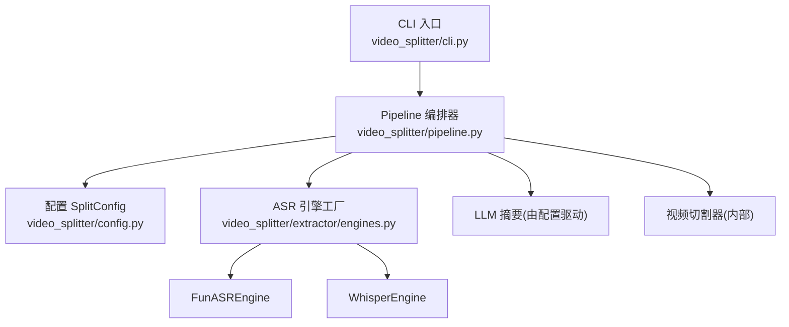
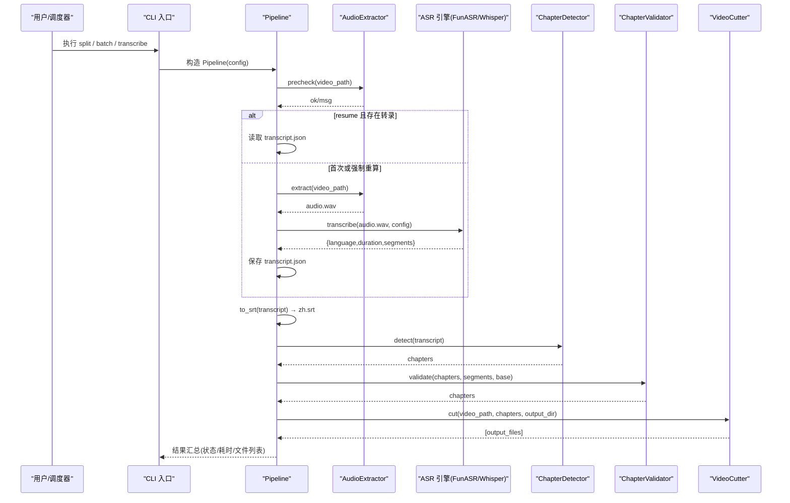
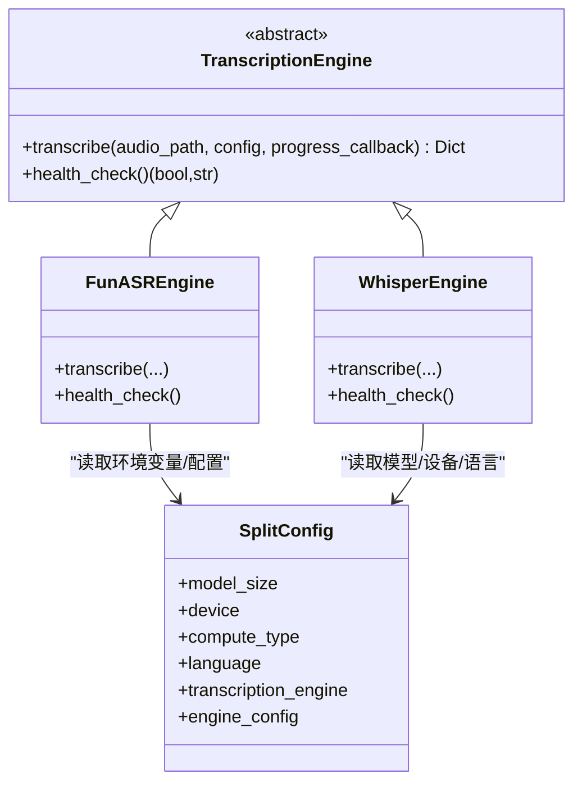
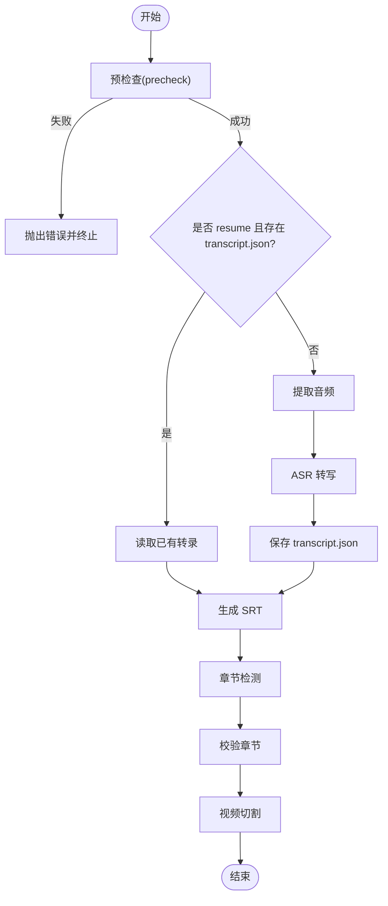
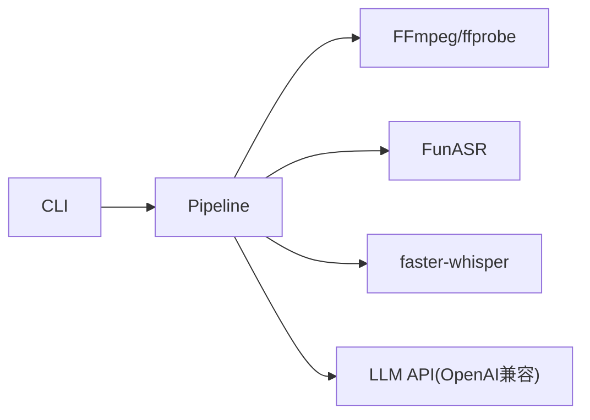

# 生产环境配置

<cite>
**本文引用的文件**   
- [README.md](file://README.md)
- [config.py](file://video_splitter/config.py)
- [cli.py](file://video_splitter/cli.py)
- [pipeline.py](file://video_splitter/pipeline.py)
- [engines.py](file://video_splitter/extractor/engines.py)
- [transcribe.py](file://video_splitter/extractor/transcribe.py)
</cite>

## 目录
1. [简介](#简介)
2. [项目结构](#项目结构)
3. [核心组件](#核心组件)
4. [架构总览](#架构总览)
5. [详细组件分析](#详细组件分析)
6. [依赖关系分析](#依赖关系分析)
7. [性能考虑](#性能考虑)
8. [故障排查指南](#故障排查指南)
9. [结论](#结论)
10. [附录：生产环境清单与最佳实践](#附录生产环境清单与最佳实践)

## 简介
本指南面向在生产环境中部署 VideoSplitter 的运维与平台工程师，聚焦系统要求、配置模板与最佳实践、安全加固、性能调优以及高可用与负载均衡方案。内容基于仓库中实际实现进行提炼，确保可落地、可验证。

## 项目结构
VideoSplitter 以命令行入口为统一接入点，通过 Pipeline 编排“预检查→音频提取→转写→章节检测→校验→切割”等步骤；ASR 引擎采用可插拔设计（FunASR 与 faster-whisper），LLM 调用由配置项驱动，日志使用 Python logging 模块。

图表来源
- [cli.py:1-256](file://video_splitter/cli.py#L1-L256)
- [pipeline.py:1-131](file://video_splitter/pipeline.py#L1-L131)
- [config.py:1-54](file://video_splitter/config.py#L1-L54)
- [engines.py:1-251](file://video_splitter/extractor/engines.py#L1-L251)

章节来源
- [README.md:1-50](file://README.md#L1-L50)
- [cli.py:1-256](file://video_splitter/cli.py#L1-L256)
- [pipeline.py:1-131](file://video_splitter/pipeline.py#L1-L131)
- [config.py:1-54](file://video_splitter/config.py#L1-L54)
- [engines.py:1-251](file://video_splitter/extractor/engines.py#L1-L251)

## 核心组件
- 配置中心 SplitConfig：集中管理模型大小、设备、计算类型、分段时长、LLM 相关参数、切分策略、语言、命名模板、断点续跑、ASR 引擎选择及引擎特定配置。支持从环境变量覆盖默认值。
- 流水线 Pipeline：负责端到端流程编排、中间产物落盘、错误处理与耗时统计。
- ASR 引擎：提供 FunASR 与 faster-whisper 两种实现，并通过工厂函数 create_engine 按名称创建。
- CLI：提供 split、transcribe、cut、check、review、batch、gui 等子命令，便于自动化与批处理。

章节来源
- [config.py:19-53](file://video_splitter/config.py#L19-L53)
- [pipeline.py:21-131](file://video_splitter/pipeline.py#L21-L131)
- [engines.py:17-251](file://video_splitter/extractor/engines.py#L17-L251)
- [cli.py:15-256](file://video_splitter/cli.py#L15-L256)

## 架构总览
下图展示生产环境下典型的数据流与控制流：CLI 接收参数并加载配置，Pipeline 协调各阶段，ASR 引擎完成语音转文本，随后进入章节检测与校验，最终输出切片与字幕。

图表来源
- [cli.py:15-46](file://video_splitter/cli.py#L15-L46)
- [pipeline.py:31-111](file://video_splitter/pipeline.py#L31-L111)
- [engines.py:85-152](file://video_splitter/extractor/engines.py#L85-L152)
- [transcribe.py:11-59](file://video_splitter/extractor/transcribe.py#L11-L59)

## 详细组件分析

### 配置与环境变量（SplitConfig）
- 关键配置项
  - 模型与设备：model_size、device、compute_type
  - 分段控制：max_segment_duration、min_segment_duration
  - LLM 相关：llm_api_base、llm_api_key、llm_model、llm_token_budget、llm_max_retries
  - 切分策略：cut_mode、keyframe_tolerance
  - 输出设置：language、naming_template、resume
  - ASR 引擎：transcription_engine、engine_config
- 环境变量覆盖
  - OPENAI_API_BASE → llm_api_base
  - OPENAI_API_KEY → llm_api_key（若同时设置 WHALECLOUD_API_KEY，则以后者为准）
  - VIDEO_SPLITTER_DEVICE → device
  - VIDEO_SPLITTER_RESUME → resume（接受 1/true/yes）
  - VIDEO_SPLITTER_ENGINE → transcription_engine
- 建议
  - 生产环境务必通过环境变量注入密钥，避免硬编码。
  - 将 llm_token_budget 与 llm_max_retries 结合业务成本与稳定性进行调优。

章节来源
- [config.py:19-53](file://video_splitter/config.py#L19-L53)
- [cli.py:139-144](file://video_splitter/cli.py#L139-L144)

### ASR 引擎与转写
- 引擎注册与工厂
  - 支持 funasr 与 whisper 两种引擎，create_engine(name) 根据名称返回对应实例。
- FunASR 引擎
  - 通过环境变量 VIDEO_SPLITTER_FUNASR_MODEL_DIR 指定本地模型目录，未设置时使用内置默认模型名。
  - 健康检查 health_check 会尝试加载模型并进行一次轻量推理。
- Whisper 引擎
  - 基于 faster-whisper，使用 SplitConfig 中的 model_size、device、compute_type、language 等参数。
  - 提供进度回调接口，便于监控。
- 转写工具
  - estimate_tokens 用于粗略估算 LLM token 用量，辅助 dry_run 成本预估。
  - to_srt 将转写结果转换为 SRT 字幕。

图表来源
- [engines.py:17-251](file://video_splitter/extractor/engines.py#L17-L251)
- [config.py:19-53](file://video_splitter/config.py#L19-L53)
- [transcribe.py:11-59](file://video_splitter/extractor/transcribe.py#L11-L59)

章节来源
- [engines.py:85-173](file://video_splitter/extractor/engines.py#L85-L173)
- [engines.py:175-220](file://video_splitter/extractor/engines.py#L175-L220)
- [transcribe.py:11-59](file://video_splitter/extractor/transcribe.py#L11-L59)

### 流水线与断点续跑
- 步骤顺序：precheck → extract → transcribe → 生成 SRT → chapter → validate → cut
- 断点续跑：当启用 resume 且中间产物存在时，跳过已完成的步骤，直接读取 transcript.json 与 chapters.json。
- 失败处理：捕获异常并将 status 标记为 error，记录错误信息，同时保留已生成的中间文件以便恢复。

图表来源
- [pipeline.py:31-111](file://video_splitter/pipeline.py#L31-L111)

章节来源
- [pipeline.py:31-111](file://video_splitter/pipeline.py#L31-L111)

### CLI 与批处理
- 常用命令
  - split：完整流水线（支持 --dry-run 估算成本）
  - transcribe：仅转写
  - cut：基于已有章节文件进行切割
  - check：依赖与健康检查（含 Whisper 基准测试）
  - review：交互式校对
  - batch：批量处理目录下 .mp4
- 日志级别
  - 默认 INFO，可通过标准 logging 机制调整。

章节来源
- [cli.py:15-256](file://video_splitter/cli.py#L15-L256)

## 依赖关系分析
- 外部依赖
  - FFmpeg/ffprobe：用于媒体信息与切割，需安装并确保 PATH 可达。
  - FunASR：中文 ASR 模型与推理库。
  - faster-whisper：可选 ASR 引擎。
  - json-repair：可选，用于修复 JSON。
- 运行时检查
  - CLI 的 check 子命令会探测 FFmpeg、faster-whisper、json-repair 可用性，并对 Whisper 做简单基准测试，给出 large-v3 CPU 耗时估算参考。

图表来源
- [cli.py:85-151](file://video_splitter/cli.py#L85-L151)
- [engines.py:14-14](file://video_splitter/extractor/engines.py#L14-L14)
- [transcribe.py:27-33](file://video_splitter/extractor/transcribe.py#L27-L33)

章节来源
- [cli.py:85-151](file://video_splitter/cli.py#L85-L151)
- [engines.py:14-14](file://video_splitter/extractor/engines.py#L14-L14)
- [transcribe.py:27-33](file://video_splitter/extractor/transcribe.py#L27-L33)

## 性能考虑
- 硬件与资源
  - CPU：Whisper large-v3 在 CPU 上耗时较长，check 子命令提供了 tiny/cpu 基准与 large-v3 估算方法，可用于容量规划。
  - 内存：FunASR 与 larger 模型加载需要较大内存，建议至少 16GB，推荐 32GB+。
  - 存储：中间产物包括 transcript.json、chapters.json、zh.srt 以及输出片段，需预留足够空间。
- 并发与批处理
  - 当前 batch 命令串行处理，适合中小规模任务；大规模场景建议在进程/容器层面并行化，并结合队列与限流。
- 缓存策略
  - 利用 resume 模式与中间文件落盘减少重复计算。
  - 对热门视频可持久化 transcript/chapters 到共享存储，供多实例复用。
- 资源限制
  - 通过环境变量控制 device 与 compute_type，CPU 环境建议使用 int8 以降低内存与提升吞吐。
  - 合理设置 llm_token_budget 与 llm_max_retries，避免大段文本导致 LLM 超时或费用激增。

章节来源
- [cli.py:101-128](file://video_splitter/cli.py#L101-L128)
- [config.py:21-30](file://video_splitter/config.py#L21-L30)
- [pipeline.py:54-86](file://video_splitter/pipeline.py#L54-L86)

## 故障排查指南
- 常见依赖问题
  - FFmpeg/ffprobe 未安装或不可用：check 子命令会报告缺失，请安装并确保 PATH。
  - FunASR 未安装或模型路径不正确：使用 engines.health_check 自检，确认模型目录与网络连通性。
  - faster-whisper 未安装：install 依赖后重试。
- LLM 连接问题
  - 检查 OPENAI_API_BASE 与 OPENAI_API_KEY/WHALECLOUD_API_KEY 是否正确。
  - 注意代理/防火墙导致的 SSL 握手失败与连接中断，必要时调整网络策略或使用稳定代理。
- 日志定位
  - 默认 INFO 级别，可在启动前设置 LOG_LEVEL 环境变量或通过 logging 配置调整至 DEBUG 以获取更详细信息。
  - 关注 Pipeline 的错误日志与状态字段，快速定位失败阶段。

章节来源
- [cli.py:85-151](file://video_splitter/cli.py#L85-L151)
- [engines.py:154-172](file://video_splitter/extractor/engines.py#L154-L172)
- [engines.py:207-219](file://video_splitter/extractor/engines.py#L207-L219)
- [cli.py:11](file://video_splitter/cli.py#L11)

## 结论
VideoSplitter 在生产环境的关键在于：稳定的依赖与模型准备、安全的密钥管理、合理的资源与并发策略、完善的日志与可观测性，以及通过断点续跑与中间产物缓存提升鲁棒性与效率。结合本文的配置模板与安全、性能、高可用建议，可实现稳定高效的视频智能切分服务。

## 附录：生产环境清单与最佳实践

### 系统要求（最小建议）
- CPU：4 核及以上（large-v3 在 CPU 上较慢，建议 8 核以上以提升吞吐）
- 内存：16 GB（FunASR/large 模型建议 32 GB+）
- 存储：SSD，预留 50 GB+（视视频量与片段数量而定）
- 网络：访问 LLM 代理/网关与 FunASR 模型仓库的稳定带宽

### 配置文件模板（环境变量）
以下为生产环境推荐的环境变量清单（键名与行为来自代码实现）：
- OPENAI_API_BASE：LLM 代理地址
- OPENAI_API_KEY：LLM 密钥（若同时设置 WHALECLOUD_API_KEY，后者优先）
- WHALECLOUD_API_KEY：企业云密钥（优先级高于 OPENAI_API_KEY）
- VIDEO_SPLITTER_DEVICE：设备选择（如 cpu/gpu/auto）
- VIDEO_SPLITTER_RESUME：是否启用断点续跑（1/true/yes）
- VIDEO_SPLITTER_ENGINE：ASR 引擎（funasr/whisper）
- VIDEO_SPLITTER_FUNASR_MODEL_DIR：FunASR 本地模型目录
- 其他 SplitConfig 字段可按需在应用层注入（如 llm_token_budget、llm_max_retries、cut_mode 等）

说明
- 所有敏感信息均通过环境变量注入，避免写入代码或版本库。
- 建议配合容器编排平台的 Secret 管理机制进行分发与轮换。

章节来源
- [config.py:26-53](file://video_splitter/config.py#L26-L53)
- [engines.py:109-110](file://video_splitter/extractor/engines.py#L109-L110)

### 安全配置
- 密钥管理
  - 使用平台级密钥管理服务（如 Vault、KMS、Secrets Manager）下发 OPENAI_API_KEY/WHALECLOUD_API_KEY。
  - 禁止将密钥写入镜像或配置文件；仅在运行时注入环境变量。
- 访问控制
  - 对外暴露面尽量最小化，仅开放必要端口；使用反向代理与鉴权中间件。
  - 对 LLM 代理地址进行白名单与证书校验，防止中间人攻击。
- 网络隔离
  - 将工作节点置于私有子网，仅允许出站访问 LLM 代理与模型仓库。
  - 使用内网镜像仓库缓存 FunASR 模型，避免公网下载带来的不稳定与合规风险。

### 性能调优参数
- ASR 引擎
  - FunASR：固定模型目录，预热模型以减少冷启动延迟。
  - Whisper：在 CPU 环境使用 compute_type=int8，降低内存占用并提高吞吐。
- LLM 调用
  - 合理设置 llm_token_budget 与 llm_max_retries，避免长文本一次性请求导致失败或费用飙升。
- 批处理与并发
  - 在进程/容器层面并行化 batch 任务，结合队列与限流保护下游服务。
  - 使用共享存储缓存 transcript/chapters，避免重复计算。

章节来源
- [transcribe.py:27-33](file://video_splitter/extractor/transcribe.py#L27-L33)
- [config.py:26-30](file://video_splitter/config.py#L26-L30)
- [cli.py:165-196](file://video_splitter/cli.py#L165-L196)

### 高可用与负载均衡
- 无状态服务化
  - 将 VideoSplitter 封装为无状态服务，输入输出通过对象存储或消息队列对接。
- 水平扩展
  - 多实例部署，结合负载均衡器分发任务；每个实例独立读取/写入共享存储。
- 弹性伸缩
  - 基于队列长度与资源利用率自动扩缩容，保障高峰期吞吐与低谷期成本。
- 容错与重试
  - 对 LLM 与 ASR 调用增加重试与退避策略；对失败任务进入死信队列人工介入。
- 数据一致性
  - 使用幂等键（如视频指纹或文件名）避免重复处理；中间产物原子写入与校验。

[本节为概念性指导，不直接分析具体源码文件]
