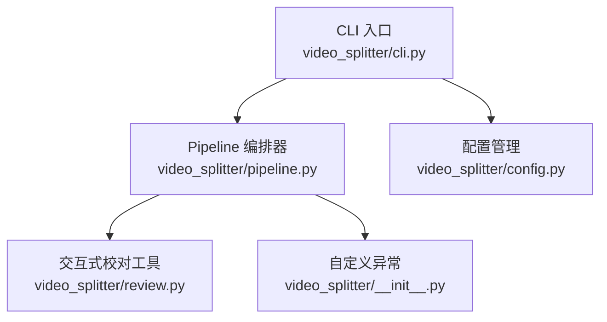
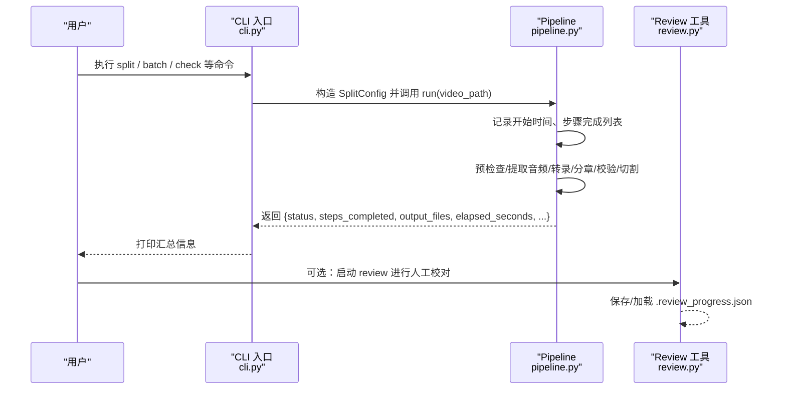
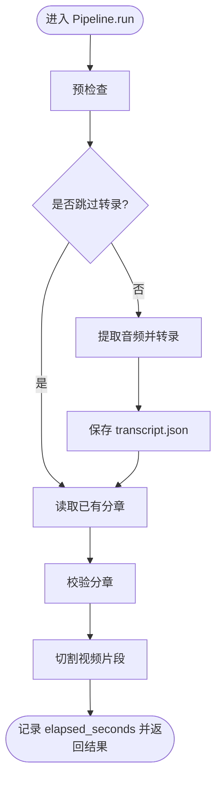
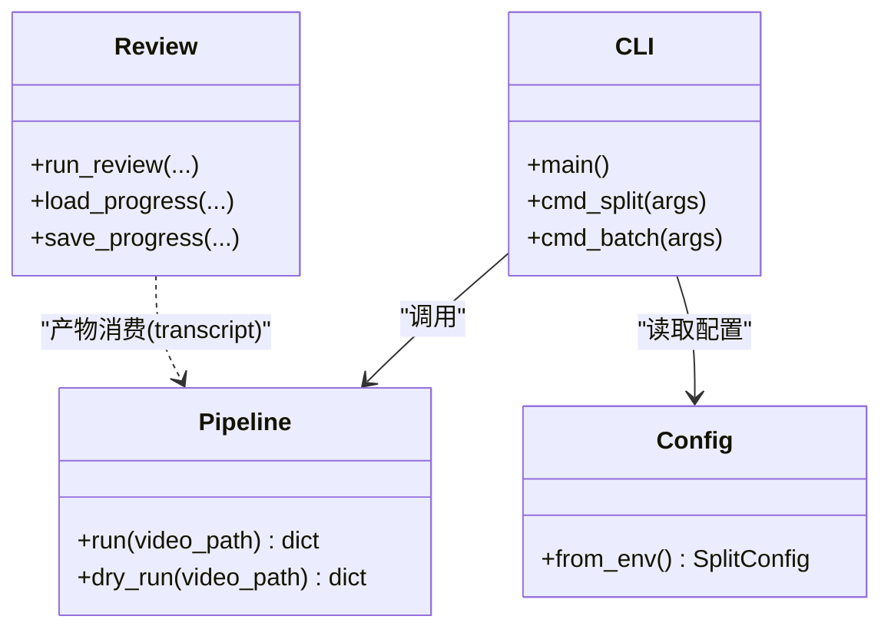

# 监控与日志

<cite>
**本文引用的文件**   
- [video_splitter/cli.py](file://video_splitter/cli.py)
- [video_splitter/pipeline.py](file://video_splitter/pipeline.py)
- [video_splitter/config.py](file://video_splitter/config.py)
- [video_splitter/review.py](file://video_splitter/review.py)
- [video_splitter/__init__.py](file://video_splitter/__init__.py)
</cite>

## 目录
1. [简介](#简介)
2. [项目结构](#项目结构)
3. [核心组件](#核心组件)
4. [架构总览](#架构总览)
5. [详细组件分析](#详细组件分析)
6. [依赖关系分析](#依赖关系分析)
7. [性能考量](#性能考量)
8. [故障排查指南](#故障排查指南)
9. [结论](#结论)
10. [附录](#附录)

## 简介
本文件为 VideoSplitter 的“监控与日志”专项文档，聚焦以下目标：
- 说明内置日志系统的配置与使用方式（级别、输出格式、扩展点）
- 提供关键指标的监控方案（处理进度、错误率、性能指标等）
- 给出集成外部监控系统（Prometheus、Grafana 等）的建议路径
- 解释分布式追踪的实现思路（请求链路跟踪与性能分析）
- 提供告警规则配置与通知机制建议
- 包含日志分析与故障诊断的工具与方法

当前仓库已实现基础日志能力与部分可观测性数据（如耗时、步骤完成状态），但尚未内置 Prometheus/Grafana/分布式追踪的直接集成。本文在现有代码基础上，给出最小改动即可落地的实践方案。

## 项目结构
与监控和日志相关的核心位置如下：
- CLI 入口负责初始化全局日志并驱动 Pipeline
- Pipeline 编排各阶段，记录关键节点与耗时
- Review 工具维护交互式校对进度，便于定位问题
- 配置模块提供运行参数与环境变量覆盖

图表来源
- [video_splitter/cli.py:1-20](file://video_splitter/cli.py#L1-L20)
- [video_splitter/pipeline.py:1-30](file://video_splitter/pipeline.py#L1-L30)
- [video_splitter/review.py:1-20](file://video_splitter/review.py#L1-L20)
- [video_splitter/config.py:1-20](file://video_splitter/config.py#L1-L20)
- [video_splitter/__init__.py:1-6](file://video_splitter/__init__.py#L1-L6)

章节来源
- [video_splitter/cli.py:1-20](file://video_splitter/cli.py#L1-L20)
- [video_splitter/pipeline.py:1-30](file://video_splitter/pipeline.py#L1-L30)
- [video_splitter/review.py:1-20](file://video_splitter/review.py#L1-L20)
- [video_splitter/config.py:1-20](file://video_splitter/config.py#L1-L20)
- [video_splitter/__init__.py:1-6](file://video_splitter/__init__.py#L1-L6)

## 核心组件
- 日志系统
  - CLI 层通过标准库 logging 进行全局初始化，设置默认级别与输出格式
  - 各模块通过 getLogger(__name__) 获取子 logger，便于按模块过滤
  - 当前未启用文件轮转；可通过 Handler 替换或添加 RotatingFileHandler 实现
- 关键指标
  - 处理时长：Pipeline.run 在 finally 中计算 elapsed_seconds
  - 步骤完成状态：result.steps_completed 记录 precheck/transcribe/chapter/validate/cut
  - 错误信息：异常捕获后写入 result.error 并记录 error 级别日志
- 交互式校对进度
  - review.py 维护 .review_progress.json，支持中断恢复与修改计数，便于回溯与统计

章节来源
- [video_splitter/cli.py:10-13](file://video_splitter/cli.py#L10-L13)
- [video_splitter/pipeline.py:31-111](file://video_splitter/pipeline.py#L31-L111)
- [video_splitter/review.py:101-149](file://video_splitter/review.py#L101-L149)

## 架构总览
下图展示从 CLI 到 Pipeline 的关键流程与日志埋点位置，以及结果返回结构中的可观测字段。

图表来源
- [video_splitter/cli.py:15-46](file://video_splitter/cli.py#L15-L46)
- [video_splitter/pipeline.py:31-111](file://video_splitter/pipeline.py#L31-L111)
- [video_splitter/review.py:201-347](file://video_splitter/review.py#L201-L347)

## 详细组件分析

### 内置日志系统：配置与使用
- 全局初始化
  - CLI 层使用 basicConfig 设置默认级别与输出格式，便于快速上手
- 模块级 Logger
  - 各模块通过 getLogger(__name__) 获取命名空间 logger，可按模块筛选
- 日志级别
  - 当前默认 INFO；可在 CLI 层调整 level 以适配不同场景（DEBUG/INFO/WARNING/ERROR）
- 输出格式
  - 默认包含时间戳与级别；如需结构化输出（JSON），可替换 Formatter 或使用第三方库
- 文件轮转
  - 当前未启用；推荐在 CLI 层增加 RotatingFileHandler 或 TimedRotatingFileHandler，将日志持久化并按大小/时间切分
- 最佳实践
  - 避免在热路径频繁记录 DEBUG 日志
  - 对关键事件（开始/结束/失败）统一使用 info/error 级别，便于检索
  - 敏感信息（密钥、路径）不要直接入日志

章节来源
- [video_splitter/cli.py:10-13](file://video_splitter/cli.py#L10-L13)
- [video_splitter/pipeline.py:18](file://video_splitter/pipeline.py#L18)
- [video_splitter/review.py:13](file://video_splitter/review.py#L13)

### 关键指标与埋点现状
- 处理时长
  - Pipeline.run 在 finally 块中计算 elapsed_seconds，作为整体耗时指标
- 步骤完成状态
  - result.steps_completed 记录每个阶段的完成情况，可用于成功率与阶段耗时分析
- 错误信息
  - 异常被捕获后写入 result.error，并以 error 级别记录日志
- 交互式校对进度
  - review.py 维护 .review_progress.json，包含 current_index、total、modified_count，便于统计修改量与断点续校

图表来源
- [video_splitter/pipeline.py:31-111](file://video_splitter/pipeline.py#L31-L111)

章节来源
- [video_splitter/pipeline.py:31-111](file://video_splitter/pipeline.py#L31-L111)
- [video_splitter/review.py:101-149](file://video_splitter/review.py#L101-L149)

### 集成外部监控系统（Prometheus/Grafana）
- 指标采集建议
  - 在 Pipeline.run 中暴露以下指标：
    - 计数器：成功次数、失败次数、各阶段完成次数
    - 直方图/计时器：各阶段耗时、总体耗时
    - 标签：video_name、engine、cut_mode、model_size 等
  - 在 CLI 层或独立服务中注册 HTTP 端点，供 Prometheus 抓取
- 可视化
  - 在 Grafana 中创建仪表盘，展示：
    - 任务成功率、失败原因分布
    - 各阶段耗时分位（p50/p95/p99）
    - 批量处理的吞吐与错误率
- 变更范围
  - 仅需在 Pipeline 与 CLI 层增加少量指标上报逻辑，不影响既有流程

[本节为概念性指导，不直接分析具体文件]

### 分布式追踪（请求链路跟踪与性能分析）
- 设计要点
  - 为每次处理生成唯一 trace_id，贯穿 CLI → Pipeline → 各子阶段
  - 在每个阶段开始/结束记录 span，附带标签（阶段名、耗时、错误码）
  - 将 trace/span 导出至后端（如 OpenTelemetry Collector + Jaeger/Zipkin）
- 落地建议
  - 在 CLI 入口处创建根 span，传入 Pipeline
  - Pipeline 在各阶段创建子 span，并在异常时记录错误属性
  - 若需跨进程（FFmpeg/ASR 引擎），通过环境变量传递 trace_id

[本节为概念性指导，不直接分析具体文件]

### 告警规则与通知机制
- 建议告警项
  - 任务失败率超过阈值（如 5 分钟内 > 10%）
  - 平均耗时显著上升（相对基线超 2x）
  - 某阶段失败占比异常（如 validate 失败突增）
- 通知渠道
  - 邮件/企业微信/钉钉/Slack 等
- 实施路径
  - 基于 Prometheus 告警规则 + Alertmanager 推送
  - 或在日志侧基于关键字（ERROR/Exception）触发告警

[本节为概念性指导，不直接分析具体文件]

### 交互式校对工具的观测价值
- 用途
  - 通过 .review_progress.json 了解校对进度、修改数量，辅助定位 ASR 质量瓶颈
- 建议
  - 定期汇总 modified_count，结合分段时长与文本长度做质量评估
  - 在校对完成后清理进度文件，避免污染后续批处理

章节来源
- [video_splitter/review.py:101-149](file://video_splitter/review.py#L101-L149)
- [video_splitter/review.py:201-347](file://video_splitter/review.py#L201-L347)

## 依赖关系分析
- 组件耦合
  - CLI 依赖 Pipeline 与配置；Pipeline 依赖多个子模块（音频、转录、分章、校验、切割）
  - Review 工具独立于 Pipeline，仅依赖 transcript JSON 与文件系统
- 潜在风险
  - 若 Pipeline 内部异常未被正确记录，将影响上层统计与告警
  - 缺少文件轮转可能导致日志体积膨胀

图表来源
- [video_splitter/cli.py:207-256](file://video_splitter/cli.py#L207-L256)
- [video_splitter/pipeline.py:21-131](file://video_splitter/pipeline.py#L21-L131)
- [video_splitter/config.py:19-53](file://video_splitter/config.py#L19-L53)
- [video_splitter/review.py:201-347](file://video_splitter/review.py#L201-L347)

章节来源
- [video_splitter/cli.py:207-256](file://video_splitter/cli.py#L207-L256)
- [video_splitter/pipeline.py:21-131](file://video_splitter/pipeline.py#L21-L131)
- [video_splitter/config.py:19-53](file://video_splitter/config.py#L19-L53)
- [video_splitter/review.py:201-347](file://video_splitter/review.py#L201-L347)

## 性能考量
- 日志开销
  - 避免在高频循环中记录过多日志；必要时采用采样或聚合
- 指标上报
  - 使用异步或缓冲方式上报指标，降低对主流程的影响
- 文件 I/O
  - 校对进度与中间产物写入应尽量避免阻塞主流程；必要时使用临时文件+原子替换

[本节为通用指导，不直接分析具体文件]

## 故障排查指南
- 常见问题定位
  - 查看 Pipeline 返回的 status 与 error 字段，确认失败阶段
  - 根据 steps_completed 判断已完成步骤，缩小排查范围
  - 使用 review 工具加载 transcript，核对分段与时间轴
- 日志检索
  - 在 CLI 层调整日志级别为 DEBUG，复现问题并收集上下文
  - 若启用文件输出，结合 grep/awk 等工具检索 ERROR/Exception 关键字
- 进度恢复
  - 若校对中断，.review_progress.json 会保留当前位置，重新运行即可续校

章节来源
- [video_splitter/pipeline.py:102-111](file://video_splitter/pipeline.py#L102-L111)
- [video_splitter/review.py:101-149](file://video_splitter/review.py#L101-L149)

## 结论
- 当前仓库已具备基础的日志与可观测性能力：统一的日志初始化、关键阶段记录、整体耗时与步骤状态返回、交互式校对进度文件
- 建议在 CLI 层增强日志持久化与轮转，在 Pipeline 层补充结构化指标上报，以便对接 Prometheus/Grafana 与告警系统
- 引入分布式追踪可进一步提升复杂链路的问题定位效率

[本节为总结性内容，不直接分析具体文件]

## 附录
- 建议的最小改动清单
  - 在 CLI 层增加 RotatingFileHandler，按天或按大小轮转
  - 在 Pipeline.run 中增加指标上报（成功/失败计数、阶段耗时直方图）
  - 在 CLI 入口处创建 trace_id，并透传到 Pipeline 与各阶段
  - 在 Review 工具中增加阶段性统计输出（如每 N 段记录一次进度）

[本节为建议性内容，不直接分析具体文件]
