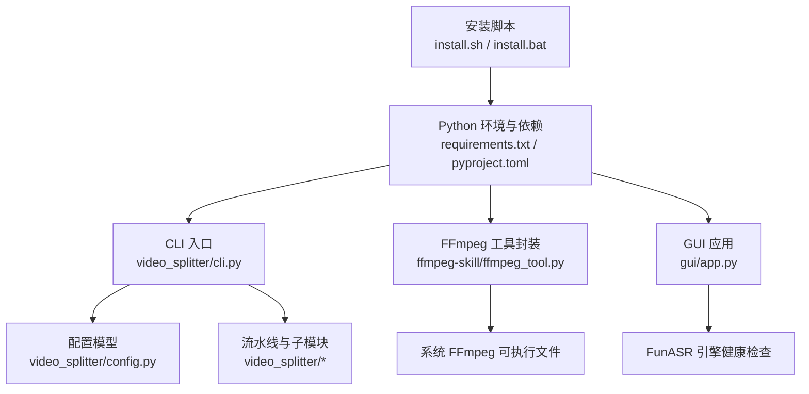
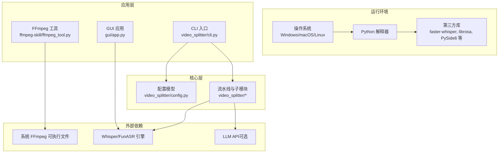
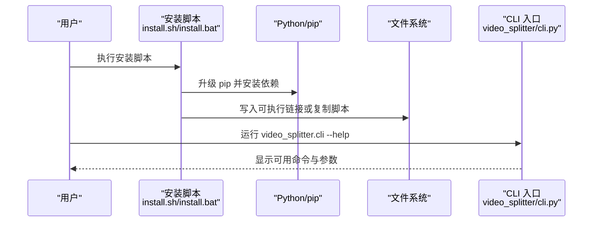
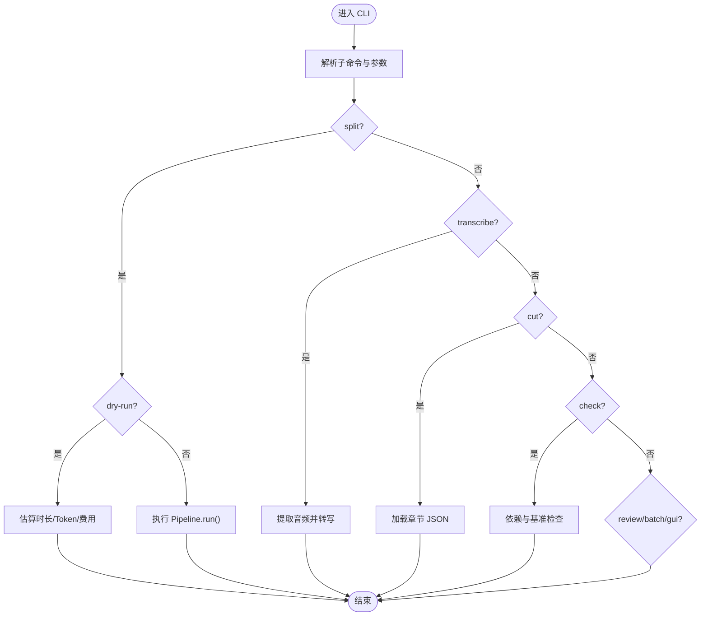
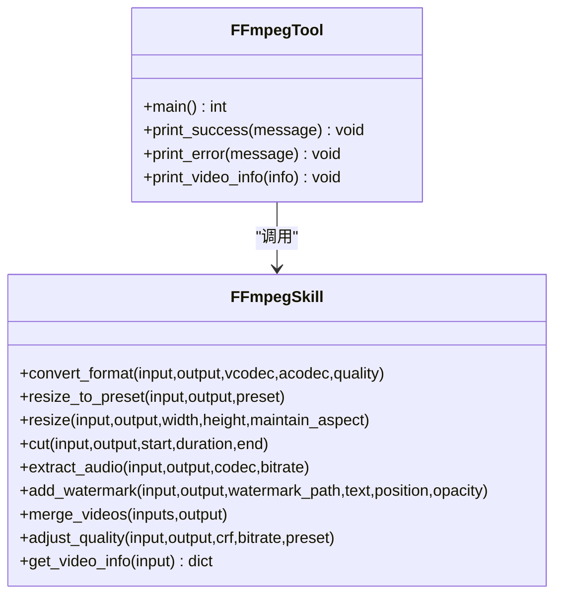
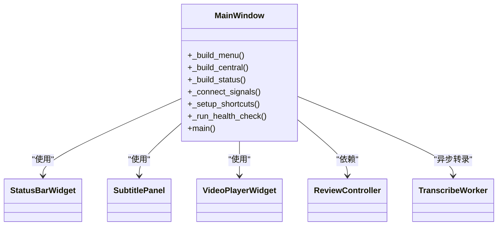
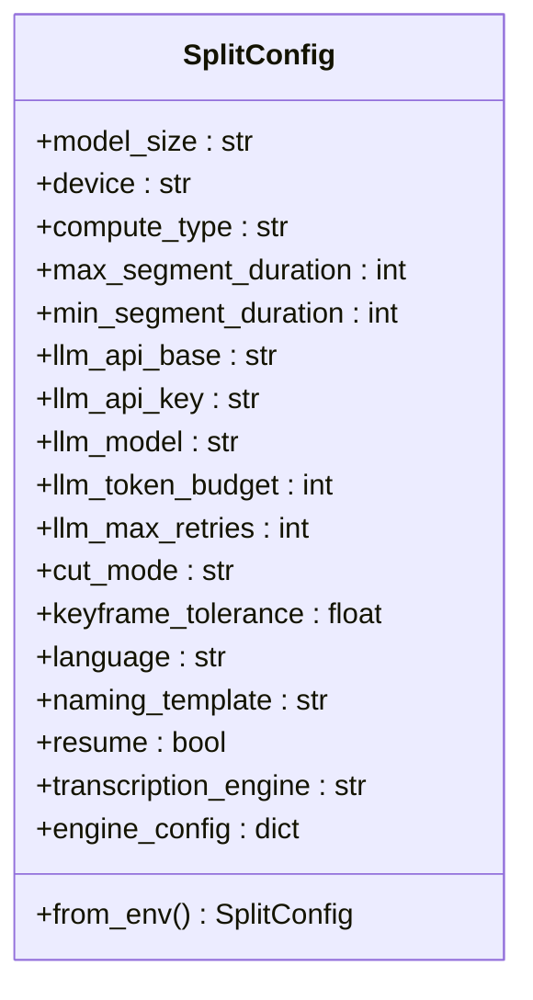
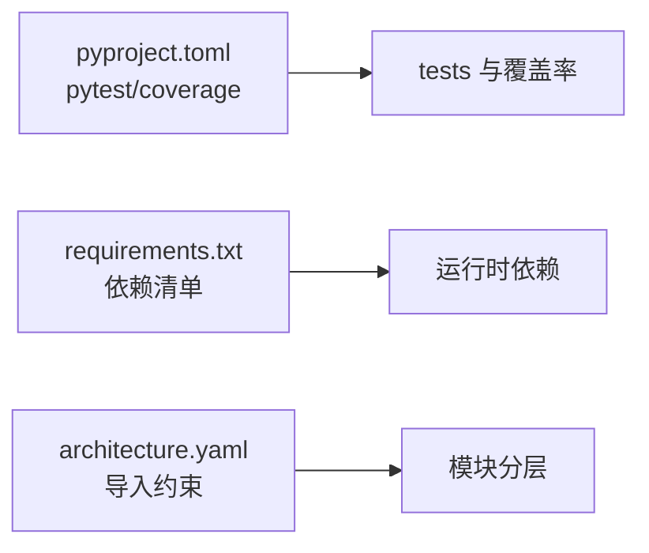

# 部署与运维

<cite>
**本文引用的文件**
- [README.md](file://README.md)
- [pyproject.toml](file://pyproject.toml)
- [requirements.txt](file://requirements.txt)
- [install.sh](file://install.sh)
- [install.bat](file://install.bat)
- [architecture.yaml](file://architecture.yaml)
- [video_splitter/config.py](file://video_splitter/config.py)
- [video_splitter/cli.py](file://video_splitter/cli.py)
- [ffmpeg-skill/ffmpeg_tool.py](file://ffmpeg-skill/ffmpeg_tool.py)
- [gui/app.py](file://gui/app.py)
- [video_splitter/split.bat](file://video_splitter/split.bat)
- [video_splitter/vsplit.bat](file://video_splitter/vsplit.bat)
</cite>

## 目录
1. [简介](#简介)
2. [项目结构](#项目结构)
3. [核心组件](#核心组件)
4. [架构总览](#架构总览)
5. [详细组件分析](#详细组件分析)
6. [依赖分析](#依赖分析)
7. [性能考虑](#性能考虑)
8. [故障排查指南](#故障排查指南)
9. [结论](#结论)
10. [附录](#附录)

## 简介
本指南面向部署与运维人员，提供跨平台（Windows、macOS、Linux）的安装与部署方法，容器化部署建议，生产环境配置优化与安全设置，日志收集、监控告警与故障排查流程，性能调优与资源管理建议，备份恢复与灾难恢复策略，版本升级与回滚操作，以及常见问题诊断与解决方案。

## 项目结构
仓库包含以下与部署运维密切相关的部分：
- 安装脚本：跨平台一键安装与环境检查
- CLI 入口：视频分割、转写、批量处理、交互式审查等命令
- FFmpeg 工具封装：独立命令行工具 ffmpeg-tool
- GUI 应用：字幕审查界面（可选）
- 配置模型：环境变量驱动的运行时配置
- 构建与测试：pytest 配置与覆盖率要求
- 架构约束：模块导入限制

**图表来源**
- [install.sh:1-152](file://install.sh#L1-L152)
- [install.bat:1-81](file://install.bat#L1-L81)
- [requirements.txt:1-26](file://requirements.txt#L1-L26)
- [pyproject.toml:1-28](file://pyproject.toml#L1-L28)
- [video_splitter/cli.py:1-256](file://video_splitter/cli.py#L1-L256)
- [ffmpeg-skill/ffmpeg_tool.py:1-283](file://ffmpeg-skill/ffmpeg_tool.py#L1-L283)
- [gui/app.py:1-268](file://gui/app.py#L1-L268)
- [video_splitter/config.py:1-54](file://video_splitter/config.py#L1-L54)

**章节来源**
- [README.md:1-50](file://README.md#L1-L50)
- [pyproject.toml:1-28](file://pyproject.toml#L1-L28)
- [requirements.txt:1-26](file://requirements.txt#L1-L26)
- [install.sh:1-152](file://install.sh#L1-L152)
- [install.bat:1-81](file://install.bat#L1-L81)
- [architecture.yaml:1-11](file://architecture.yaml#L1-L11)

## 核心组件
- 安装脚本
  - Linux/macOS：install.sh 检测 Python 与 FFmpeg，安装基础依赖，创建可执行链接并提示 PATH 更新。
  - Windows：install.bat 检测 Python 与 FFmpeg，安装依赖，复制工具脚本并提供批处理快捷方式。
- CLI 入口
  - 提供 split、transcribe、cut、check、review、batch、gui 等子命令；支持 dry-run、resume、cut-mode 等参数。
  - check 子命令用于依赖校验与简单基准测试。
- FFmpeg 工具封装
  - ffmpeg-tool 提供 convert、resize、cut、extract-audio、watermark、merge、quality、info 等命令。
- GUI 应用
  - 基于 PySide6 的字幕审查界面，集成 FunASR 引擎健康检查与转录工作线程。
- 配置模型
  - SplitConfig 通过环境变量覆盖默认值，如设备、LLM API、语言、命名模板、切分模式等。

**章节来源**
- [install.sh:1-152](file://install.sh#L1-L152)
- [install.bat:1-81](file://install.bat#L1-L81)
- [video_splitter/cli.py:1-256](file://video_splitter/cli.py#L1-L256)
- [ffmpeg-skill/ffmpeg_tool.py:1-283](file://ffmpeg-skill/ffmpeg_tool.py#L1-L283)
- [gui/app.py:1-268](file://gui/app.py#L1-L268)
- [video_splitter/config.py:1-54](file://video_splitter/config.py#L1-L54)

## 架构总览
系统由“安装与运行层”、“CLI/GUI 交互层”、“核心处理层”和“外部依赖层”组成。CLI 与 GUI 均依赖配置模型与外部工具（FFmpeg、Whisper/FunASR）。

**图表来源**
- [video_splitter/cli.py:1-256](file://video_splitter/cli.py#L1-L256)
- [ffmpeg-skill/ffmpeg_tool.py:1-283](file://ffmpeg-skill/ffmpeg_tool.py#L1-L283)
- [gui/app.py:1-268](file://gui/app.py#L1-L268)
- [video_splitter/config.py:1-54](file://video_splitter/config.py#L1-L54)
- [requirements.txt:1-26](file://requirements.txt#L1-L26)

## 详细组件分析

### 安装与启动流程（跨平台）
- Linux/macOS
  - 运行 install.sh，自动检测 Python 与 FFmpeg，安装 numpy/tqdm，创建 ~/.local/bin/ffmpeg-tool 软链接，必要时提示更新 PATH。
- Windows
  - 运行 install.bat，自动检测 Python 与 FFmpeg，安装依赖，复制工具脚本到用户本地目录，生成 ffmpeg-tool.bat 快捷方式。
- 通用验证
  - 使用 CLI 的 check 子命令进行依赖与性能基线检查。

**图表来源**
- [install.sh:1-152](file://install.sh#L1-L152)
- [install.bat:1-81](file://install.bat#L1-L81)
- [video_splitter/cli.py:1-256](file://video_splitter/cli.py#L1-L256)

**章节来源**
- [install.sh:1-152](file://install.sh#L1-L152)
- [install.bat:1-81](file://install.bat#L1-L81)
- [video_splitter/cli.py:1-256](file://video_splitter/cli.py#L1-L256)

### CLI 命令与工作流
- split：完整流水线（转写→分段→切割），支持 dry-run 估算成本与 token 用量。
- transcribe：仅音频转写，输出 transcript.json。
- cut：基于已有章节文件进行精确切割。
- check：依赖检查与 Whisper tiny/cpu 基准测试。
- review：交互式字幕审查。
- batch：批量处理目录下 .mp4 文件。
- gui：启动 GUI 应用。

**图表来源**
- [video_splitter/cli.py:1-256](file://video_splitter/cli.py#L1-L256)

**章节来源**
- [video_splitter/cli.py:1-256](file://video_splitter/cli.py#L1-L256)

### FFmpeg 工具封装（ffmpeg-tool）
- 提供格式转换、分辨率调整、片段截取、音频提取、水印、合并、质量调整、信息查看等命令。
- 错误处理涵盖 FFmpegError、文件不存在、参数无效、中断等情况。

**图表来源**
- [ffmpeg-skill/ffmpeg_tool.py:1-283](file://ffmpeg-skill/ffmpeg_tool.py#L1-L283)

**章节来源**
- [ffmpeg-skill/ffmpeg_tool.py:1-283](file://ffmpeg-skill/ffmpeg_tool.py#L1-L283)

### GUI 应用（字幕审查）
- 主窗口包含菜单、视频播放器、审查面板与状态栏。
- 集成 FunASR 引擎健康检查，异步转录工作线程，快捷键与保存逻辑。

**图表来源**
- [gui/app.py:1-268](file://gui/app.py#L1-L268)

**章节来源**
- [gui/app.py:1-268](file://gui/app.py#L1-L268)

### 配置模型与环境变量
- SplitConfig 提供默认值并通过 from_env 读取环境变量覆盖：
  - OPENAI_API_BASE、OPENAI_API_KEY、WHALECLOUD_API_KEY
  - VIDEO_SPLITTER_DEVICE、VIDEO_SPLITTER_RESUME、VIDEO_SPLITTER_ENGINE
- 其他字段包括模型大小、计算类型、分段时长、LLM 预算与重试、切分模式、语言、命名模板等。

**图表来源**
- [video_splitter/config.py:1-54](file://video_splitter/config.py#L1-L54)

**章节来源**
- [video_splitter/config.py:1-54](file://video_splitter/config.py#L1-L54)

## 依赖分析
- 构建与测试
  - pytest 配置在 pyproject.toml，指定测试路径与标记（slow、integration）。
  - 覆盖率统计范围包含 video_splitter 与 gui，排除测试文件。
- 外部依赖
  - requirements.txt 列出核心与可选依赖，包括 faster-whisper、json-repair、pydantic、librosa、soundfile、openai、PySide6、funasr、torch 等。
- 架构约束
  - architecture.yaml 限制模块导入关系，确保分层清晰。

**图表来源**
- [pyproject.toml:1-28](file://pyproject.toml#L1-L28)
- [requirements.txt:1-26](file://requirements.txt#L1-L26)
- [architecture.yaml:1-11](file://architecture.yaml#L1-L11)

**章节来源**
- [pyproject.toml:1-28](file://pyproject.toml#L1-L28)
- [requirements.txt:1-26](file://requirements.txt#L1-L26)
- [architecture.yaml:1-11](file://architecture.yaml#L1-L11)

## 性能考虑
- 依赖与基准
  - 使用 CLI 的 check 子命令对 FFmpeg、faster-whisper 可用性进行检查，并进行 tiny/cpu 基准测试，估算 large-v3 CPU 耗时。
- 模型与设备
  - 通过环境变量 VIDEO_SPLITTER_DEVICE 控制推理设备；compute_type 可设为 auto/int8 以平衡精度与速度。
- 分段与切分
  - max_segment_duration/min_segment_duration 影响转写与切分粒度；cut_mode 选择 fast/precise 权衡速度与精度。
- 批处理
  - batch 命令顺序处理多个视频，便于离线任务编排与资源隔离。

**章节来源**
- [video_splitter/cli.py:85-152](file://video_splitter/cli.py#L85-L152)
- [video_splitter/config.py:19-54](file://video_splitter/config.py#L19-L54)

## 故障排查指南
- 常见环境问题
  - Python 版本不兼容：install.sh/install.bat 会检测并提示安装 Python 3.8+。
  - FFmpeg 未安装或未加入 PATH：安装脚本会给出各平台安装指引；CLI 的 check 子命令也会报告缺失。
  - 依赖缺失：pip 安装失败时根据报错安装对应包（如 json-repair、PySide6）。
- 运行时问题
  - LLM API 未配置：check 子命令会警告缺少 API Key；可通过 OPENAI_API_KEY/WHALECLOUD_API_KEY 设置。
  - FunASR 引擎不可用：GUI 启动时会进行健康检查并弹出提示。
- 日志与调试
  - CLI 使用 logging 输出 INFO 级别日志，便于定位问题。
  - 使用 dry-run 估算成本与 Token 用量，避免不必要的 LLM 调用。
  - 使用 resume 跳过已完成的中间步骤，提升重跑效率。

**章节来源**
- [install.sh:1-152](file://install.sh#L1-L152)
- [install.bat:1-81](file://install.bat#L1-L81)
- [video_splitter/cli.py:1-256](file://video_splitter/cli.py#L1-L256)
- [gui/app.py:143-156](file://gui/app.py#L143-L156)

## 结论
本项目提供了跨平台的安装脚本、完善的 CLI/GUI 工具链、可配置的运行环境与清晰的依赖管理。通过 check 子命令与健康检查机制，能够快速定位环境问题与依赖缺失。在生产环境中，建议结合环境变量集中管理配置，启用 dry-run 与 resume 提升稳定性与效率，并使用批处理与外部调度系统进行资源管理与容错。

## 附录

### 平台安装与部署要点
- Windows
  - 运行 install.bat，确保 Python 与 FFmpeg 已安装且 FFmpeg 在 PATH 中。
  - 使用生成的 ffmpeg-tool.bat 快速访问工具。
  - 如需直接运行 CLI，可使用 video_splitter/split.bat 或 video_splitter/vsplit.bat。
- macOS/Linux
  - 运行 install.sh，按提示更新 PATH 后使用 ffmpeg-tool。
  - 若需 GUI，请安装 PySide6 相关依赖。

**章节来源**
- [install.bat:1-81](file://install.bat#L1-L81)
- [install.sh:1-152](file://install.sh#L1-L152)
- [video_splitter/split.bat:1-11](file://video_splitter/split.bat#L1-L11)
- [video_splitter/vsplit.bat:1-10](file://video_splitter/vsplit.bat#L1-L10)

### 容器化部署建议
- 基础镜像
  - 选择包含 Python 与系统包的镜像（例如 Ubuntu/Debian），预装 FFmpeg。
- 依赖安装
  - 将 requirements.txt 复制到镜像内，使用 pip 安装依赖。
- 环境变量
  - 通过容器环境变量注入 OPENAI_API_BASE、OPENAI_API_KEY、WHALECLOUD_API_KEY、VIDEO_SPLITTER_DEVICE、VIDEO_SPLITTER_RESUME、VIDEO_SPLITTER_ENGINE 等。
- 进程管理
  - 使用 systemd 或容器编排工具（Docker/Kubernetes）管理 CLI 任务与 GUI 服务（如需）。
- 资源限制
  - 为推理任务分配合理 CPU/内存配额，避免 OOM。
- 数据卷
  - 挂载输入/输出目录，持久化 transcript.json、segments 与 SRT 文件。

[本节为概念性指导，无需代码来源]

### 生产环境配置优化与安全设置
- 配置管理
  - 统一通过环境变量注入敏感信息（API Key），避免硬编码。
  - 使用 SplitConfig.from_env 读取配置，保持行为一致。
- 安全
  - 最小权限原则：运行账户仅具备必要读写权限。
  - 网络访问控制：限制对外部 LLM API 的访问白名单。
- 可靠性
  - 启用 resume 与 dry-run，减少重复计算与意外开销。
  - 使用 batch 与外部调度实现任务队列与重试。

**章节来源**
- [video_splitter/config.py:39-54](file://video_splitter/config.py#L39-L54)
- [video_splitter/cli.py:15-46](file://video_splitter/cli.py#L15-L46)

### 日志收集、监控告警与故障排查
- 日志
  - CLI 使用标准 logging，INFO 级别输出时间戳与消息，便于接入集中式日志系统。
- 监控
  - 记录关键指标：任务开始/结束时间、分段数量、耗时、错误码。
  - 对 LLM 调用次数与费用进行估算与上报（dry-run 结果）。
- 告警
  - 当 check 子命令检测到依赖缺失或引擎不可用时触发告警。
- 排查
  - 使用 check 子命令进行自检；逐步缩小问题范围至 FFmpeg、Whisper/FunASR、LLM API。

**章节来源**
- [video_splitter/cli.py:11-12](file://video_splitter/cli.py#L11-L12)
- [video_splitter/cli.py:85-152](file://video_splitter/cli.py#L85-L152)

### 性能调优与资源管理
- 模型与设备
  - 根据硬件选择 device 与 compute_type；CPU 环境下优先 int8 以降低内存占用。
- 分段策略
  - 调整 max_segment_duration 与 min_segment_duration 以平衡转写质量与速度。
- 批处理与并发
  - 使用 batch 串行处理，避免资源争用；在高配机器上可并行多实例。
- 存储与 IO
  - 使用高速磁盘存放临时音频与中间文件，减少 IO 瓶颈。

**章节来源**
- [video_splitter/config.py:19-54](file://video_splitter/config.py#L19-L54)
- [video_splitter/cli.py:165-196](file://video_splitter/cli.py#L165-L196)

### 备份恢复与灾难恢复策略
- 数据备份
  - 定期备份 transcript.json、chapters.json、segments 目录与 SRT 文件。
- 恢复流程
  - 从备份恢复数据后，使用 resume 模式重新运行 pipeline，跳过已完成步骤。
- 灾难恢复
  - 保留历史版本的环境变量与配置文件；在异常情况下回滚到上一稳定版本。

[本节为概念性指导，无需代码来源]

### 版本升级与回滚操作流程
- 升级
  - 更新 requirements.txt 与 pyproject.toml，重新安装依赖。
  - 使用 CLI 的 check 子命令验证新环境。
- 回滚
  - 恢复旧版依赖与配置文件；使用 resume 模式继续未完成的任务。
- 兼容性
  - 注意 Python 版本与依赖版本约束（>=3.12 在 pyproject.toml 中声明）。

**章节来源**
- [pyproject.toml:1-28](file://pyproject.toml#L1-L28)
- [requirements.txt:1-26](file://requirements.txt#L1-L26)
- [video_splitter/cli.py:15-46](file://video_splitter/cli.py#L15-L46)

### 常见问题诊断与解决方案
- FFmpeg 未找到
  - 确认 PATH 中包含 FFmpeg bin 目录；使用 install.sh/install.bat 提供的指引安装。
- Python 版本不兼容
  - 安装 Python 3.8+（推荐满足 pyproject.toml 要求的版本）。
- 依赖缺失
  - 根据报错安装对应包（如 json-repair、PySide6、funasr、torch）。
- LLM API 未配置
  - 设置 OPENAI_API_KEY 或 WHALECLOUD_API_KEY；检查 OPENAI_API_BASE。
- FunASR 引擎不可用
  - GUI 启动时会进行健康检查并提示；检查依赖与模型下载情况。

**章节来源**
- [install.sh:51-76](file://install.sh#L51-L76)
- [install.bat:22-35](file://install.bat#L22-L35)
- [video_splitter/cli.py:85-152](file://video_splitter/cli.py#L85-L152)
- [gui/app.py:143-156](file://gui/app.py#L143-L156)
