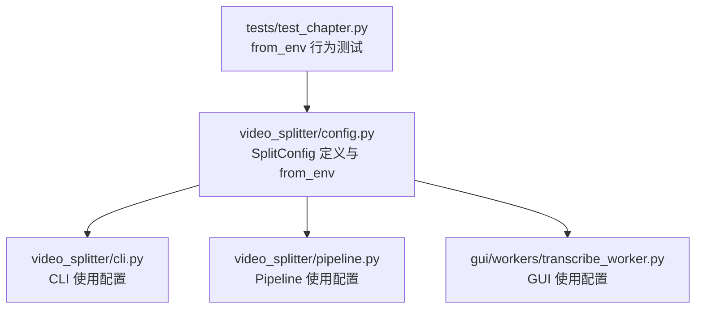
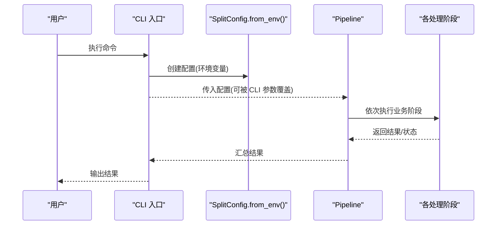
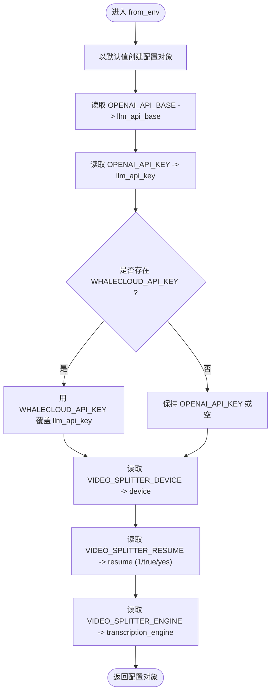
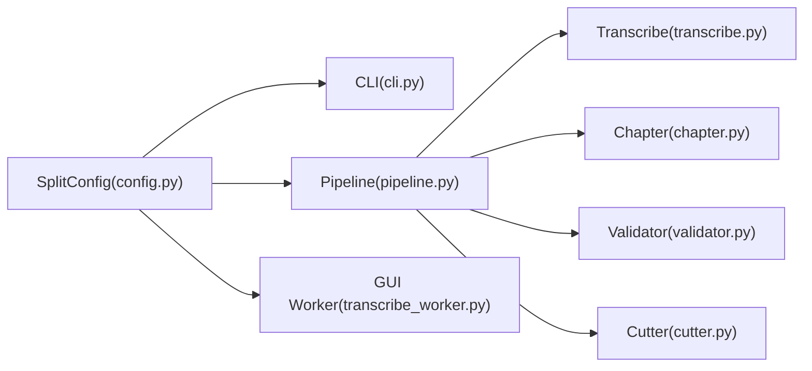

# 配置管理

<cite>
**本文引用的文件**   
- [video_splitter/config.py](file://video_splitter/config.py)
- [video_splitter/cli.py](file://video_splitter/cli.py)
- [video_splitter/pipeline.py](file://video_splitter/pipeline.py)
- [video_splitter/extractor/transcribe.py](file://video_splitter/extractor/transcribe.py)
- [video_splitter/analyzer/chapter.py](file://video_splitter/analyzer/chapter.py)
- [video_splitter/analyzer/validator.py](file://video_splitter/analyzer/validator.py)
- [video_splitter/splitter/cutter.py](file://video_splitter/splitter/cutter.py)
- [gui/workers/transcribe_worker.py](file://gui/workers/transcribe_worker.py)
- [tests/test_chapter.py](file://tests/test_chapter.py)
</cite>

## 目录
1. [简介](#简介)
2. [项目结构](#项目结构)
3. [核心组件](#核心组件)
4. [架构总览](#架构总览)
5. [详细组件分析](#详细组件分析)
6. [依赖关系分析](#依赖关系分析)
7. [性能与扩展性考虑](#性能与扩展性考虑)
8. [故障排查指南](#故障排查指南)
9. [结论](#结论)
10. [附录](#附录)

## 简介
本技术文档聚焦于视频分割项目的配置管理系统，围绕 SplitConfig 配置类的设计与实现进行系统性说明。内容涵盖：
- 配置项定义、默认值与环境变量覆盖机制
- 配置优先级与继承策略（代码默认 → 环境变量 → CLI 参数）
- 配置验证与错误处理现状
- 不同部署环境的示例配置建议
- 配置文件版本管理与迁移注意事项
- 配置热重载与动态调整的实现方案建议

## 项目结构
配置相关的关键位置与职责如下：
- video_splitter/config.py：SplitConfig 数据类定义与 from_env 环境加载
- video_splitter/cli.py：CLI 入口，基于 SplitConfig.from_env() 构建配置并允许命令行覆盖
- video_splitter/pipeline.py：流程编排器，接收 SplitConfig 驱动各阶段
- gui/workers/transcribe_worker.py：GUI 工作线程中直接使用 SplitConfig
- tests/test_chapter.py：对 SplitConfig.from_env() 的行为进行断言式测试

图表来源
- [video_splitter/config.py:19-53](file://video_splitter/config.py#L19-L53)
- [video_splitter/cli.py:15-23](file://video_splitter/cli.py#L15-L23)
- [video_splitter/pipeline.py:24-29](file://video_splitter/pipeline.py#L24-L29)
- [gui/workers/transcribe_worker.py:8](file://gui/workers/transcribe_worker.py#L8)
- [tests/test_chapter.py:312-347](file://tests/test_chapter.py#L312-L347)

章节来源
- [video_splitter/config.py:1-54](file://video_splitter/config.py#L1-L54)
- [video_splitter/cli.py:1-256](file://video_splitter/cli.py#L1-L256)
- [video_splitter/pipeline.py:1-131](file://video_splitter/pipeline.py#L1-L131)
- [gui/workers/transcribe_worker.py:8](file://gui/workers/transcribe_worker.py#L8)
- [tests/test_chapter.py:312-347](file://tests/test_chapter.py#L312-L347)

## 核心组件
- SplitConfig 数据类
  - 字段分组与用途
    - Whisper 模型与设备：model_size, device, compute_type
    - 分段时长边界：max_segment_duration, min_segment_duration
    - LLM 摘要设置：llm_api_base, llm_api_key, llm_model, llm_token_budget, llm_max_retries
    - 切割策略：cut_mode, keyframe_tolerance
    - 输出设置：language, naming_template, resume
    - ASR 引擎：transcription_engine, engine_config
  - 从环境变量加载：from_env 方法
    - OPENAI_API_BASE → llm_api_base
    - OPENAI_API_KEY → llm_api_key（若存在 WHALECLOUD_API_KEY 则覆盖）
    - VIDEO_SPLITTER_DEVICE → device
    - VIDEO_SPLITTER_RESUME → resume（支持 "1"/"true"/"yes"）
    - VIDEO_SPLITTER_ENGINE → transcription_engine

- CLI 集成
  - 通过 SplitConfig.from_env() 初始化后，再根据命令行参数覆盖部分字段（如 max_segment_duration、resume、model_size、cut_mode）

- Pipeline 集成
  - Pipeline 构造时接受可选的 SplitConfig；未提供则调用 SplitConfig.from_env() 获取配置
  - 后续各阶段（音频提取、转写、章节检测、校验、切割）均读取该配置实例

章节来源
- [video_splitter/config.py:19-53](file://video_splitter/config.py#L19-L53)
- [video_splitter/cli.py:15-23](file://video_splitter/cli.py#L15-L23)
- [video_splitter/pipeline.py:24-29](file://video_splitter/pipeline.py#L24-L29)

## 架构总览
配置在系统中的流转路径如下：
- 启动入口（CLI/GUI）→ 创建 SplitConfig（from_env）→ 传入 Pipeline/组件 → 运行

图表来源
- [video_splitter/cli.py:15-23](file://video_splitter/cli.py#L15-L23)
- [video_splitter/pipeline.py:24-29](file://video_splitter/pipeline.py#L24-L29)

## 详细组件分析

### SplitConfig 设计与实现
- 设计要点
  - 使用 dataclass 声明强类型字段与默认值，便于序列化与单元测试
  - from_env 仅做“最小必要”的环境变量解析，避免引入复杂外部依赖
  - 保留 engine_config 作为引擎特定配置的扩展点

- 关键方法与行为
  - from_env：按优先级合并环境变量到默认配置
    - OPENAI_API_BASE 覆盖 llm_api_base
    - OPENAI_API_KEY 覆盖 llm_api_key；WHALECLOUD_API_KEY 进一步覆盖
    - VIDEO_SPLITTER_DEVICE 覆盖 device
    - VIDEO_SPLITTER_RESUME 以布尔化方式覆盖 resume
    - VIDEO_SPLITTER_ENGINE 覆盖 transcription_engine

图表来源
- [video_splitter/config.py:39-53](file://video_splitter/config.py#L39-L53)

章节来源
- [video_splitter/config.py:19-53](file://video_splitter/config.py#L19-L53)

### CLI 与配置优先级
- 优先级顺序（从高到低）
  1) CLI 参数（如 --max-duration、--model、--cut-mode、--resume）
  2) 环境变量（OPENAI_API_BASE、OPENAI_API_KEY、WHALECLOUD_API_KEY、VIDEO_SPLITTER_DEVICE、VIDEO_SPLITTER_RESUME、VIDEO_SPLITTER_ENGINE）
  3) 代码默认值（dataclass 字段默认值）

- 典型覆盖场景
  - 在 from_env 之后，CLI 将覆盖 max_segment_duration、resume、model_size、cut_mode 等字段
  - 注意：CLI 不会覆盖 llm_* 系列字段，这些应通过环境变量控制

章节来源
- [video_splitter/cli.py:15-23](file://video_splitter/cli.py#L15-L23)

### Pipeline 中的配置使用
- Pipeline 构造时若未显式传入 SplitConfig，则自动调用 SplitConfig.from_env()
- 后续阶段（音频提取、转写、章节检测、校验、切割）均使用该配置实例

章节来源
- [video_splitter/pipeline.py:24-29](file://video_splitter/pipeline.py#L24-L29)

### GUI 中的配置使用
- GUI 工作线程直接导入并使用 SplitConfig，用于转录任务

章节来源
- [gui/workers/transcribe_worker.py:8](file://gui/workers/transcribe_worker.py#L8)

### 配置验证与默认值策略
- 当前实现
  - 未在 SplitConfig 层集中进行字段校验
  - 默认值由 dataclass 字段提供
  - 运行时校验分散在各组件内部（例如切分策略、引擎选择等）
- 建议增强
  - 在 from_env 后增加统一校验逻辑（范围检查、枚举值检查、必填项检查）
  - 为非法输入抛出明确的异常并提供修复提示
  - 将校验逻辑与日志记录结合，便于问题定位

章节来源
- [video_splitter/config.py:19-53](file://video_splitter/config.py#L19-L53)
- [video_splitter/pipeline.py:102-106](file://video_splitter/pipeline.py#L102-L106)

### 配置项清单与说明
- Whisper 模型与设备
  - model_size：Whisper 模型大小（如 tiny/base/small/medium/large-v3）
  - device：计算设备（auto/cpu/gpu），可通过 VIDEO_SPLITTER_DEVICE 覆盖
  - compute_type：计算精度（auto/int8 等）
- 分段时长边界
  - max_segment_duration：最大分段时长（秒）
  - min_segment_duration：最小区间长度（秒）
- LLM 摘要设置
  - llm_api_base：LLM API 基地址，可由 OPENAI_API_BASE 覆盖
  - llm_api_key：LLM API 密钥，可由 OPENAI_API_KEY 或 WHALECLOUD_API_KEY 覆盖
  - llm_model：LLM 模型名称
  - llm_token_budget：单次 LLM 调用的 token 预算
  - llm_max_retries：LLM 调用重试次数
- 切割策略
  - cut_mode：快速或精确模式（fast/precise）
  - keyframe_tolerance：关键帧容差（秒）
- 输出设置
  - language：语言（默认 zh）
  - naming_template：输出命名模板
  - resume：是否启用断点续跑
- ASR 引擎
  - transcription_engine：ASR 引擎名（如 funasr），可由 VIDEO_SPLITTER_ENGINE 覆盖
  - engine_config：引擎特定配置字典（如 model_name、device 等）

章节来源
- [video_splitter/config.py:20-37](file://video_splitter/config.py#L20-L37)

### 环境变量与映射关系
- OPENAI_API_BASE → llm_api_base
- OPENAI_API_KEY → llm_api_key
- WHALECLOUD_API_KEY → llm_api_key（覆盖 OPENAI_API_KEY）
- VIDEO_SPLITTER_DEVICE → device
- VIDEO_SPLITTER_RESUME → resume（支持 "1"/"true"/"yes"）
- VIDEO_SPLITTER_ENGINE → transcription_engine

章节来源
- [video_splitter/config.py:39-53](file://video_splitter/config.py#L39-L53)

### 配置优先级与继承机制
- 继承链
  - 代码默认值 ← 环境变量 ← CLI 参数
- 覆盖规则
  - CLI 参数仅在对应字段上生效（如 max_segment_duration、resume、model_size、cut_mode）
  - 其余字段（尤其是 llm_*）需通过环境变量控制

章节来源
- [video_splitter/cli.py:15-23](file://video_splitter/cli.py#L15-L23)

### 不同部署环境的配置示例
以下为常见环境的配置建议（以环境变量为主，CLI 按需覆盖）：
- 开发环境
  - 目标：快速迭代、低资源占用
  - 建议：
    - VIDEO_SPLITTER_DEVICE=cpu
    - VIDEO_SPLITTER_ENGINE=funasr
    - llm_token_budget 适当降低
    - resume=false
- 测试环境
  - 目标：稳定回归、可重复
  - 建议：
    - 固定 model_size、engine_config
    - 开启 resume=true 以便断点续跑
    - 明确 llm_api_base、llm_api_key
- 生产环境
  - 目标：高可用、高性能
  - 建议：
    - device=gpu（若可用）
    - cut_mode=precise（质量优先）
    - llm_max_retries 合理提升
    - 严格校验 llm_api_key 与 llm_api_base

[本节为概念性指导，不直接分析具体文件]

### 配置文件版本管理与迁移指南
- 现状
  - 当前未实现 YAML/JSON/TOML 等配置文件加载
  - 所有配置来源于代码默认值与环境变量
- 建议
  - 引入配置文件格式（如 JSON/YAML），并在 from_env 基础上增加 from_file 方法
  - 建立配置版本字段（如 config_version），在升级时进行兼容性检查与迁移
  - 提供迁移脚本，将旧版配置键映射至新版字段
  - 在 CI 中加入配置校验步骤，确保新配置符合 schema

[本节为概念性指导，不直接分析具体文件]

### 配置热重载与动态调整方案
- 现状
  - 当前无运行时热重载机制
- 建议方案
  - 进程内热重载
    - 新增 reload() 方法，监听文件或系统信号，重新加载配置并更新全局配置单例
    - 对正在运行的 Pipeline 实例，采用“惰性更新”策略：下一批任务前刷新配置
  - 进程外热重载
    - 通过消息队列或本地服务暴露配置变更接口，触发子进程重启或配置注入
  - 安全与一致性
    - 原子替换配置引用，避免并发读写不一致
    - 对关键配置（如 llm_api_key）变更进行审计与告警

[本节为概念性指导，不直接分析具体文件]

## 依赖关系分析
- 模块耦合
  - CLI 与 Pipeline 均依赖 SplitConfig
  - GUI 工作线程也依赖 SplitConfig
  - 各业务阶段（transcribe、chapter、validator、cutter）通过配置影响行为

图表来源
- [video_splitter/config.py:19-53](file://video_splitter/config.py#L19-L53)
- [video_splitter/cli.py:15-23](file://video_splitter/cli.py#L15-L23)
- [video_splitter/pipeline.py:24-29](file://video_splitter/pipeline.py#L24-L29)
- [video_splitter/extractor/transcribe.py:7](file://video_splitter/extractor/transcribe.py#L7)
- [video_splitter/analyzer/chapter.py:1](file://video_splitter/analyzer/chapter.py#L1)
- [video_splitter/analyzer/validator.py:1](file://video_splitter/analyzer/validator.py#L1)
- [video_splitter/splitter/cutter.py:1](file://video_splitter/splitter/cutter.py#L1)
- [gui/workers/transcribe_worker.py:8](file://gui/workers/transcribe_worker.py#L8)

章节来源
- [video_splitter/config.py:19-53](file://video_splitter/config.py#L19-L53)
- [video_splitter/cli.py:15-23](file://video_splitter/cli.py#L15-L23)
- [video_splitter/pipeline.py:24-29](file://video_splitter/pipeline.py#L24-L29)
- [video_splitter/extractor/transcribe.py:7](file://video_splitter/extractor/transcribe.py#L7)
- [video_splitter/analyzer/chapter.py:1](file://video_splitter/analyzer/chapter.py#L1)
- [video_splitter/analyzer/validator.py:1](file://video_splitter/analyzer/validator.py#L1)
- [video_splitter/splitter/cutter.py:1](file://video_splitter/splitter/cutter.py#L1)
- [gui/workers/transcribe_worker.py:8](file://gui/workers/transcribe_worker.py#L8)

## 性能与扩展性考虑
- 配置对性能的影响
  - device/compute_type 直接影响推理速度
  - llm_token_budget 决定 LLM 调用批次与成本
  - cut_mode/keyframe_tolerance 影响切割耗时与质量
- 扩展点
  - engine_config 为未来接入更多 ASR 引擎预留空间
  - 建议在 from_env 后增加配置校验与日志，便于监控与排障

[本节为通用指导，不直接分析具体文件]

## 故障排查指南
- 常见问题
  - LLM API Key 未配置或为空：检查 OPENAI_API_KEY 或 WHALECLOUD_API_KEY
  - 设备不可用：确认 VIDEO_SPLITTER_DEVICE 设置与实际硬件一致
  - 断点续跑未生效：确认 VIDEO_SPLITTER_RESUME 取值是否为 "1"/"true"/"yes"
  - 引擎切换无效：确认 VIDEO_SPLITTER_ENGINE 是否正确设置
- 定位手段
  - 查看 CLI 输出与日志
  - 使用 dry-run 估算成本与 token 数，辅助判断配置合理性
  - 在 Pipeline 捕获的错误信息中查找根因

章节来源
- [video_splitter/cli.py:139-151](file://video_splitter/cli.py#L139-L151)
- [video_splitter/pipeline.py:102-106](file://video_splitter/pipeline.py#L102-L106)

## 结论
- SplitConfig 提供了清晰、可扩展的配置抽象，并通过 from_env 实现了轻量化的环境变量覆盖
- CLI 与 Pipeline 的组合形成了“默认值 → 环境变量 → 命令行”的明确优先级链
- 当前缺少统一的配置校验与配置文件加载能力，建议逐步完善以提升健壮性与可维护性
- 针对多环境部署，建议通过环境变量集中管理敏感信息与差异化配置，并结合 CI 校验保障一致性

[本节为总结性内容，不直接分析具体文件]

## 附录

### 单元测试参考
- 对 from_env 的行为进行了断言式测试，覆盖默认值、resume 布尔化、引擎切换、API Key 覆盖、设备覆盖等场景

章节来源
- [tests/test_chapter.py:312-347](file://tests/test_chapter.py#L312-L347)
