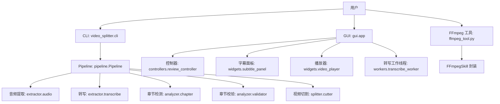
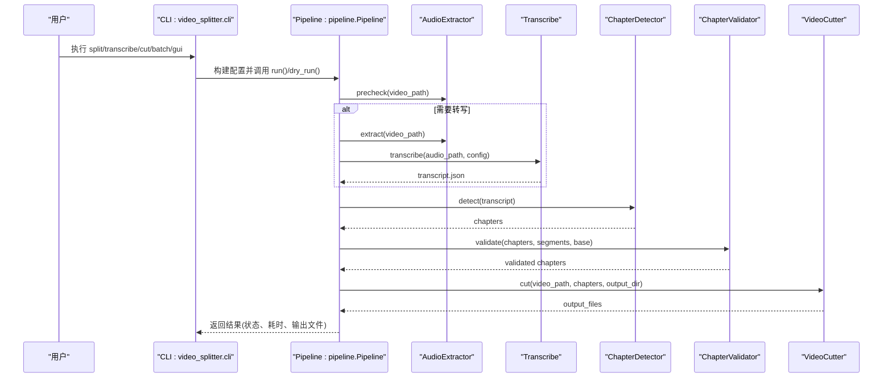
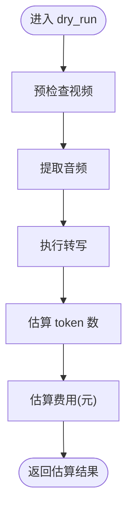
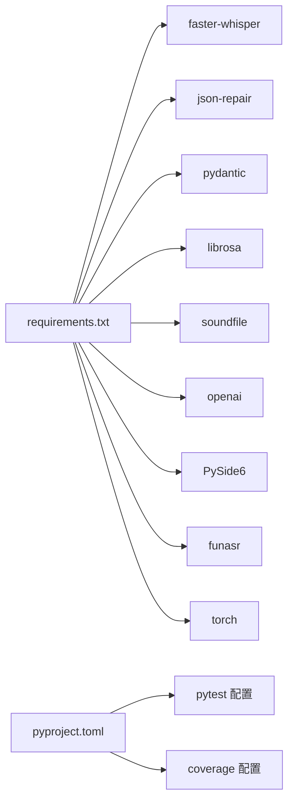

# 快速开始

<cite>
**本文引用的文件**   
- [README.md](file://README.md)
- [pyproject.toml](file://pyproject.toml)
- [requirements.txt](file://requirements.txt)
- [install.sh](file://install.sh)
- [install.bat](file://install.bat)
- [video_splitter/cli.py](file://video_splitter/cli.py)
- [video_splitter/config.py](file://video_splitter/config.py)
- [video_splitter/pipeline.py](file://video_splitter/pipeline.py)
- [gui/app.py](file://gui/app.py)
- [ffmpeg-skill/examples.py](file://ffmpeg-skill/examples.py)
- [ffmpeg-skill/ffmpeg_tool.py](file://ffmpeg-skill/ffmpeg_tool.py)
- [video_splitter/split.bat](file://video_splitter/split.bat)
- [video_splitter/vsplit.bat](file://video_splitter/vsplit.bat)
</cite>

## 目录
1. [简介](#简介)
2. [项目结构](#项目结构)
3. [核心组件](#核心组件)
4. [架构总览](#架构总览)
5. [详细组件分析](#详细组件分析)
6. [依赖关系分析](#依赖关系分析)
7. [性能与资源建议](#性能与资源建议)
8. [故障排查指南](#故障排查指南)
9. [结论](#结论)
10. [附录：常用命令速查](#附录常用命令速查)

## 简介
本快速开始指南面向首次接触 VideoSplitter 的用户，目标是在 15 分钟内完成环境搭建并运行第一个视频处理任务。你将学到：
- 安装 FFmpeg、Python 依赖与跨平台配置
- 使用命令行进行单视频处理、批量处理与 GUI 启动
- 通过 Python API 集成到现有项目
- 常见配置项与环境变量设置
- 基础故障排查方法

## 项目结构
VideoSplitter 提供两条主要路径：
- 智能分段流水线（基于语音转写 + 章节检测 + 校验 + 切割）
- 通用 FFmpeg 技能工具（格式转换、裁剪、合并等）

图表来源
- [video_splitter/cli.py:207-256](file://video_splitter/cli.py#L207-L256)
- [video_splitter/pipeline.py:21-131](file://video_splitter/pipeline.py#L21-L131)
- [gui/app.py:27-268](file://gui/app.py#L27-L268)
- [ffmpeg-skill/ffmpeg_tool.py:20-283](file://ffmpeg-skill/ffmpeg_tool.py#L20-L283)

章节来源
- [README.md:1-50](file://README.md#L1-L50)
- [pyproject.toml:1-28](file://pyproject.toml#L1-L28)
- [requirements.txt:1-26](file://requirements.txt#L1-L26)

## 核心组件
- CLI 入口与子命令：split、transcribe、cut、check、review、batch、gui
- Pipeline 编排：预检查 → 音频提取 → 转写 → 章节检测 → 校验 → 切割
- 配置管理：从环境变量加载模型、设备、切分策略、LLM 接口等
- GUI：PySide6 界面，支持打开视频、加载转写结果、逐条校对字幕
- FFmpeg 工具：独立命令行工具，封装格式转换、缩放、裁剪、水印、合并、质量调整、信息查询

章节来源
- [video_splitter/cli.py:15-205](file://video_splitter/cli.py#L15-L205)
- [video_splitter/pipeline.py:21-131](file://video_splitter/pipeline.py#L21-L131)
- [video_splitter/config.py:19-53](file://video_splitter/config.py#L19-L53)
- [gui/app.py:27-268](file://gui/app.py#L27-L268)
- [ffmpeg-skill/ffmpeg_tool.py:20-283](file://ffmpeg-skill/ffmpeg_tool.py#L20-L283)

## 架构总览
下图展示“智能分段”主流程的调用链与数据流。

图表来源
- [video_splitter/cli.py:15-46](file://video_splitter/cli.py#L15-L46)
- [video_splitter/pipeline.py:31-111](file://video_splitter/pipeline.py#L31-L111)

## 详细组件分析

### 安装与环境准备
- 系统要求
  - Python 版本：>=3.12（见 pyproject），脚本兼容 >=3.8
  - FFmpeg：必须安装且可被系统 PATH 找到
- 一键安装脚本
  - Linux/macOS：install.sh 会检测 Python/FFmpeg、安装依赖、创建快捷命令并提示 PATH 更新
  - Windows：install.bat 会检测 Python/FFmpeg、安装依赖、复制工具脚本并提供批处理便捷方式
- 手动安装步骤
  - 安装 FFmpeg（官方下载或包管理器）
  - 安装 Python 依赖：pip install -r requirements.txt
  - 可选：安装 PySide6 以启用 GUI

章节来源
- [pyproject.toml:1-10](file://pyproject.toml#L1-L10)
- [requirements.txt:1-26](file://requirements.txt#L1-L26)
- [install.sh:1-151](file://install.sh#L1-L151)
- [install.bat:1-81](file://install.bat#L1-L81)
- [README.md:34-41](file://README.md#L34-L41)

### 命令行快速上手
- 单视频处理（自动转写+章节+切割）
  - 命令：python -m video_splitter.cli split <视频路径> [--max-duration 分钟] [--model 模型大小] [--cut-mode fast|precise] [--resume] [--dry-run]
  - 说明：dry-run 仅估算成本与 token；resume 跳过已有中间文件
- 仅转写
  - 命令：python -m video_splitter.cli transcribe <视频路径> [--model]
- 仅按章节切割
  - 命令：python -m video_splitter.cli cut <视频路径> --chapters <chapters.json> [--cut-mode]
- 批量处理
  - 命令：python -m video_splitter.cli batch <包含 .mp4 的目录> [--max-duration] [--resume]
- 启动 GUI
  - 命令：python -m video_splitter.cli gui
- Windows 快捷启动
  - 使用 split.bat 或 vsplit.bat 直接调用 CLI

章节来源
- [video_splitter/cli.py:207-256](file://video_splitter/cli.py#L207-L256)
- [video_splitter/split.bat:1-11](file://video_splitter/split.bat#L1-L11)
- [video_splitter/vsplit.bat:1-10](file://video_splitter/vsplit.bat#L1-L10)

### Python API 集成示例
- 使用 FFmpeg Skill 进行格式转换、缩放、裁剪、提取音频、加水印、合并、质量调整、获取信息、进度回调与批量处理
- 参考示例文件中的函数，按需取消注释并传入真实文件路径

章节来源
- [ffmpeg-skill/examples.py:1-205](file://ffmpeg-skill/examples.py#L1-L205)

### GUI 使用要点
- 打开视频后，可在后台线程中进行转写，完成后在“Review”标签页逐条校对字幕
- 快捷键：空格播放/暂停、Ctrl+S 保存当前、Ctrl+Return 保存并跳转下一条、Ctrl+Left/Right 上一条/下一条、Ctrl+G 跳转序号
- 健康检查：启动时自动检测 FunASR 引擎可用性，若不可用仍可编辑已有转写

章节来源
- [gui/app.py:27-268](file://gui/app.py#L27-L268)

### 配置与环境变量
- 关键配置项（默认值来自 SplitConfig）
  - 模型与设备：model_size、device、compute_type
  - 分段时长：max_segment_duration、min_segment_duration
  - LLM 接口：llm_api_base、llm_api_key、llm_model、llm_token_budget、llm_max_retries
  - 切割策略：cut_mode、keyframe_tolerance
  - 输出语言与命名模板：language、naming_template
  - 断点续跑：resume
  - 转写引擎：transcription_engine（默认 funasr）
- 环境变量覆盖
  - OPENAI_API_BASE / WHALECLOUD_API_KEY / OPENAI_API_KEY：LLM 接口与密钥
  - VIDEO_SPLITTER_DEVICE：设备选择
  - VIDEO_SPLITTER_RESUME：开启断点续跑（接受 1/true/yes）
  - VIDEO_SPLITTER_ENGINE：切换转写引擎

章节来源
- [video_splitter/config.py:19-53](file://video_splitter/config.py#L19-L53)

### 流程图：Dry Run 估算

图表来源
- [video_splitter/pipeline.py:113-131](file://video_splitter/pipeline.py#L113-L131)

## 依赖关系分析
- 运行时依赖
  - FFmpeg：外部二进制，必须在 PATH 中可用
  - Python 库：faster-whisper、json-repair、pydantic、librosa、soundfile、openai、PySide6、funasr、torch 等
- 测试与覆盖率
  - pytest 配置与标记（slow、integration）
  - coverage 源与忽略规则

图表来源
- [requirements.txt:1-26](file://requirements.txt#L1-L26)
- [pyproject.toml:6-28](file://pyproject.toml#L6-L28)

章节来源
- [requirements.txt:1-26](file://requirements.txt#L1-L26)
- [pyproject.toml:1-28](file://pyproject.toml#L1-L28)

## 性能与资源建议
- 模型与设备
  - 小模型（tiny/base/small）适合 CPU 快速验证；large-v3 更准确但较慢
  - 可通过环境变量 VIDEO_SPLITTER_DEVICE 指定设备
- 分段时长
  - max_segment_duration 越大，单次转写越长，内存与时间消耗越高
- 转写引擎
  - funasr 为默认引擎，也可通过 VIDEO_SPLITTER_ENGINE 切换
- 断点续跑
  - resume 模式可跳过已完成的中间步骤，提升迭代效率

[本节为通用建议，不直接分析具体文件]

## 故障排查指南
- 常见问题
  - FFmpeg 未找到：确保已安装并将 bin 目录加入 PATH
  - Python 版本过低：建议使用 >=3.12（pyproject 要求），脚本兼容 >=3.8
  - 缺少依赖：pip install -r requirements.txt
  - LLM 密钥未配置：设置 OPENAI_API_KEY 或 WHALECLOUD_API_KEY
  - GUI 无法启动：确认已安装 PySide6
- 诊断命令
  - 运行 check 子命令，自动检查 FFmpeg、faster-whisper、json-repair 与 LLM 配置，并给出简要基准
- 日志与错误
  - CLI 使用 logging 输出 INFO 级别日志；Pipeline 捕获异常并记录失败原因

章节来源
- [video_splitter/cli.py:85-152](file://video_splitter/cli.py#L85-L152)
- [video_splitter/pipeline.py:102-106](file://video_splitter/pipeline.py#L102-L106)
- [install.sh:51-76](file://install.sh#L51-L76)
- [install.bat:22-35](file://install.bat#L22-L35)

## 结论
通过以上步骤，你可以在 15 分钟内完成环境搭建并成功运行一次完整的视频分段任务。后续可根据需求调整模型、设备、分段策略与转写引擎，或使用 GUI 进行人工校对，亦可直接将 FFmpeg Skill 集成到你的项目中。

[本节为总结性内容，不直接分析具体文件]

## 附录：常用命令速查
- 单视频处理
  - python -m video_splitter.cli split <视频路径>
- 仅转写
  - python -m video_splitter.cli transcribe <视频路径>
- 仅切割
  - python -m video_splitter.cli cut <视频路径> --chapters <chapters.json>
- 批量处理
  - python -m video_splitter.cli batch <目录>
- 启动 GUI
  - python -m video_splitter.cli gui
- 环境检查
  - python -m video_splitter.cli check
- Windows 快捷启动
  - split.bat <参数> 或 vsplit.bat <命令> <参数>

章节来源
- [video_splitter/cli.py:207-256](file://video_splitter/cli.py#L207-L256)
- [video_splitter/split.bat:1-11](file://video_splitter/split.bat#L1-L11)
- [video_splitter/vsplit.bat:1-10](file://video_splitter/vsplit.bat#L1-L10)