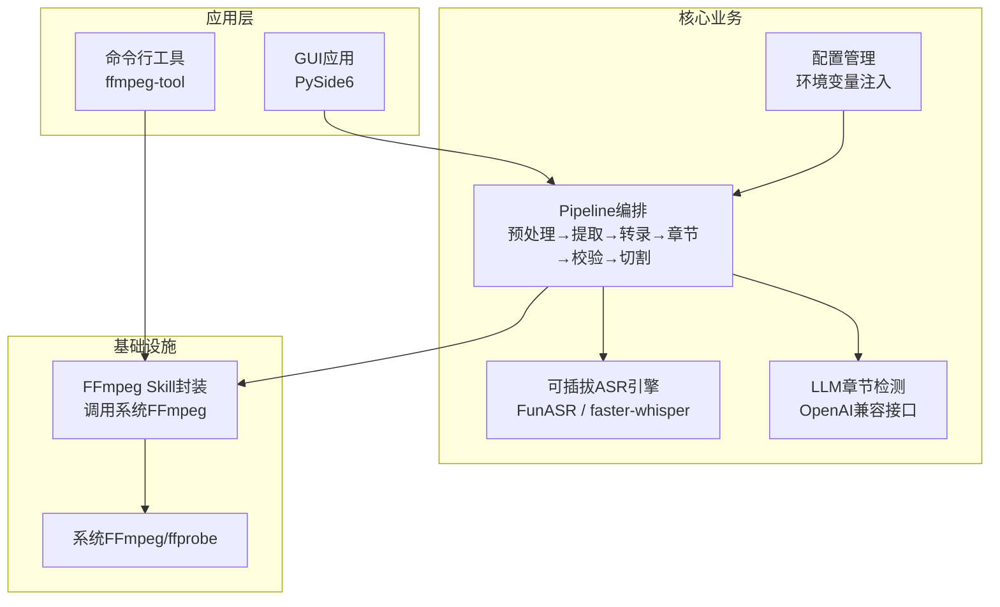
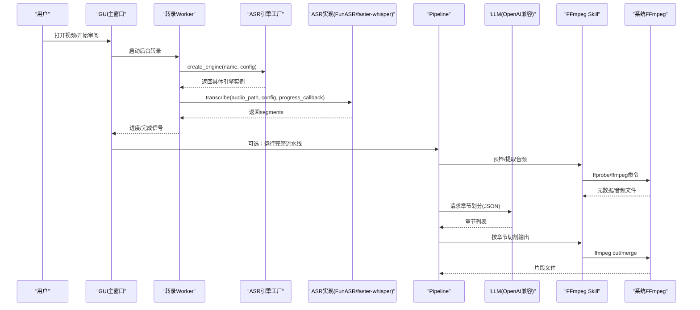
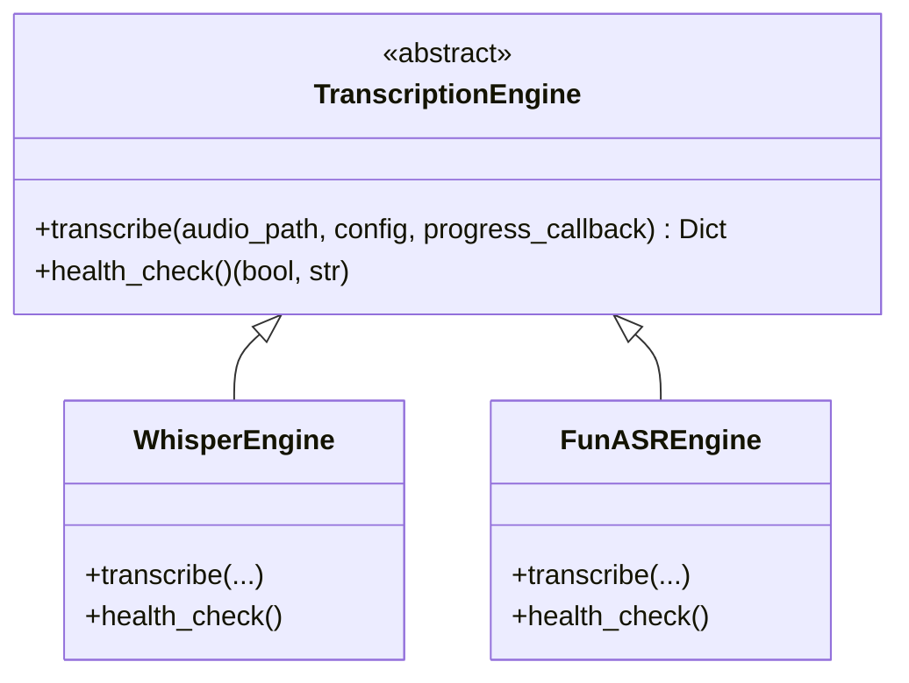
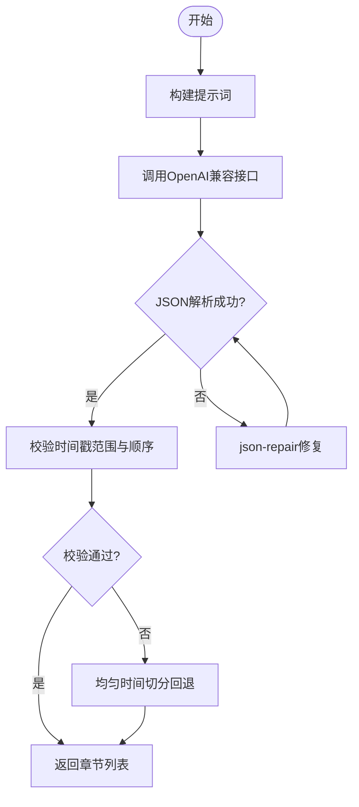
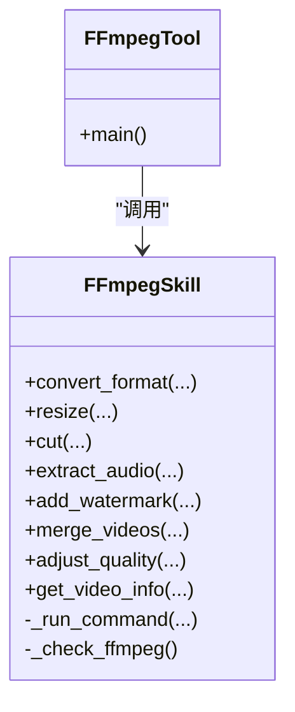
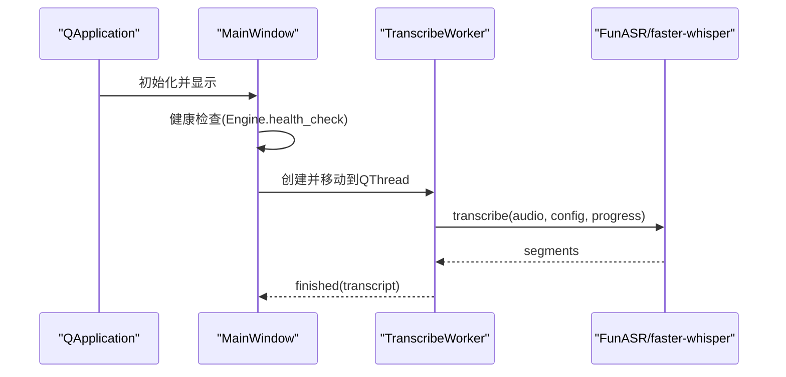
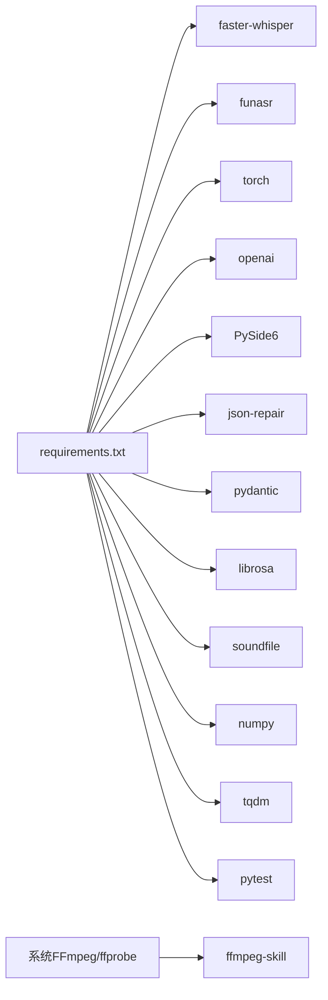

# 技术栈

<cite>
**本文引用的文件**   
- [pyproject.toml](file://pyproject.toml)
- [requirements.txt](file://requirements.txt)
- [README.md](file://README.md)
- [video_splitter/config.py](file://video_splitter/config.py)
- [video_splitter/extractor/transcribe.py](file://video_splitter/extractor/transcribe.py)
- [video_splitter/extractor/engines.py](file://video_splitter/extractor/engines.py)
- [video_splitter/analyzer/chapter.py](file://video_splitter/analyzer/chapter.py)
- [video_splitter/pipeline.py](file://video_splitter/pipeline.py)
- [gui/app.py](file://gui/app.py)
- [gui/workers/transcribe_worker.py](file://gui/workers/transcribe_worker.py)
- [ffmpeg-skill/__init__.py](file://ffmpeg-skill/__init__.py)
- [ffmpeg-skill/ffmpeg_tool.py](file://ffmpeg-skill/ffmpeg_tool.py)
- [install.sh](file://install.sh)
</cite>

## 目录
1. [简介](#简介)
2. [项目结构](#项目结构)
3. [核心组件](#核心组件)
4. [架构总览](#架构总览)
5. [详细组件分析](#详细组件分析)
6. [依赖关系分析](#依赖关系分析)
7. [性能考量](#性能考量)
8. [故障排查指南](#故障排查指南)
9. [结论](#结论)
10. [附录](#附录)

## 简介
本技术栈说明聚焦于VideoSplitter项目的核心技术选型与集成方式，涵盖：
- Python 3.8+（实际要求更高）作为主要开发语言的原因与优势
- 关键依赖库的作用与权衡：faster-whisper、FunASR、OpenAI SDK、PySide6
- FFmpeg在视频处理中的核心地位与版本要求
- 第三方服务集成：OpenAI API、Azure OpenAI等LLM提供商的适配方式
- 技术选型的权衡考虑与替代方案

## 项目结构
本项目采用分层与模块化组织：
- 核心处理流程位于 video_splitter 包内，包含配置、提取、分析、分割等模块
- GUI层基于 PySide6，提供字幕审阅与转录工作流
- ffmpeg-skill 为FFmpeg封装与CLI工具，负责音视频转码、裁剪、信息获取等
- 安装脚本与文档辅助部署与使用

图表来源
- [video_splitter/pipeline.py:1-131](file://video_splitter/pipeline.py#L1-L131)
- [video_splitter/config.py:1-54](file://video_splitter/config.py#L1-L54)
- [video_splitter/extractor/engines.py:1-251](file://video_splitter/extractor/engines.py#L1-L251)
- [video_splitter/analyzer/chapter.py:1-343](file://video_splitter/analyzer/chapter.py#L1-L343)
- [ffmpeg-skill/__init__.py:1-673](file://ffmpeg-skill/__init__.py#L1-L673)

章节来源
- [pyproject.toml:1-28](file://pyproject.toml#L1-L28)
- [requirements.txt:1-26](file://requirements.txt#L1-L26)
- [README.md:1-50](file://README.md#L1-L50)

## 核心组件
- Python运行时与版本约束
  - pyproject声明requires-python>=3.12；requirements注释Python 3.8+。建议以3.12为目标环境以获得更好的类型检查与性能优化。
- ASR语音识别
  - faster-whisper：高性能本地Whisper推理，支持VAD过滤与进度回调
  - FunASR：中文ASR备选引擎，默认模型路径可通过环境变量覆盖
- LLM大语言模型
  - OpenAI SDK：通过base_url与api_key接入任意OpenAI兼容服务（如Azure OpenAI、私有代理）
  - json-repair：对LLM返回的JSON进行修复，增强鲁棒性
- GUI界面
  - PySide6：跨平台桌面端，用于字幕审阅与转录任务调度
- 媒体处理
  - FFmpeg：底层音视频编解码与格式转换的核心，通过ffmpeg-skill封装与CLI暴露

章节来源
- [pyproject.toml:1-28](file://pyproject.toml#L1-L28)
- [requirements.txt:1-26](file://requirements.txt#L1-L26)
- [video_splitter/extractor/transcribe.py:1-105](file://video_splitter/extractor/transcribe.py#L1-L105)
- [video_splitter/extractor/engines.py:1-251](file://video_splitter/extractor/engines.py#L1-L251)
- [video_splitter/analyzer/chapter.py:1-343](file://video_splitter/analyzer/chapter.py#L1-L343)
- [gui/app.py:1-268](file://gui/app.py#L1-L268)
- [ffmpeg-skill/__init__.py:1-673](file://ffmpeg-skill/__init__.py#L1-L673)

## 架构总览
整体数据流与控制流如下：
- GUI或CLI触发任务
- Pipeline编排执行：预检→音频提取→ASR转录→LLM章节检测→校验→按章节切割
- FFmpeg Skill负责与系统FFmpeg交互，完成转码、裁剪、信息读取等操作
- 配置通过环境变量注入，支持设备、引擎、LLM基址与密钥等

图表来源
- [gui/app.py:1-268](file://gui/app.py#L1-L268)
- [gui/workers/transcribe_worker.py:1-49](file://gui/workers/transcribe_worker.py#L1-L49)
- [video_splitter/extractor/engines.py:1-251](file://video_splitter/extractor/engines.py#L1-L251)
- [video_splitter/extractor/transcribe.py:1-105](file://video_splitter/extractor/transcribe.py#L1-L105)
- [video_splitter/analyzer/chapter.py:1-343](file://video_splitter/analyzer/chapter.py#L1-L343)
- [video_splitter/pipeline.py:1-131](file://video_splitter/pipeline.py#L1-L131)
- [ffmpeg-skill/__init__.py:1-673](file://ffmpeg-skill/__init__.py#L1-L673)

## 详细组件分析

### Python与版本策略
- 目标版本
  - pyproject要求>=3.12，利于类型提示、性能与生态兼容性
  - requirements注释3.8+，便于历史环境参考
- 选择理由
  - 丰富的科学计算与多媒体生态（numpy、librosa、soundfile）
  - 成熟的GUI与异步事件循环（PySide6）
  - 完善的LLM客户端SDK（openai）

章节来源
- [pyproject.toml:1-28](file://pyproject.toml#L1-L28)
- [requirements.txt:1-26](file://requirements.txt#L1-L26)

### ASR引擎：faster-whisper与FunASR
- faster-whisper
  - 特点：高性能本地推理、VAD过滤、进度回调友好
  - 适用场景：多语言、通用性强、资源占用可控
- FunASR
  - 特点：中文ASR能力突出，默认模型路径可配置
  - 适用场景：中文培训/会议视频，追求更优中文识别效果
- 统一抽象
  - TranscriptionEngine抽象类定义transcribe与health_check接口
  - 工厂create_engine根据名称创建具体引擎实例，支持运行时切换

图表来源
- [video_splitter/extractor/engines.py:17-251](file://video_splitter/extractor/engines.py#L17-L251)
- [video_splitter/extractor/transcribe.py:1-105](file://video_splitter/extractor/transcribe.py#L1-L105)

章节来源
- [video_splitter/extractor/engines.py:1-251](file://video_splitter/extractor/engines.py#L1-L251)
- [video_splitter/extractor/transcribe.py:1-105](file://video_splitter/extractor/transcribe.py#L1-L105)

### LLM集成：OpenAI兼容接口与多厂商支持
- 接入方式
  - 通过OpenAI SDK的base_url与api_key，可对接任意OpenAI兼容服务
  - 支持环境变量注入OPENAI_API_BASE、OPENAI_API_KEY、WHALECLOUD_API_KEY等
- 容错与降级
  - 重试机制与指数退避
  - JSON修复(json-repair)提升解析鲁棒性
  - 失败时回退到均匀时间切分
- 多厂商适配
  - Azure OpenAI：设置base_url为Azure端点并传入对应API Key
  - 私有代理/本地模型：同样通过base_url指向后端

图表来源
- [video_splitter/analyzer/chapter.py:195-343](file://video_splitter/analyzer/chapter.py#L195-L343)
- [video_splitter/config.py:1-54](file://video_splitter/config.py#L1-L54)

章节来源
- [video_splitter/analyzer/chapter.py:1-343](file://video_splitter/analyzer/chapter.py#L1-L343)
- [video_splitter/config.py:1-54](file://video_splitter/config.py#L1-L54)

### FFmpeg：视频处理核心与版本要求
- 核心地位
  - 所有转码、裁剪、合并、水印、质量调整均通过FFmpeg完成
  - ffprobe用于获取时长、分辨率、编码信息等元数据
- 版本要求
  - 安装脚本会检测系统PATH中是否存在ffmpeg，并打印版本
  - 建议在PATH中配置稳定版本的FFmpeg（推荐近期稳定版），确保编码器与滤镜可用
- 封装与CLI
  - ffmpeg-skill提供高层API与错误包装
  - ffmpeg_tool.py提供命令行入口，便于自动化与Skill集成

图表来源
- [ffmpeg-skill/__init__.py:1-673](file://ffmpeg-skill/__init__.py#L1-L673)
- [ffmpeg-skill/ffmpeg_tool.py:1-283](file://ffmpeg-skill/ffmpeg_tool.py#L1-L283)

章节来源
- [ffmpeg-skill/__init__.py:1-673](file://ffmpeg-skill/__init__.py#L1-L673)
- [ffmpeg-skill/ffmpeg_tool.py:1-283](file://ffmpeg-skill/ffmpeg_tool.py#L1-L283)
- [install.sh:48-97](file://install.sh#L48-L97)

### GUI与后台任务：PySide6与QThread
- 主窗口负责菜单、播放器、审阅面板与状态栏
- 转录任务在QThread中运行，避免阻塞UI
- 健康检查在启动时验证FunASR可用性，并提供友好提示

图表来源
- [gui/app.py:1-268](file://gui/app.py#L1-L268)
- [gui/workers/transcribe_worker.py:1-49](file://gui/workers/transcribe_worker.py#L1-L49)
- [video_splitter/extractor/engines.py:1-251](file://video_splitter/extractor/engines.py#L1-L251)

章节来源
- [gui/app.py:1-268](file://gui/app.py#L1-L268)
- [gui/workers/transcribe_worker.py:1-49](file://gui/workers/transcribe_worker.py#L1-L49)

## 依赖关系分析
- 运行时依赖
  - faster-whisper、funasr、torch、openai、PySide6、json-repair、pydantic、librosa、soundfile、numpy、tqdm、pytest
- 外部系统依赖
  - FFmpeg/ffprobe需安装至系统PATH
- 配置与环境变量
  - OPENAI_API_BASE、OPENAI_API_KEY、WHALECLOUD_API_KEY、VIDEO_SPLITTER_DEVICE、VIDEO_SPLITTER_RESUME、VIDEO_SPLITTER_ENGINE、VIDEO_SPLITTER_FUNASR_MODEL_DIR

图表来源
- [requirements.txt:1-26](file://requirements.txt#L1-L26)
- [ffmpeg-skill/__init__.py:1-673](file://ffmpeg-skill/__init__.py#L1-L673)

章节来源
- [requirements.txt:1-26](file://requirements.txt#L1-L26)
- [install.sh:48-97](file://install.sh#L48-L97)

## 性能考量
- ASR选择
  - faster-whisper适合多语言与通用场景，GPU加速显著；FunASR在中文上表现优异，但依赖torch与较大模型
- LLM调用
  - 长文本采用滑动窗口分块，降低单次token消耗；失败回退保证可用性
- FFmpeg操作
  - 尽量使用copy模式减少重编码开销；合理选择crf与preset平衡质量与速度
- 并发与I/O
  - GUI线程化避免阻塞；批量处理时注意磁盘I/O与临时文件清理

[本节为通用指导，不直接分析具体文件]

## 故障排查指南
- FFmpeg未找到或不可用
  - 确认已安装并将bin加入PATH；安装脚本会检测并给出指引
- FunASR健康检查失败
  - 检查是否安装funasr与torch；确认模型目录环境变量是否正确
- faster-whisper导入失败
  - 确认已安装faster-whisper及必要依赖
- LLM请求失败
  - 检查OPENAI_API_BASE与OPENAI_API_KEY；网络与SSL问题可能导致httpx回退requests
- 转录进度无更新
  - 确认progress_callback链路在GUI与Worker间正确连接

章节来源
- [install.sh:48-97](file://install.sh#L48-L97)
- [video_splitter/extractor/engines.py:154-173](file://video_splitter/extractor/engines.py#L154-L173)
- [video_splitter/extractor/engines.py:207-219](file://video_splitter/extractor/engines.py#L207-L219)
- [video_splitter/analyzer/chapter.py:211-241](file://video_splitter/analyzer/chapter.py#L211-L241)
- [gui/app.py:143-156](file://gui/app.py#L143-L156)

## 结论
VideoSplitter的技术栈围绕“高性能ASR + 灵活LLM + 强大FFmpeg + 跨平台GUI”展开：
- Python 3.12+提供现代语言特性与生态支撑
- faster-whisper与FunASR互补，兼顾通用性与中文优化
- OpenAI兼容接口使多厂商LLM接入成为可能，且具备健壮的回退策略
- FFmpeg作为底层基石，配合封装与CLI提升易用性与可维护性
- PySide6保障跨平台体验与良好的交互反馈

[本节为总结性内容，不直接分析具体文件]

## 附录
- 环境变量清单
  - OPENAI_API_BASE：LLM服务基地址
  - OPENAI_API_KEY：LLM服务密钥
  - WHALECLOUD_API_KEY：特定服务商密钥覆盖
  - VIDEO_SPLITTER_DEVICE：ASR设备（auto/gpu/cpu）
  - VIDEO_SPLITTER_RESUME：是否从已有转录/章节恢复
  - VIDEO_SPLITTER_ENGINE：ASR引擎名（funasr/whisper）
  - VIDEO_SPLITTER_FUNASR_MODEL_DIR：FunASR模型目录

章节来源
- [video_splitter/config.py:1-54](file://video_splitter/config.py#L1-L54)