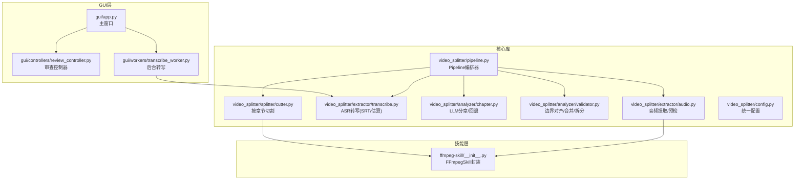
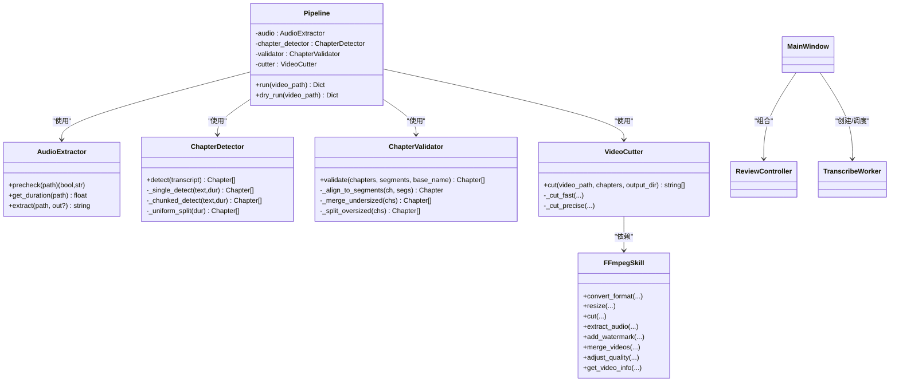
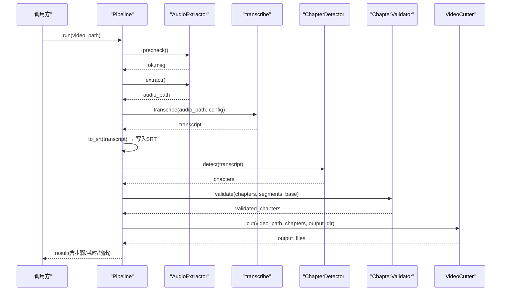
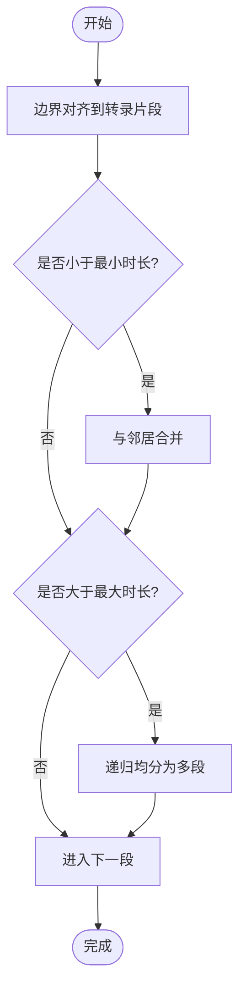
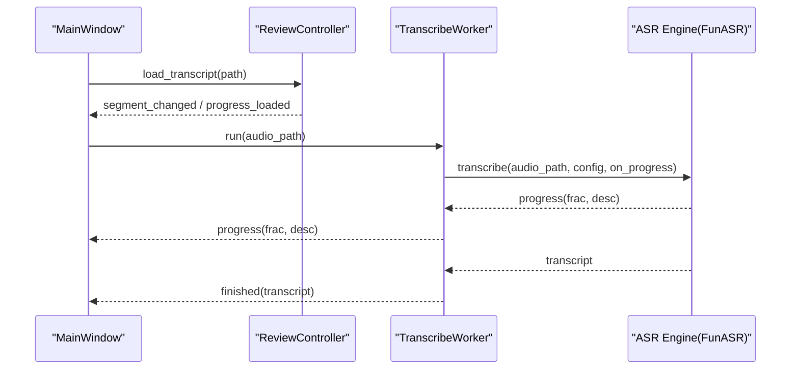

# 架构概览

<cite>
**本文引用的文件**   
- [README.md](file://README.md)
- [architecture.yaml](file://architecture.yaml)
- [video_splitter/pipeline.py](file://video_splitter/pipeline.py)
- [video_splitter/config.py](file://video_splitter/config.py)
- [video_splitter/analyzer/chapter.py](file://video_splitter/analyzer/chapter.py)
- [video_splitter/analyzer/validator.py](file://video_splitter/analyzer/validator.py)
- [video_splitter/extractor/audio.py](file://video_splitter/extractor/audio.py)
- [video_splitter/extractor/transcribe.py](file://video_splitter/extractor/transcribe.py)
- [video_splitter/splitter/cutter.py](file://video_splitter/splitter/cutter.py)
- [ffmpeg-skill/__init__.py](file://ffmpeg-skill/__init__.py)
- [gui/app.py](file://gui/app.py)
- [gui/controllers/review_controller.py](file://gui/controllers/review_controller.py)
- [gui/workers/transcribe_worker.py](file://gui/workers/transcribe_worker.py)
</cite>

## 目录
1. [简介](#简介)
2. [项目结构](#项目结构)
3. [核心组件](#核心组件)
4. [架构总览](#架构总览)
5. [详细组件分析](#详细组件分析)
6. [依赖关系分析](#依赖关系分析)
7. [性能与扩展性](#性能与扩展性)
8. [故障排查指南](#故障排查指南)
9. [结论](#结论)

## 简介
本概览面向VideoSplitter项目的整体设计，聚焦三层架构：Python核心库（视频分析与切割）、PySide6图形界面（字幕校对与进度管理）、FFmpeg技能封装（底层媒体处理）。文档重点说明模块化职责、数据流向与处理管道、组件通信机制以及Pipeline编排器的作用，并提供架构图与数据流图，帮助开发者快速理解系统的高层设计与扩展点。

## 项目结构
- 核心库 video_splitter
  - analyzer：章节检测与校验（LLM语义分章 + 规则校验）
  - extractor：音频提取与转写（FFmpeg抽取 + ASR引擎）
  - splitter：按章节切割视频（基于FFmpegSkill）
  - pipeline：端到端编排器（预检查→提取→转写→分章→校验→切割）
  - config：统一配置（模型、切段策略、命名模板、恢复模式等）
- GUI gui
  - app：主窗口与菜单、播放器、状态栏
  - controllers：审查控制器（加载/保存转录、进度持久化、SRT导出）
  - workers：后台转写工作线程（QThread + Signal/Slot）
  - widgets：UI控件（播放器、字幕面板、状态栏）
- FFmpeg技能 ffmpeg-skill
  - FFmpegSkill：对FFmpeg/ffprobe的Python封装（转换、缩放、裁剪、水印、合并、质量调整、信息查询）
  - ffmpeg_tool.py：独立CLI入口（可选）
- 约束 architecture.yaml：定义分层导入限制，确保模块边界清晰

图表来源
- [video_splitter/pipeline.py:1-131](file://video_splitter/pipeline.py#L1-L131)
- [video_splitter/extractor/audio.py:1-171](file://video_splitter/extractor/audio.py#L1-L171)
- [video_splitter/extractor/transcribe.py:1-105](file://video_splitter/extractor/transcribe.py#L1-L105)
- [video_splitter/analyzer/chapter.py:1-343](file://video_splitter/analyzer/chapter.py#L1-L343)
- [video_splitter/analyzer/validator.py:1-152](file://video_splitter/analyzer/validator.py#L1-L152)
- [video_splitter/splitter/cutter.py:1-98](file://video_splitter/splitter/cutter.py#L1-L98)
- [ffmpeg-skill/__init__.py:1-673](file://ffmpeg-skill/__init__.py#L1-L673)
- [gui/app.py:1-268](file://gui/app.py#L1-L268)
- [gui/controllers/review_controller.py:1-149](file://gui/controllers/review_controller.py#L1-L149)
- [gui/workers/transcribe_worker.py:1-49](file://gui/workers/transcribe_worker.py#L1-L49)

章节来源
- [README.md:1-50](file://README.md#L1-L50)
- [architecture.yaml:1-11](file://architecture.yaml#L1-L11)

## 核心组件
- Pipeline编排器
  - 职责：串联“预检查→音频提取→转写→分章→校验→切割”，负责中间产物落盘（转录JSON、SRT、章节JSON），支持断点续跑与耗时统计。
  - 关键流程：读取配置→预检→提取→转写→生成SRT→分章→校验→切割→汇总输出。
- Analyzer（分析器）
  - ChapterDetector：基于LLM的语义分章；超长文本滑动窗口；失败回退为均匀分段。
  - ChapterValidator：将章节边界对齐到转录片段、合并过短段、拆分过长段，并规范化标题前缀。
- Extractor（提取器）
  - AudioExtractor：调用ffprobe/ffmpeg进行时长获取与音频提取；可选librosa做语音质量预检（静音比例/RMS）。
  - transcribe：使用faster-whisper执行转写，返回segments与duration；提供to_srt与token估算工具。
- Splitter（切割器）
  - VideoCutter：优先“快速复制”模式，若精度不达标则回退“精确重编码”；通过config控制keyframe容忍度与命名模板。
- FFmpegSkill（技能封装）
  - 提供格式转换、缩放、裁剪、音频提取、水印、合并、质量调整、信息查询等高层API；内部以subprocess驱动ffmpeg/ffprobe。
- GUI（PySide6）
  - MainWindow：菜单、播放器、标签页、状态栏、快捷键。
  - ReviewController：转录加载/保存、修改标记、SRT导出、进度持久化。
  - TranscribeWorker：在QThread中运行ASR，信号回调更新UI进度与结果。

章节来源
- [video_splitter/pipeline.py:1-131](file://video_splitter/pipeline.py#L1-L131)
- [video_splitter/analyzer/chapter.py:1-343](file://video_splitter/analyzer/chapter.py#L1-L343)
- [video_splitter/analyzer/validator.py:1-152](file://video_splitter/analyzer/validator.py#L1-L152)
- [video_splitter/extractor/audio.py:1-171](file://video_splitter/extractor/audio.py#L1-L171)
- [video_splitter/extractor/transcribe.py:1-105](file://video_splitter/extractor/transcribe.py#L1-L105)
- [video_splitter/splitter/cutter.py:1-98](file://video_splitter/splitter/cutter.py#L1-L98)
- [ffmpeg-skill/__init__.py:1-673](file://ffmpeg-skill/__init__.py#L1-L673)
- [gui/app.py:1-268](file://gui/app.py#L1-L268)
- [gui/controllers/review_controller.py:1-149](file://gui/controllers/review_controller.py#L1-L149)
- [gui/workers/transcribe_worker.py:1-49](file://gui/workers/transcribe_worker.py#L1-L49)

## 架构总览
系统采用“分层+可插拔”的模块化架构：
- 表现层（GUI）：用户交互、播放与校对、进度展示。
- 业务编排层（Pipeline）：定义端到端处理顺序、错误处理与中间态持久化。
- 领域能力层（Analyzer/Extractor/Splitter）：各自专注单一职责，通过接口契约协作。
- 基础设施层（FFmpegSkill）：屏蔽外部命令细节，提供稳定API。

图表来源
- [video_splitter/pipeline.py:1-131](file://video_splitter/pipeline.py#L1-L131)
- [video_splitter/extractor/audio.py:1-171](file://video_splitter/extractor/audio.py#L1-L171)
- [video_splitter/analyzer/chapter.py:1-343](file://video_splitter/analyzer/chapter.py#L1-L343)
- [video_splitter/analyzer/validator.py:1-152](file://video_splitter/analyzer/validator.py#L1-L152)
- [video_splitter/splitter/cutter.py:1-98](file://video_splitter/splitter/cutter.py#L1-L98)
- [ffmpeg-skill/__init__.py:1-673](file://ffmpeg-skill/__init__.py#L1-L673)
- [gui/app.py:1-268](file://gui/app.py#L1-L268)
- [gui/controllers/review_controller.py:1-149](file://gui/controllers/review_controller.py#L1-L149)
- [gui/workers/transcribe_worker.py:1-49](file://gui/workers/transcribe_worker.py#L1-L49)

## 详细组件分析

### Pipeline编排器（端到端处理）
- 输入：视频路径
- 步骤：
  1) 预检查：AudioExtractor.precheck（可选librosa质量评估）
  2) 音频提取：AudioExtractor.extract（16kHz单声道WAV）
  3) 转写：transcribe（faster-whisper），产出segments与duration
  4) 生成SRT：to_srt
  5) 分章：ChapterDetector.detect（LLM或回退）
  6) 校验：ChapterValidator.validate（对齐/合并/拆分/命名）
  7) 切割：VideoCutter.cut（快速复制→精确重编码回退）
- 输出：章节列表、SRT、切片文件集合、耗时统计
- 特性：支持resume从已有转录/章节恢复；异常捕获并记录elapsed_seconds

图表来源
- [video_splitter/pipeline.py:1-131](file://video_splitter/pipeline.py#L1-L131)
- [video_splitter/extractor/audio.py:1-171](file://video_splitter/extractor/audio.py#L1-L171)
- [video_splitter/extractor/transcribe.py:1-105](file://video_splitter/extractor/transcribe.py#L1-L105)
- [video_splitter/analyzer/chapter.py:1-343](file://video_splitter/analyzer/chapter.py#L1-L343)
- [video_splitter/analyzer/validator.py:1-152](file://video_splitter/analyzer/validator.py#L1-L152)
- [video_splitter/splitter/cutter.py:1-98](file://video_splitter/splitter/cutter.py#L1-L98)

章节来源
- [video_splitter/pipeline.py:1-131](file://video_splitter/pipeline.py#L1-L131)

### Analyzer（分章与校验）
- ChapterDetector
  - 输入：带时间戳的转录文本
  - 策略：单次LLM调用（预算内）→ 滑动窗口长文本分块 → 失败回退为均匀分段
  - 输出：Chapter对象列表（title/start/end）
- ChapterValidator
  - 对齐：将章节边界对齐到最近的转录片段结束点
  - 合并：小于最小时长的相邻段合并
  - 拆分：超过最大时长的段递归均分
  - 命名：规范化序号前缀与非法字符清理

图表来源
- [video_splitter/analyzer/chapter.py:1-343](file://video_splitter/analyzer/chapter.py#L1-L343)
- [video_splitter/analyzer/validator.py:1-152](file://video_splitter/analyzer/validator.py#L1-L152)

章节来源
- [video_splitter/analyzer/chapter.py:1-343](file://video_splitter/analyzer/chapter.py#L1-L343)
- [video_splitter/analyzer/validator.py:1-152](file://video_splitter/analyzer/validator.py#L1-L152)

### Extractor（音频与转写）
- AudioExtractor
  - precheck：可选librosa计算RMS与静音比例，给出警告或失败提示
  - get_duration：ffprobe获取时长
  - extract：ffmpeg抽取16k单声道WAV
- transcribe
  - faster-whisper转写，VAD过滤，逐段回调进度
  - to_srt：生成标准SRT
  - estimate_tokens：粗略估算LLM token数（用于预算判断）

章节来源
- [video_splitter/extractor/audio.py:1-171](file://video_splitter/extractor/audio.py#L1-L171)
- [video_splitter/extractor/transcribe.py:1-105](file://video_splitter/extractor/transcribe.py#L1-L105)

### Splitter（切割器）
- VideoCutter
  - 快速模式：-ss/-to + copy，速度快但受关键帧影响
  - 精确模式：重新编码（libx264/aac），保证边界精度
  - 自动回退：快速模式实际时长偏差超过容忍阈值时切换精确模式
  - 输出：按命名模板生成切片文件

章节来源
- [video_splitter/splitter/cutter.py:1-98](file://video_splitter/splitter/cutter.py#L1-L98)

### FFmpegSkill（技能封装）
- 提供高层API：格式转换、缩放、裁剪、音频提取、水印、合并、质量调整、信息查询
- 内部实现：subprocess调用ffmpeg/ffprobe，统一错误包装为FFmpegError
- 适用场景：被VideoCutter与AudioExtractor间接使用，也可作为独立CLI工具

章节来源
- [ffmpeg-skill/__init__.py:1-673](file://ffmpeg-skill/__init__.py#L1-L673)

### GUI（PySide6）
- MainWindow
  - 构建菜单、中央布局（播放器+标签页）、状态栏、快捷键
  - 健康检查：启动时探测FunASREngine可用性
  - 打开视频后，创建TranscribeWorker并在QThread中执行转写
- ReviewController
  - 加载转录与进度，维护当前索引与已修改索引集合
  - 保存修正（原子写入转录与进度），导出SRT（临时文件+原子替换）
- TranscribeWorker
  - 在后台线程中调用engine.transcribe，通过Signal/Slot上报进度与结果

图表来源
- [gui/app.py:1-268](file://gui/app.py#L1-L268)
- [gui/controllers/review_controller.py:1-149](file://gui/controllers/review_controller.py#L1-L149)
- [gui/workers/transcribe_worker.py:1-49](file://gui/workers/transcribe_worker.py#L1-L49)

章节来源
- [gui/app.py:1-268](file://gui/app.py#L1-L268)
- [gui/controllers/review_controller.py:1-149](file://gui/controllers/review_controller.py#L1-L149)
- [gui/workers/transcribe_worker.py:1-49](file://gui/workers/transcribe_worker.py#L1-L49)

## 依赖关系分析
- 分层约束
  - architecture.yaml定义了video_splitter与ffmpeg_skill两层及其允许的导入范围，确保核心库仅依赖自身与ffmpeg_skill，避免跨层耦合。
- 直接依赖
  - Pipeline依赖AudioExtractor、transcribe、ChapterDetector、ChapterValidator、VideoCutter
  - VideoCutter动态导入ffmpeg-skill包并使用FFmpegSkill
  - GUI通过TranscribeWorker与ASR引擎解耦，ReviewController与video_splitter.review模块交互
- 潜在循环
  - 未发现循环依赖；各模块通过明确接口与数据契约协作

图表来源
- [architecture.yaml:1-11](file://architecture.yaml#L1-L11)
- [video_splitter/splitter/cutter.py:1-98](file://video_splitter/splitter/cutter.py#L1-L98)
- [gui/app.py:1-268](file://gui/app.py#L1-L268)

章节来源
- [architecture.yaml:1-11](file://architecture.yaml#L1-L11)

## 性能与扩展性
- 性能要点
  - 音频预检可选（librosa/numpy），避免不必要的CPU开销
  - 转写阶段支持进度回调，便于UI反馈与中断
  - 分章阶段对长文本采用滑动窗口，降低单次LLM压力
  - 切割优先快速复制，必要时回退精确重编码，平衡速度与精度
- 扩展点
  - 新增ASR引擎：实现统一的create_engine接口（参考GUI侧TranscribeWorker与engines的使用方式）
  - 新增分章策略：在ChapterDetector中增加新算法分支，保持返回Chapter列表
  - 自定义命名模板：通过config.naming_template控制输出文件名
  - 自定义切割策略：在VideoCutter中扩展更多模式（如无损拼接、多轨处理）

[本节为通用指导，不直接分析具体文件]

## 故障排查指南
- FFmpeg未安装或不可用
  - 现象：FFmpegSkill初始化或命令执行抛出FFmpegError
  - 排查：确认ffmpeg/ffprobe在PATH中且可执行
- 音频质量不佳
  - 现象：预检查返回高静音比例警告或失败
  - 建议：检查录音环境、音量增益、采样率与声道设置
- LLM分章失败
  - 现象：网络/鉴权/解析异常导致回退均匀分段
  - 建议：检查OPENAI_API_BASE/KEY、模型名与token预算
- 切割精度不足
  - 现象：快速模式实际时长偏差较大
  - 建议：增大keyframe_tolerance或启用precise模式
- GUI转写无响应
  - 现象：进度不更新或报错
  - 排查：查看TranscribeWorker信号连接与后台线程生命周期

章节来源
- [ffmpeg-skill/__init__.py:1-673](file://ffmpeg-skill/__init__.py#L1-L673)
- [video_splitter/extractor/audio.py:1-171](file://video_splitter/extractor/audio.py#L1-L171)
- [video_splitter/analyzer/chapter.py:1-343](file://video_splitter/analyzer/chapter.py#L1-L343)
- [video_splitter/splitter/cutter.py:1-98](file://video_splitter/splitter/cutter.py#L1-L98)
- [gui/workers/transcribe_worker.py:1-49](file://gui/workers/transcribe_worker.py#L1-L49)

## 结论
VideoSplitter采用清晰的三层架构与模块化设计：GUI负责交互与进度，Pipeline编排端到端流程，领域模块各司其职，FFmpegSkill屏蔽底层复杂性。通过LLM分章与规则校验的结合，系统在准确性与鲁棒性之间取得良好平衡；同时提供多种回退策略与可插拔扩展点，便于后续演进与定制。
