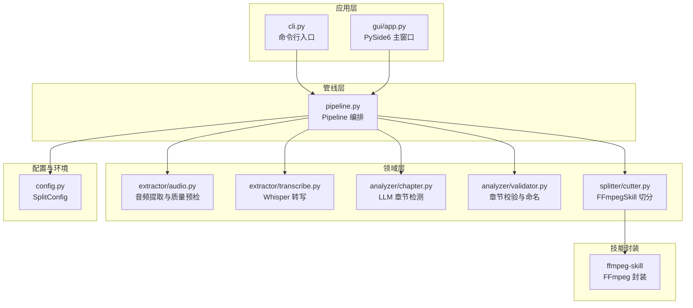
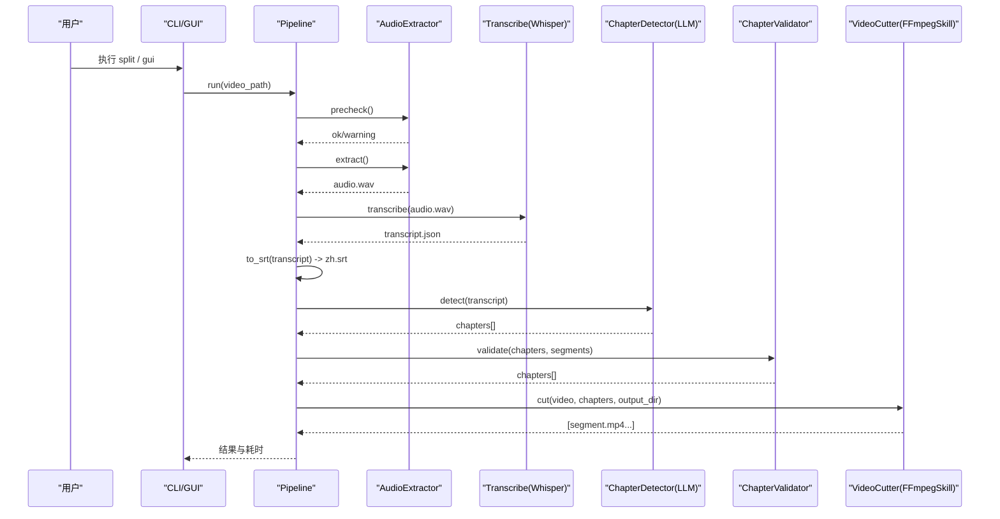
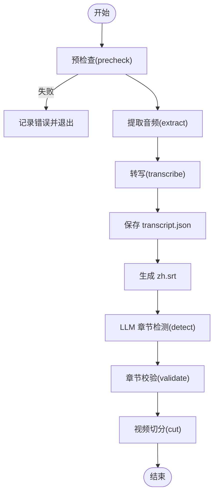
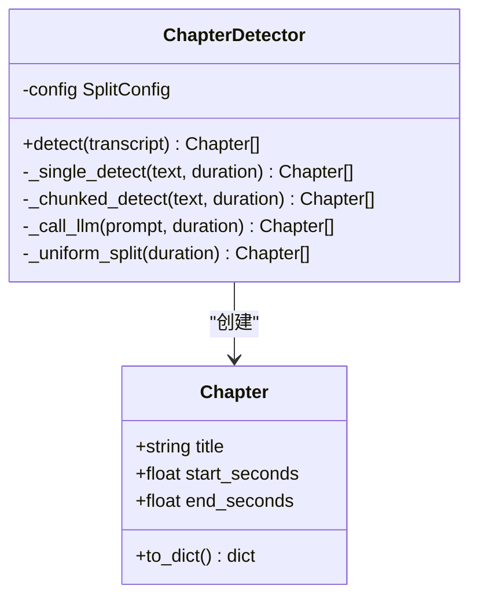
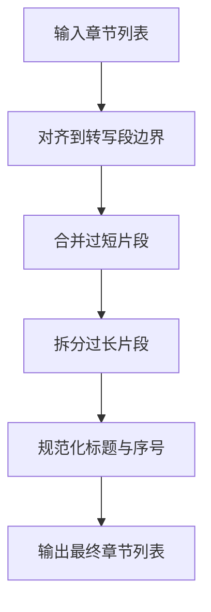
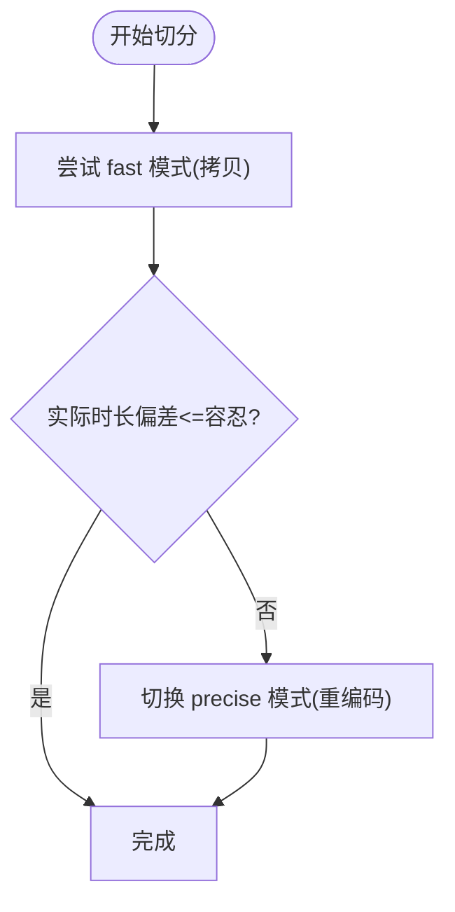
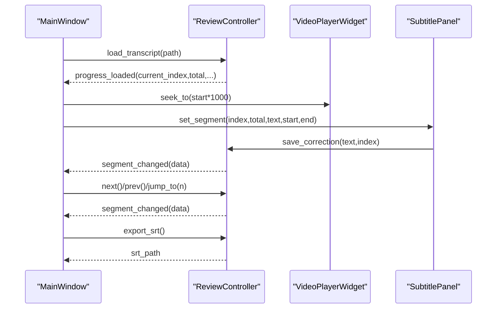
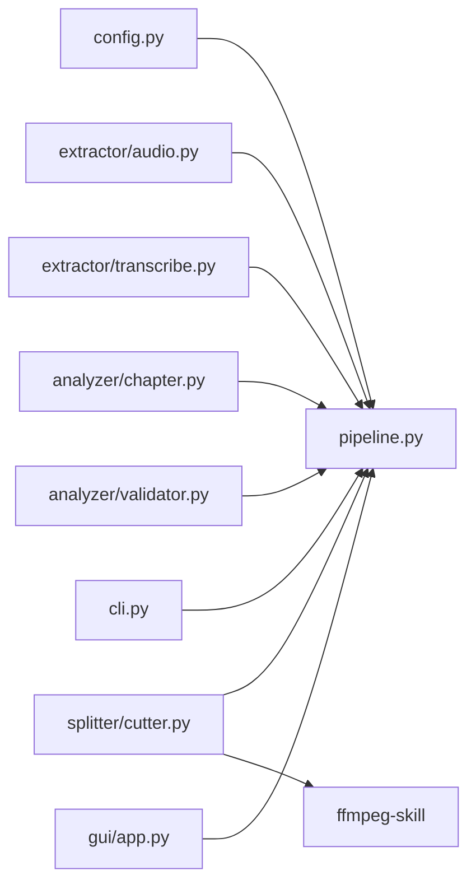

# 项目介绍

<cite>
**本文引用的文件**   
- [README.md](file://README.md)
- [PROJECT_SUMMARY.md](file://PROJECT_SUMMARY.md)
- [skill.md](file://skill.md)
- [video_splitter/__init__.py](file://video_splitter/__init__.py)
- [video_splitter/config.py](file://video_splitter/config.py)
- [video_splitter/pipeline.py](file://video_splitter/pipeline.py)
- [video_splitter/cli.py](file://video_splitter/cli.py)
- [video_splitter/extractor/audio.py](file://video_splitter/extractor/audio.py)
- [video_splitter/extractor/transcribe.py](file://video_splitter/extractor/transcribe.py)
- [video_splitter/analyzer/chapter.py](file://video_splitter/analyzer/chapter.py)
- [video_splitter/analyzer/validator.py](file://video_splitter/analyzer/validator.py)
- [video_splitter/splitter/cutter.py](file://video_splitter/splitter/cutter.py)
- [gui/app.py](file://gui/app.py)
- [gui/controllers/review_controller.py](file://gui/controllers/review_controller.py)
</cite>

## 目录
1. [引言](#引言)
2. [项目结构](#项目结构)
3. [核心组件](#核心组件)
4. [架构总览](#架构总览)
5. [详细组件分析](#详细组件分析)
6. [依赖关系分析](#依赖关系分析)
7. [性能与成本考量](#性能与成本考量)
8. [故障排查指南](#故障排查指南)
9. [结论](#结论)
10. [附录：术语与使用路径](#附录术语与使用路径)

## 引言
VideoSplitter 是一个以“智能视频分割 + AI 驱动字幕编辑 + 批量处理”为核心的工具集。它面向教育视频章节划分、会议记录整理、在线课程制作等真实场景，提供从音频提取、语音转写（ASR）、基于大语言模型（LLM）的语义章节检测、章节校验与切分、以及交互式字幕校对的一体化工作流。其独特优势包括：
- 基于 LLM 的智能章节检测：自动识别话题边界并生成中文标题，支持长文本滑动窗口与失败回退策略。
- 多 ASR 引擎支持：默认集成 FunASR，同时保留 Whisper 转写能力，便于在不同环境与成本之间权衡。
- 交互式字幕编辑：GUI 提供播放、跳转、保存与导出 SRT 的能力，支持断点续审与原子写入。
- 批处理能力：命令行一键批量处理目录下所有视频，输出结构化结果与统计摘要。

本项目通过清晰的模块化设计与稳健的错误处理，为初学者提供了直观的学习路径与可落地的工程实践。

## 项目结构
仓库采用分层组织方式：
- 应用层：CLI 入口与 GUI 界面，分别面向自动化流程与人工校对。
- 管线层：Pipeline 编排预检查、转写、章节检测、校验、切分等步骤。
- 领域层：音频提取、转写、章节检测、章节校验、视频切分等独立模块。
- 配置与环境：统一配置对象 SplitConfig，支持环境变量覆盖。
- 技能封装：ffmpeg-skill 作为底层媒体处理能力的封装，被切分模块动态加载。

图表来源
- [video_splitter/cli.py:1-256](file://video_splitter/cli.py#L1-L256)
- [gui/app.py:1-268](file://gui/app.py#L1-L268)
- [video_splitter/pipeline.py:1-131](file://video_splitter/pipeline.py#L1-L131)
- [video_splitter/extractor/audio.py:1-171](file://video_splitter/extractor/audio.py#L1-L171)
- [video_splitter/extractor/transcribe.py:1-105](file://video_splitter/extractor/transcribe.py#L1-L105)
- [video_splitter/analyzer/chapter.py:1-343](file://video_splitter/analyzer/chapter.py#L1-L343)
- [video_splitter/analyzer/validator.py:1-152](file://video_splitter/analyzer/validator.py#L1-L152)
- [video_splitter/splitter/cutter.py:1-98](file://video_splitter/splitter/cutter.py#L1-L98)
- [video_splitter/config.py:1-54](file://video_splitter/config.py#L1-L54)

章节来源
- [video_splitter/cli.py:1-256](file://video_splitter/cli.py#L1-L256)
- [gui/app.py:1-268](file://gui/app.py#L1-L268)
- [video_splitter/pipeline.py:1-131](file://video_splitter/pipeline.py#L1-L131)
- [video_splitter/config.py:1-54](file://video_splitter/config.py#L1-L54)

## 核心组件
- Pipeline（管线编排）
  - 负责串联预检查、音频提取、转写、SRT 导出、章节检测、校验、切分，并输出结构化结果与耗时统计。
  - 支持断点续跑（resume），在中间产物存在时跳过对应步骤。
- SplitConfig（配置管理）
  - 集中管理 Whisper 模型参数、LLM 调用参数、切分策略、命名模板、ASR 引擎选择等。
  - 支持通过环境变量覆盖默认值，便于部署与测试。
- AudioExtractor（音频提取与质量预检）
  - 使用 ffprobe 获取时长，librosa 进行短时 RMS 与静音比例估算，提前发现无音或高静音风险。
- Transcription（转写）
  - 基于 faster-whisper 的转写接口，返回带时间戳的段落列表，并提供 SRT 转换与 token 估算。
- ChapterDetector（LLM 章节检测）
  - 将转录文本组装为提示词，调用 OpenAI 兼容 API；超长文本采用滑动窗口分块与去重合并；失败回退到均匀分段。
- ChapterValidator（章节校验）
  - 对齐到最近转写段边界、合并过短片段、拆分过长片段，并规范化标题前缀与非法字符。
- VideoCutter（视频切分）
  - 优先快速拷贝模式，若实际时长偏差超过容忍阈值则回退到精确编码模式；输出按模板命名的 MP4 片段。
- CLI/GUI（交互入口）
  - CLI 提供 split、transcribe、cut、check、review、batch、gui 等子命令。
  - GUI 提供打开视频/转录、进度显示、快捷键操作、错误提示与健康检查。

章节来源
- [video_splitter/pipeline.py:1-131](file://video_splitter/pipeline.py#L1-L131)
- [video_splitter/config.py:1-54](file://video_splitter/config.py#L1-L54)
- [video_splitter/extractor/audio.py:1-171](file://video_splitter/extractor/audio.py#L1-L171)
- [video_splitter/extractor/transcribe.py:1-105](file://video_splitter/extractor/transcribe.py#L1-L105)
- [video_splitter/analyzer/chapter.py:1-343](file://video_splitter/analyzer/chapter.py#L1-L343)
- [video_splitter/analyzer/validator.py:1-152](file://video_splitter/analyzer/validator.py#L1-L152)
- [video_splitter/splitter/cutter.py:1-98](file://video_splitter/splitter/cutter.py#L1-L98)
- [video_splitter/cli.py:1-256](file://video_splitter/cli.py#L1-L256)
- [gui/app.py:1-268](file://gui/app.py#L1-L268)

## 架构总览
系统围绕“输入视频 → 音频提取 → 转写 → 章节检测 → 校验 → 切分 → 输出”的主链路展开，辅以 CLI/GUI 双入口与统一的配置管理。

图表来源
- [video_splitter/pipeline.py:1-131](file://video_splitter/pipeline.py#L1-L131)
- [video_splitter/extractor/audio.py:1-171](file://video_splitter/extractor/audio.py#L1-L171)
- [video_splitter/extractor/transcribe.py:1-105](file://video_splitter/extractor/transcribe.py#L1-L105)
- [video_splitter/analyzer/chapter.py:1-343](file://video_splitter/analyzer/chapter.py#L1-L343)
- [video_splitter/analyzer/validator.py:1-152](file://video_splitter/analyzer/validator.py#L1-L152)
- [video_splitter/splitter/cutter.py:1-98](file://video_splitter/splitter/cutter.py#L1-L98)

## 详细组件分析

### 组件一：Pipeline（端到端编排）
- 职责：统一调度各阶段，维护中间产物路径（transcript.json、chapters.json、zh.srt、segments 目录），记录步骤完成状态与耗时。
- 关键特性：
  - resume 模式：当中间产物存在时直接加载，避免重复计算。
  - dry_run：仅估计时长、token 数与费用，不发起 LLM 调用。
  - 异常捕获：任何阶段失败都会标记 status=error 并抛出异常，便于上层处理。

图表来源
- [video_splitter/pipeline.py:1-131](file://video_splitter/pipeline.py#L1-L131)

章节来源
- [video_splitter/pipeline.py:1-131](file://video_splitter/pipeline.py#L1-L131)

### 组件二：ChapterDetector（LLM 智能章节检测）
- 设计要点：
  - 单段检测：当转录文本长度在 token 预算内，一次 LLM 调用完成。
  - 分块检测：超长文本按约 15 分钟分块，保留 2 分钟重叠上下文，逐块检测后合并去重。
  - 健壮性：重试指数退避、JSON 修复、严格的时间范围与顺序校验；全部失败回退为均匀分段。
- 数据结构：
  - Chapter(title, start_seconds, end_seconds)，提供序列化与字符串表示。

图表来源
- [video_splitter/analyzer/chapter.py:1-343](file://video_splitter/analyzer/chapter.py#L1-L343)

章节来源
- [video_splitter/analyzer/chapter.py:1-343](file://video_splitter/analyzer/chapter.py#L1-L343)

### 组件三：ChapterValidator（章节校验与命名）
- 功能：
  - 边界对齐：将章节起止对齐到最近的转写段边界，保证与原始段落一致。
  - 合并过短：小于最小持续时间的片段与相邻合并。
  - 拆分过长：大于最大持续时间的片段按均分策略拆分为若干部分。
  - 命名规范：清理非法字符，确保序号前缀格式。

图表来源
- [video_splitter/analyzer/validator.py:1-152](file://video_splitter/analyzer/validator.py#L1-L152)

章节来源
- [video_splitter/analyzer/validator.py:1-152](file://video_splitter/analyzer/validator.py#L1-L152)

### 组件四：VideoCutter（视频切分）
- 策略：
  - fast 模式：优先使用流拷贝快速切分，若实际时长偏差超过 keyframe_tolerance，则回退到 precise 模式。
  - precise 模式：重新编码以确保精度，适用于对边界要求严格的场景。
- 输出：按命名模板生成 MP4 片段，支持进度回调。

图表来源
- [video_splitter/splitter/cutter.py:1-98](file://video_splitter/splitter/cutter.py#L1-L98)

章节来源
- [video_splitter/splitter/cutter.py:1-98](file://video_splitter/splitter/cutter.py#L1-L98)

### 组件五：GUI 与 Review 控制器
- MainWindow：构建菜单、播放器、标签页、状态栏，绑定快捷键与信号槽，启动健康检查与转录线程。
- ReviewController：维护当前索引、修改集合，支持前进/后退/跳转、保存修正、导出 SRT，持久化审阅进度。

图表来源
- [gui/app.py:1-268](file://gui/app.py#L1-L268)
- [gui/controllers/review_controller.py:1-149](file://gui/controllers/review_controller.py#L1-L149)

章节来源
- [gui/app.py:1-268](file://gui/app.py#L1-L268)
- [gui/controllers/review_controller.py:1-149](file://gui/controllers/review_controller.py#L1-L149)

## 依赖关系分析
- 外部依赖
  - FFmpeg/ffprobe：用于音频提取、视频信息读取与切分。
  - faster-whisper：本地语音转写。
  - json-repair：可选，提升 LLM JSON 解析鲁棒性。
  - openai：LLM 客户端（OpenAI 兼容）。
  - librosa/numpy：音频质量预检（可选）。
  - PySide6：GUI 框架。
- 内部耦合
  - Pipeline 强依赖 extractor、analyzer、splitter 三个子域。
  - cutter 通过动态导入 ffmpeg-skill 实现解耦。
  - config 贯穿全链路，提供统一配置源。

图表来源
- [video_splitter/config.py:1-54](file://video_splitter/config.py#L1-L54)
- [video_splitter/pipeline.py:1-131](file://video_splitter/pipeline.py#L1-L131)
- [video_splitter/extractor/audio.py:1-171](file://video_splitter/extractor/audio.py#L1-L171)
- [video_splitter/extractor/transcribe.py:1-105](file://video_splitter/extractor/transcribe.py#L1-L105)
- [video_splitter/analyzer/chapter.py:1-343](file://video_splitter/analyzer/chapter.py#L1-L343)
- [video_splitter/analyzer/validator.py:1-152](file://video_splitter/analyzer/validator.py#L1-L152)
- [video_splitter/splitter/cutter.py:1-98](file://video_splitter/splitter/cutter.py#L1-L98)
- [video_splitter/cli.py:1-256](file://video_splitter/cli.py#L1-L256)
- [gui/app.py:1-268](file://gui/app.py#L1-L268)

章节来源
- [video_splitter/config.py:1-54](file://video_splitter/config.py#L1-L54)
- [video_splitter/pipeline.py:1-131](file://video_splitter/pipeline.py#L1-L131)
- [video_splitter/cli.py:1-256](file://video_splitter/cli.py#L1-L256)
- [gui/app.py:1-268](file://gui/app.py#L1-L268)

## 性能与成本考量
- 转写性能
  - faster-whisper 支持不同模型尺寸与设备类型，CPU 下 large-v3 预计较慢，tiny/base/small 更快但精度较低。
  - 可通过 compute_type 与 device 调整速度与精度的平衡。
- LLM 成本
  - 通过 estimate_tokens 粗略估算 token 数，结合 llm_token_budget 控制是否分块。
  - dry_run 可预估费用与调用次数，避免不必要的开销。
- 切分性能
  - fast 模式几乎零拷贝，速度极快；precise 模式需要重编码，耗时较长但更精准。
  - keyframe_tolerance 控制何时回退到 precise 模式，避免不必要重编码。

[本节为通用指导，无需特定文件引用]

## 故障排查指南
- 常见环境问题
  - FFmpeg 未安装或不在 PATH：使用 check 命令验证环境，参考 README 安装指引。
  - 缺少可选依赖（json-repair、librosa、numpy、openai、PySide6）：根据报错提示安装相应包。
- 转写问题
  - 音频无声或静音比例过高：AudioExtractor 会给出警告，建议检查录音质量或降噪预处理。
  - 转写失败：确认 faster-whisper 可用，必要时更换模型尺寸或设备。
- LLM 调用失败
  - 检查 OPENAI_API_BASE/OPENAI_API_KEY/WHALECLOUD_API_KEY 等环境变量是否正确。
  - 网络不稳定时可启用重试；极端情况会回退为均匀分段。
- 切分异常
  - fast 模式失败会自动回退 precise；如仍失败，检查磁盘空间与输出目录权限。
- GUI 健康检查
  - 启动时进行 FunASR 健康检查，若不可用仍可基于已有转录工作。

章节来源
- [video_splitter/cli.py:85-152](file://video_splitter/cli.py#L85-L152)
- [video_splitter/extractor/audio.py:26-99](file://video_splitter/extractor/audio.py#L26-L99)
- [gui/app.py:143-156](file://gui/app.py#L143-L156)

## 结论
VideoSplitter 将“智能章节检测 + 高质量转写 + 灵活切分 + 交互式校对”整合为一条稳定可靠的流水线，既满足自动化批量生产，也支持人工精细化校对。通过可插拔的 ASR 引擎与 LLM 配置，用户可在成本、速度与效果之间自由权衡。对于教育、会议与在线课程等场景，它能显著降低手工剪辑与校对的时间成本，提升内容生产效率。

[本节为总结性内容，无需特定文件引用]

## 附录：术语与使用路径
- 术语对照
  - 转写（Transcription）：将音频转换为带时间戳的文本段落。
  - 章节（Chapter）：按语义划分的视频段落，包含标题与起止时间。
  - 切分（Cutting）：依据章节边界将原视频切割为多个片段。
  - 审阅（Review）：对转写结果进行人工校对与修正。
- 快速上手路径
  - 安装 FFmpeg 与 Python 依赖，参考 README 与 PROJECT_SUMMARY。
  - 使用 CLI：
    - 完整流程：vsplit split <视频路径> --max-duration 15 --model large-v3
    - 仅转写：vsplit transcribe <视频路径>
    - 仅切分：vsplit cut <视频路径> --chapters chapters.json
    - 批量处理：vsplit batch <目录>
    - 交互式审阅：vsplit review <视频路径>
    - 启动 GUI：vsplit gui
  - 使用 GUI：
    - 打开视频或转录文件，查看与编辑字幕，导出 SRT。
- 相关文档
  - 技能说明与示例：skill.md
  - 项目概览与示例：PROJECT_SUMMARY.md
  - 基础说明：README.md

章节来源
- [README.md:1-50](file://README.md#L1-L50)
- [PROJECT_SUMMARY.md:1-203](file://PROJECT_SUMMARY.md#L1-L203)
- [skill.md:1-418](file://skill.md#L1-L418)
- [video_splitter/cli.py:207-256](file://video_splitter/cli.py#L207-L256)
- [gui/app.py:263-268](file://gui/app.py#L263-L268)
