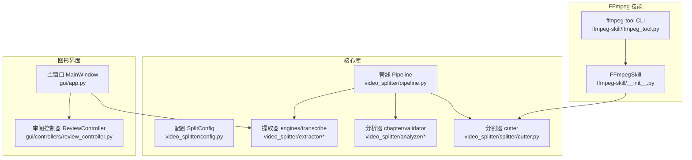
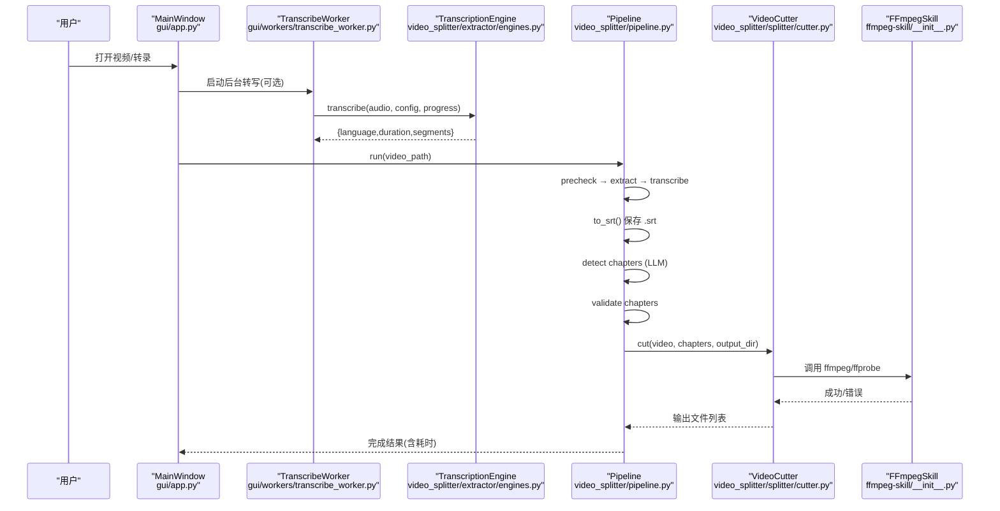
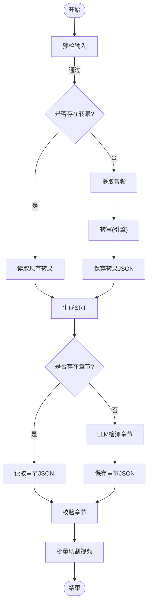
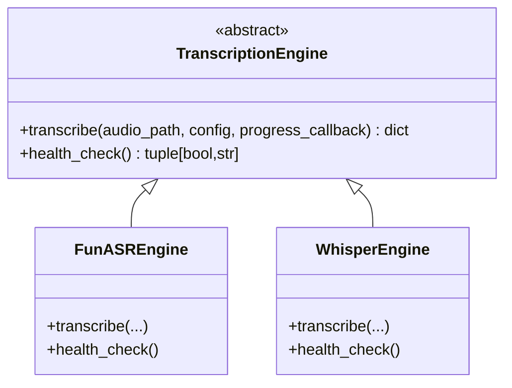
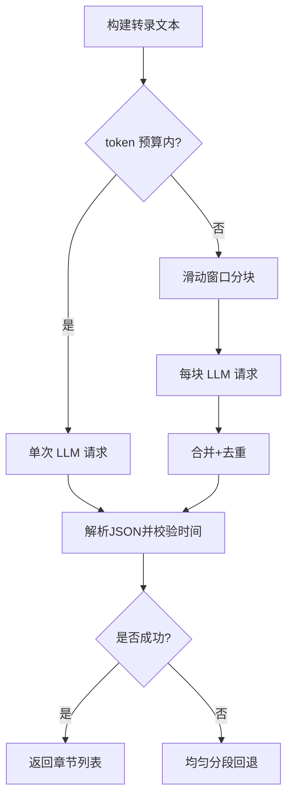
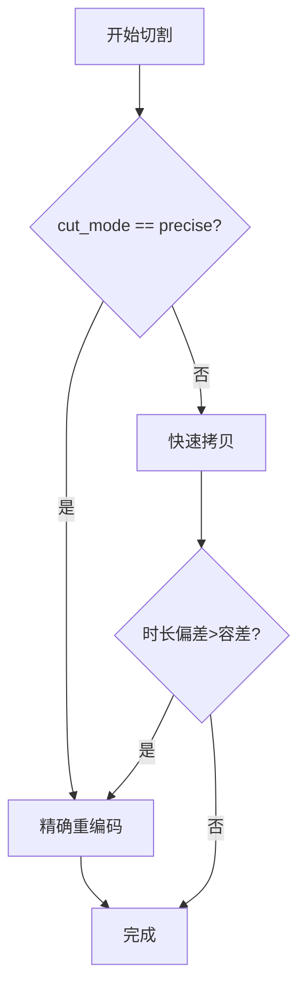
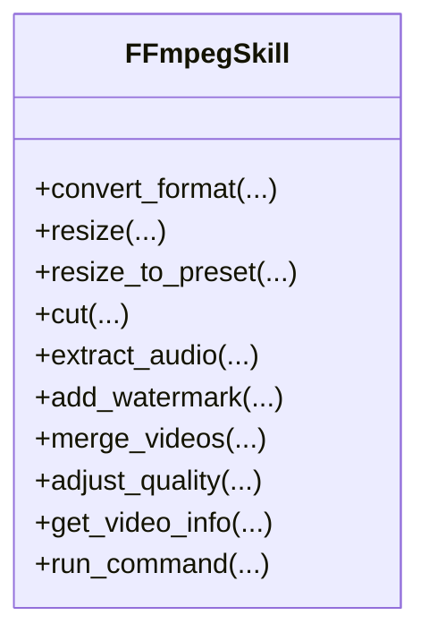
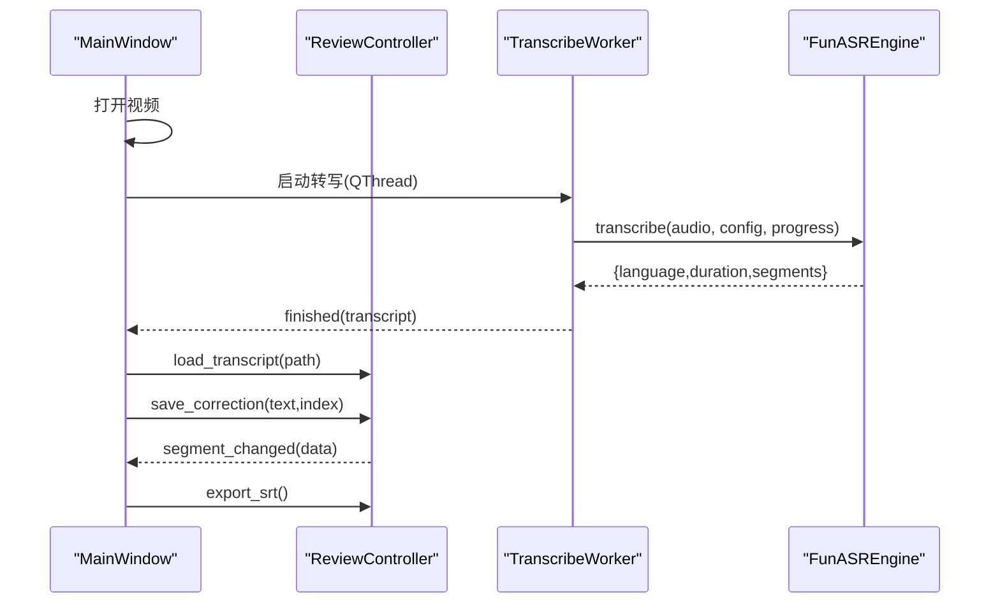
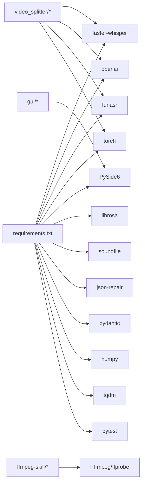

# 项目概述

<cite>
**本文引用的文件**   
- [README.md](file://README.md)
- [pyproject.toml](file://pyproject.toml)
- [requirements.txt](file://requirements.txt)
- [video_splitter/__init__.py](file://video_splitter/__init__.py)
- [video_splitter/config.py](file://video_splitter/config.py)
- [video_splitter/pipeline.py](file://video_splitter/pipeline.py)
- [video_splitter/extractor/transcribe.py](file://video_splitter/extractor/transcribe.py)
- [video_splitter/extractor/engines.py](file://video_splitter/extractor/engines.py)
- [video_splitter/analyzer/chapter.py](file://video_splitter/analyzer/chapter.py)
- [video_splitter/splitter/cutter.py](file://video_splitter/splitter/cutter.py)
- [ffmpeg-skill/__init__.py](file://ffmpeg-skill/__init__.py)
- [ffmpeg-skill/ffmpeg_tool.py](file://ffmpeg-skill/ffmpeg_tool.py)
- [gui/app.py](file://gui/app.py)
- [gui/controllers/review_controller.py](file://gui/controllers/review_controller.py)
- [install.sh](file://install.sh)
</cite>

## 目录
1. [简介](#简介)
2. [项目结构](#项目结构)
3. [核心组件](#核心组件)
4. [架构总览](#架构总览)
5. [详细组件分析](#详细组件分析)
6. [依赖关系分析](#依赖关系分析)
7. [性能与可扩展性](#性能与可扩展性)
8. [故障排查指南](#故障排查指南)
9. [结论](#结论)
10. [附录：系统要求与环境配置](#附录系统要求与环境配置)

## 简介
VideoSplitter 是一个以“智能视频分割 + AI 驱动字幕编辑 + 批量处理”为核心价值的工具集。它通过可插拔的语音识别引擎（FunASR、faster-whisper）将视频转为带时间戳的字幕，再结合大语言模型进行语义章节划分，最终基于 FFmpeg 实现精准或快速的视频切分；同时提供 PySide6 图形界面用于字幕审阅与修正，支持进度持久化与 SRT 导出。

核心价值与目标
- 智能视频分割：基于转录文本与大模型提示词自动识别话题边界，生成章节并输出分段视频。
- AI 驱动字幕编辑：GUI 中逐条审阅、修改字幕，原子写入保障数据安全，支持导出标准 SRT。
- 批量处理能力：流水线式编排（预检→提取→转写→章节→校验→切割），支持断点续跑与进度统计。

技术栈选择原因与优势
- faster-whisper：本地高效语音识别，支持 VAD 过滤与多设备类型，适合离线批处理。
- FunASR：中文场景优化，提供句子级起止时间，便于直接映射到视频段落。
- OpenAI 兼容 LLM：统一接口调用，灵活切换后端（如企业代理），提升章节划分的语义质量。
- FFmpeg Skill：对 FFmpeg 的高层封装，统一错误处理、进度回调与常用操作（转换、裁剪、合并等）。
- PySide6：跨平台桌面 GUI，线程安全地承载长耗时任务（转写）与交互。

## 项目结构
整体采用分层组织：
- ffmpeg-skill：FFmpeg 技能封装与 CLI 工具
- video_splitter：核心库（配置、管线、提取器、分析器、分割器）
- gui：PySide6 图形界面（主窗口、控制器、工作线程、控件）
- 安装脚本与测试：跨平台安装与验证

图表来源
- [ffmpeg-skill/__init__.py:22-143](file://ffmpeg-skill/__init__.py#L22-L143)
- [ffmpeg-skill/ffmpeg_tool.py:20-242](file://ffmpeg-skill/ffmpeg_tool.py#L20-L242)
- [video_splitter/config.py:19-54](file://video_splitter/config.py#L19-L54)
- [video_splitter/pipeline.py:21-131](file://video_splitter/pipeline.py#L21-L131)
- [video_splitter/extractor/engines.py:17-251](file://video_splitter/extractor/engines.py#L17-L251)
- [video_splitter/analyzer/chapter.py:43-343](file://video_splitter/analyzer/chapter.py#L43-L343)
- [video_splitter/splitter/cutter.py:22-98](file://video_splitter/splitter/cutter.py#L22-L98)
- [gui/app.py:27-268](file://gui/app.py#L27-L268)
- [gui/controllers/review_controller.py:20-149](file://gui/controllers/review_controller.py#L20-L149)

章节来源
- [README.md:1-50](file://README.md#L1-L50)
- [pyproject.toml:1-28](file://pyproject.toml#L1-L28)
- [requirements.txt:1-26](file://requirements.txt#L1-L26)

## 核心组件
- 配置管理 SplitConfig：集中管理 ASR 模型、LLM 参数、切分策略、命名模板、断点续跑开关与引擎选择，支持环境变量覆盖。
- 管线 Pipeline：串联预检、音频提取、转写、SRT 导出、章节检测、校验与切割，记录步骤与耗时，异常时返回结构化结果。
- 提取器与引擎：抽象 TranscriptionEngine，内置 FunASREngine 与 WhisperEngine，统一健康检查与进度回调。
- 分析器 ChapterDetector：按 token 预算选择单次或滑动窗口调用 LLM，失败回退为均匀分段；解析 JSON 并做时间范围校验。
- 分割器 VideoCutter：优先快速拷贝模式，必要时回退精确重编码；使用 ffprobe 校验时长偏差。
- FFmpeg Skill：封装常见媒体处理命令，统一错误与超时处理，提供 CLI 入口。
- GUI 审阅：主窗口加载视频与转录，后台线程执行转写，控制器维护状态机与持久化，支持 SRT 原子导出。

章节来源
- [video_splitter/config.py:19-54](file://video_splitter/config.py#L19-L54)
- [video_splitter/pipeline.py:21-131](file://video_splitter/pipeline.py#L21-L131)
- [video_splitter/extractor/engines.py:17-251](file://video_splitter/extractor/engines.py#L17-L251)
- [video_splitter/analyzer/chapter.py:43-343](file://video_splitter/analyzer/chapter.py#L43-L343)
- [video_splitter/splitter/cutter.py:22-98](file://video_splitter/splitter/cutter.py#L22-L98)
- [ffmpeg-skill/__init__.py:22-143](file://ffmpeg-skill/__init__.py#L22-L143)
- [gui/app.py:27-268](file://gui/app.py#L27-L268)
- [gui/controllers/review_controller.py:20-149](file://gui/controllers/review_controller.py#L20-L149)

## 架构总览
系统由三层构成：
- 表现层（GUI）：PySide6 主窗口、控件与工作线程，负责用户交互与异步任务调度。
- 业务层（Core）：Pipeline 编排各阶段，TranscriptionEngine 抽象不同 ASR 实现，ChapterDetector 调用 LLM 进行语义切分。
- 基础设施层（FFmpeg Skill）：对 FFmpeg/ffprobe 的统一封装，CLI 与核心库共享同一能力。

图表来源
- [gui/app.py:157-178](file://gui/app.py#L157-L178)
- [video_splitter/extractor/engines.py:85-173](file://video_splitter/extractor/engines.py#L85-L173)
- [video_splitter/pipeline.py:31-111](file://video_splitter/pipeline.py#L31-L111)
- [video_splitter/splitter/cutter.py:30-98](file://video_splitter/splitter/cutter.py#L30-L98)
- [ffmpeg-skill/__init__.py:95-143](file://ffmpeg-skill/__init__.py#L95-L143)

## 详细组件分析

### 配置模块 SplitConfig
- 职责：集中管理 ASR 模型大小、设备与计算类型、片段时长上下界、LLM 基地址与密钥、切分模式与容差、命名模板、断点续跑、转写引擎选择及引擎特定配置。
- 关键点：from_env 从环境变量覆盖默认值，便于部署与 CI 环境注入。

章节来源
- [video_splitter/config.py:19-54](file://video_splitter/config.py#L19-L54)

### 管线 Pipeline
- 职责：端到端编排“预检→提取→转写→SRT→章节→校验→切割”，记录步骤与耗时，支持 resume 断点续跑。
- 关键流程：
  - 预检：确保输入可用
  - 转写：若存在 transcript.json 则跳过
  - 章节：若存在 chapters.json 则跳过
  - 切割：根据章节批量输出片段
  - 异常：捕获并记录错误信息

图表来源
- [video_splitter/pipeline.py:31-111](file://video_splitter/pipeline.py#L31-L111)

章节来源
- [video_splitter/pipeline.py:21-131](file://video_splitter/pipeline.py#L21-L131)

### 转写引擎与适配器
- 抽象接口 TranscriptionEngine：定义 transcribe 与 health_check，统一进度回调与返回值结构。
- FunASREngine：基于 funasr.AutoModel，返回句子级起止时间（毫秒→秒），缺失时回退 ffprobe 获取时长。
- WhisperEngine：复用 faster-whisper 的转写逻辑，包装进度回调。
- 工厂 create_engine：按名称创建引擎实例，注册表包含 funasr 与 whisper。

图表来源
- [video_splitter/extractor/engines.py:17-251](file://video_splitter/extractor/engines.py#L17-L251)

章节来源
- [video_splitter/extractor/engines.py:17-251](file://video_splitter/extractor/engines.py#L17-L251)
- [video_splitter/extractor/transcribe.py:11-105](file://video_splitter/extractor/transcribe.py#L11-L105)

### 章节检测与校验
- ChapterDetector：构建带时间戳的转录文本，按 token 预算决定单次或滑动窗口调用 LLM；解析响应并校验时间范围；失败回退为均匀分段。
- Chapter：章节对象，包含标题与起止秒数，提供序列化方法。
- 提示词模板：强调自然话题边界、序号格式、时间约束与无重叠无间隙。

图表来源
- [video_splitter/analyzer/chapter.py:77-343](file://video_splitter/analyzer/chapter.py#L77-L343)

章节来源
- [video_splitter/analyzer/chapter.py:18-343](file://video_splitter/analyzer/chapter.py#L18-L343)

### 视频切割器 VideoCutter
- 策略：fast 模式先尝试流拷贝，若时长偏差超过阈值则回退 precise 模式（重新编码）；precise 模式固定视频/音频编码器与码率。
- 辅助：使用 ffprobe 获取实际时长，比较偏差决定是否重编码。

图表来源
- [video_splitter/splitter/cutter.py:30-98](file://video_splitter/splitter/cutter.py#L30-L98)

章节来源
- [video_splitter/splitter/cutter.py:22-98](file://video_splitter/splitter/cutter.py#L22-L98)

### FFmpeg 技能与 CLI
- FFmpegSkill：封装格式转换、缩放、裁剪、水印、合并、质量调整、信息查询等，统一错误与超时处理。
- ffmpeg_tool.py：命令行入口，提供子命令 convert/resize/cut/extract-audio/watermark/merge/quality/info，支持 JSON 输出。

图表来源
- [ffmpeg-skill/__init__.py:22-673](file://ffmpeg-skill/__init__.py#L22-673)
- [ffmpeg-skill/ffmpeg_tool.py:20-242](file://ffmpeg-skill/ffmpeg_tool.py#L20-L242)

章节来源
- [ffmpeg-skill/__init__.py:22-673](file://ffmpeg-skill/__init__.py#L22-673)
- [ffmpeg-skill/ffmpeg_tool.py:20-242](file://ffmpeg-skill/ffmpeg_tool.py#L20-L242)

### GUI 审阅子系统
- MainWindow：菜单、播放器、标签页、状态栏、快捷键、健康检查与转写线程生命周期管理。
- ReviewController：状态机（当前索引、已修改集合）、转录与进度持久化、SRT 原子导出。
- 数据流：打开视频→后台转写→载入转录→逐条审阅→保存修正→导出 SRT。

图表来源
- [gui/app.py:157-268](file://gui/app.py#L157-268)
- [gui/controllers/review_controller.py:36-149](file://gui/controllers/review_controller.py#L36-L149)
- [video_splitter/extractor/engines.py:85-173](file://video_splitter/extractor/engines.py#L85-L173)

章节来源
- [gui/app.py:27-268](file://gui/app.py#L27-L268)
- [gui/controllers/review_controller.py:20-149](file://gui/controllers/review_controller.py#L20-L149)

## 依赖关系分析
- Python 版本：>=3.12（项目元数据）
- 核心依赖：faster-whisper、openai、funasr、torch、PySide6、librosa、soundfile、json-repair、pydantic、numpy、tqdm、pytest
- 外部依赖：FFmpeg/ffprobe 必须安装且可在 PATH 中找到

图表来源
- [requirements.txt:1-26](file://requirements.txt#L1-L26)
- [pyproject.toml:1-28](file://pyproject.toml#L1-L28)

章节来源
- [requirements.txt:1-26](file://requirements.txt#L1-L26)
- [pyproject.toml:1-28](file://pyproject.toml#L1-L28)

## 性能与可扩展性
- 转写性能：faster-whisper 支持设备与计算类型选择；FunASR 提供中文优化模型，可按需切换。
- 章节检测：按 token 预算自动分块，避免超长上下文导致失败；LLM 调用具备重试与指数退避。
- 切割性能：优先流拷贝减少 CPU 占用，仅在必要时重编码；时长偏差阈值控制精度与速度平衡。
- 可扩展点：新增转写引擎只需实现 TranscriptionEngine 接口并注册至工厂；章节检测可替换提示词或接入其他 LLM 客户端。

## 故障排查指南
- FFmpeg 未安装或不可用
  - 现象：初始化 FFmpegSkill 报错或 ffprobe 找不到
  - 处理：安装 FFmpeg 并确保在 PATH 中；参考安装脚本提示
- 转写引擎不可用
  - 现象：健康检查失败（缺少依赖或模型加载失败）
  - 处理：安装对应包（funasr/faster-whisper），设置模型路径环境变量
- LLM 调用失败
  - 现象：章节检测回退为均匀分段
  - 处理：检查 API Key/Base URL、网络连通性与配额；适当增大 llm_max_retries
- 切割失败或时长偏差过大
  - 现象：fast 模式失败或偏差超过 keyframe_tolerance
  - 处理：确认源文件可解码；必要时提高容差或强制 precise 模式

章节来源
- [ffmpeg-skill/__init__.py:73-94](file://ffmpeg-skill/__init__.py#L73-L94)
- [video_splitter/extractor/engines.py:154-173](file://video_splitter/extractor/engines.py#L154-L173)
- [video_splitter/analyzer/chapter.py:195-242](file://video_splitter/analyzer/chapter.py#L195-L242)
- [video_splitter/splitter/cutter.py:55-98](file://video_splitter/splitter/cutter.py#L55-L98)

## 结论
VideoSplitter 将“语音识别—语义章节—视频切割—字幕审阅”整合为一条可配置、可恢复、可观测的流水线，并通过 GUI 降低人工校对成本。其模块化设计使得引擎与 LLM 可插拔替换，FFmpeg Skill 提供稳定可靠的底层能力，适合在企业环境中进行批量视频内容治理与知识沉淀。

## 附录：系统要求与环境配置
- 系统要求
  - Python >= 3.12（项目元数据）
  - FFmpeg/ffprobe 已安装并在 PATH 中
- 环境配置
  - 安装依赖：pip install -r requirements.txt
  - 环境变量（示例）：
    - OPENAI_API_BASE / OPENAI_API_KEY：LLM 代理与密钥
    - WHALECLOUD_API_KEY：企业代理密钥覆盖
    - VIDEO_SPLITTER_DEVICE：ASR 设备（auto/gpu/cpu）
    - VIDEO_SPLITTER_RESUME：启用断点续跑
    - VIDEO_SPLITTER_ENGINE：选择转写引擎（funasr/whisper）
    - VIDEO_SPLITTER_FUNASR_MODEL_DIR：FunASR 模型目录
- 安装脚本
  - Linux/macOS：运行 install.sh，自动检测 Python/FFmpeg，安装基础依赖，并将 ffmpeg-tool 加入 PATH
  - Windows：手动安装 FFmpeg 并添加到 PATH，随后安装 Python 依赖

章节来源
- [pyproject.toml:1-28](file://pyproject.toml#L1-L28)
- [requirements.txt:1-26](file://requirements.txt#L1-L26)
- [video_splitter/config.py:39-54](file://video_splitter/config.py#L39-L54)
- [install.sh:1-152](file://install.sh#L1-L152)
